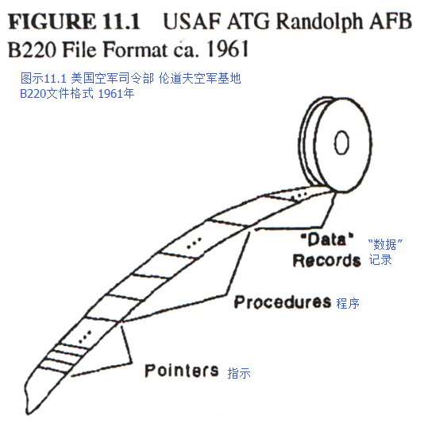

**上述观点在进程中有迹可循，大约在1961年，一位程序员参与了美国空军b220文件的版式设计，经过了若干次操作，我“难于窥见”他的想法**（True to the stages, I "barely saw" the idea several times ca. 1961 while a programmer in the Air b220 file format Force）。
起初，他们将Burroughs 220用于把来自一个空军司令部设备的文件传输到另一个空军司令部的设备上去。
由于没有标准的操作系统或文件格式，一些设计者（如今我们并不知道他们是谁）想出了一种巧妙的方法解决这一问题，他们把每个文件都分成了三个部分。
其中，第三个部分包含了所有真正的数据，它们以任意的大小和形式存在。
第二个部分则包含了B220的程序，它知道如何处理记录与字段来对第三部分进行复制与更新。
第一个部分则是一组数列或是第二部分的程序里进入点中的相应指示（最初的指示存在于一个标准指令中，这个指令代表着一些标准含义）。
这个想法的妙处无需赘述，它也应用于后来的一些系统中，并且直到[COBOL](http://baike.baidu.com/view/90933.htm)的强制使用取代了它的存在。

第二次的“难于窥见”随后发生在ATC打算让B5000取代220的时候。
我当时并不真正的欣赏它，但我确实注意到它分段式的储存系统、[HLL](http://baike.baidu.com/view/1190296.htm)编译以及字节码执行（byte-coded execution）带来的效率、为子程序调用（subroutine calling）和多进程转换（multiprocess switching）的自动调整结构、可分享的干净代码、保护机制等。
同时，**我也看见其使用的程序参照表（Program Reference Table）就相当于220文件系统方案为组件提供的一个过程接口（procedural interface）**(I saw that the access to its Program Reference Table corresponded to the 220 file system scheme of providing a procedural interface to a modul)**。
但是，当时我在这个机器身上的重大发现不是它面向对象的想法，而是其中对HLL翻译与评估的一些洞见。【Barton, 1961】【Burroughs, 1961】

