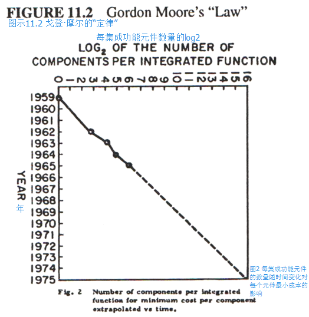

继空军之后，我在课余会进行勤工俭学，而我大部分的工作是在为国家大气研究中心（National Center for Atmospheric Research）的大批量天气数据采集读取系统编程。
那时我对一般的仿真模拟产生了兴趣——尤其是用一个机器模仿另一个——但是除了在一台CDC6600上制作一个一维的域位块转换（[bitblt](http://baike.baidu.com/view/1080366.htm)）用以模仿各种机器的字体大小外，我大部分的注意力都分散在了学校上，或者我该具体点说，是学校的剧场里。
在奇帕瓦福尔斯（Chippewa Falls）对6600进行调试（debug）的同时，我读了[戈登·摩尔（Gordon Moore）](http://baike.baidu.com/view/59874.htm)的一篇文章，里面预测了芯片上集成硅（integrated silicon）的密度会呈指数般地上升，同时成本会下降【摩尔 65】。
1965年的这个时候，当我站在房间般大小、依靠氟利昂降温的10 MIP 6600旁时，摩尔惊骇世俗的预测对我来说遥远而缥缈。

