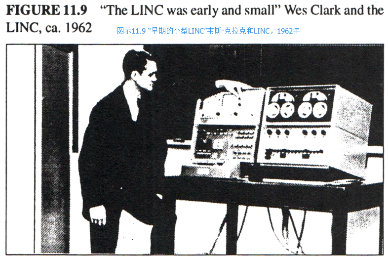

戴夫·埃文斯并不觉得研究生院应当作为一个研究机构而存在。
和许多ARPA的**“承包人（contractors）”**，一样，他希望自己的学生能做些“真正的东西”；
研究生应当尽快完成他们的学业；
并且他们的论文应当超越当前的发展。
戴夫经常给他的学生一些咨询类的工作，1967年年初，他把我介绍给了艾德· 奇德尔，对方是个友善的硬件天才，在一家当地的航空航天公司任职，那时他正在捣鼓一台“小机器”。
那台机器并不是第一台个人电脑——第一台个人电脑是韦斯·克拉克的LINC——但是戴夫希望这台电脑能够为非计算机专业的人所用，具体说来就是，他希望能用像BASIC这样的高阶语言来为这台电脑编程。
我提议道：“用JOSS怎么样？”
他说：“好啊，随你怎么来。”，这就是我们愉快合作的开始，我们把那台机器叫做FLEX。
随着设计的深入，我们意识到我们需要的是一种可以自如地模拟以及延展的语言，JOSS（或者其它任何我所知的语言）并不精于此道。
而用Simula的话，机器又太小了，所以我们把Simula也淘汰了。
JOSS的美丽之处在于，对于终端用户来说，它的设计足够博人眼球——并且该领域无出其右【Joss 1960，Joss 1978】。
但用在精确计算方面（除了cf. Lampson 65），JOSS运行得太慢了，它也缺少真正的程序、变量作用域等等。
和JOSS类似但显然潜能更大的是沃斯的EULER【沃斯 1966】。
它是对Algol的概括，首先由韦恩哈登提出【凡·韦恩哈登 1963】。为此，他做了一系列的改造，摒了范式、统一了特性、并把程序作为第一对象等等。
实际上，这个语言有点像LISP，但没有LISP那么深刻的内涵。

