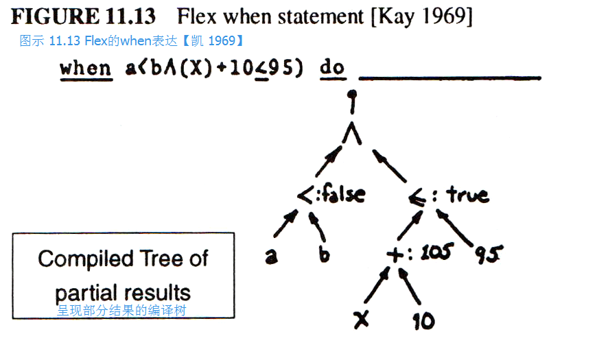

FLEX中另一个有趣的控制结构叫做“when”，它是一种事件驱动的[“软中断（soft interrupt）”](http://baike.baidu.com/view/197370.htm)。
这种布尔表达式会以[树型选择排序（tournement）](http://baike.baidu.com/view/3108940.htm)的方式呈现，任何可能的中间结果（intermediate result）都将囊括在其中。
在所有的when结构中，相关变量（variable）都要通过这些树型结构，因此若产生变化，只要对布尔数据类型相应的部分进行计算即可。
它的效率很高，并且与现用于电子表格（spreadsheet）的技术相似。
其实它有些大材小用，因为困难总是发生在事件驱动系统中。
换言之就是，控制只有when结构的语境会很繁琐，when结构应当很灵敏。
一部分的布尔表达式会用于检验语境。
我觉得在这些语境中，不管怎样，程序的结构应当能够设置和取消[事件驱动（event driver）](http://baike.baidu.com/view/536048.htm#1)。
这一点FLEX系统还无法做到，并且实现它还亟待一个更好的[体系结构（architecture）](http://baike.baidu.com/view/1188494.htm)。

