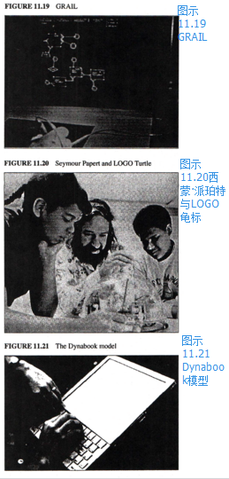

但之后，那年在[兰德公司（RAND）](http://baike.baidu.com/view/31484.htm)我看到了一个真正美丽动人的系统。
它的名字叫GRAIL，是[JOSS](http://baike.baidu.com/view/1200937.htm)的图像衍生品。
第一个平板（著名的RAND平板）由汤姆·艾利斯（Tom Ellis）发明【Davis 1964】，其功能是捕捉人类的姿态；加韦·哥罗纳（Gave Groner）还写了个程序，让其有效地辨认动作并作出回应【Groner 1966】。
尽管所有的东西都由泡泡糖固定，系统也时常崩溃，我却不曾忘怀我与它的第一次互动。它的操作很直接，且它本身是模拟计算机的，无模式，也很美。
我意识到[FLEX](http://baike.baidu.com/subview/623340/13746390.htm)的界面完全跑偏了，但是一个像GRAIL这样的系统，需要整个单机的360/44来运行，如何才能把它装进一个微小的机器里去？

一个月后，我终于拜访了[西蒙·派珀特（Seymour Papert）](http://baike.baidu.com/view/4370843.htm)、沃利·冯茨（Wally Feurzig）、辛西娅·所罗门（Cynthia Solomon）等一些这个领域的先锋，他们创立了LOGO，同时把它应用在列克星敦市学校的教育中。
那里，孩子们在一个为他们量身定做的环境下，用为他们特别设计的语言开展真正的编程活动。
随着[Simula](http://baike.baidu.com/view/1112576.htm)引入了OOP的概念，我终于带着对“个人电脑真正何去何从”的疑问与其相遇。
正如[恩格尔巴特（Douglas C. Engelbart）](http://baike.baidu.com/view/686586.htm)反对IBM提出的“铁路运输（railroads）”所用的隐喻，个人电脑的未来不是个人的动力交通工具，而是一个意义要深远许多倍的事物：个人的动态媒介。
想要开车上路，人们必须等到高中并且得拥有“驾照”，但是媒介就不一样了，它会延伸进每个人的童年。

现在，与FLEX相悖的机器、扁平的屏显、GRAIL、巴顿关于“交流（communication）”的谈话、[麦克卢汉（McLuhan）](http://baike.baidu.com/view/978197.htm?fromtitle=Marshall+Mcluhan&type=syn)的媒介理论、以及派珀特对孩子的教育，这一切糅和在一起，编织出一幅未来个人电脑的真正图景。
我想起了奥尔德斯·马努蒂尔乌斯（Aldus Manutius ），他在印刷机出现40年后，为了让书本顺利地装入鞍囊中去，他发明了现代书籍的尺寸。
未来的个人电脑不会超过一个笔记本的大小，它需要如JOSS、GRAIL和LOGO那样友好的界面，**但也要向Simula和FLEX一样是面向对象的（but with the reach of Simula and FLEX）**。
清晰毕现而又浪漫的想象有种惊人的能力，它能让人们聚焦在自己的思想与意愿上。
现在，人们能够轻易知晓下一步该做些什么。
我用硬纸板做了一个模型来看看未来的个人电脑长什么样、用起来是什么感觉，我还使用铅粒填充，来预测它的质量（小于两磅）。
我还安装了键盘和触笔，因为尽管大家认为打字与书写已经能完美地被辨认出来了（其实我们没有理由这么期盼），但触笔带来的低速的触感上的自由和键盘带来的有限制的高速需要达到一个平衡。
从ARPA进行无线分组的实验开始，我就期待着Dynabook笔记本在十年或更久以后能够拥有一个无线网络系统。

