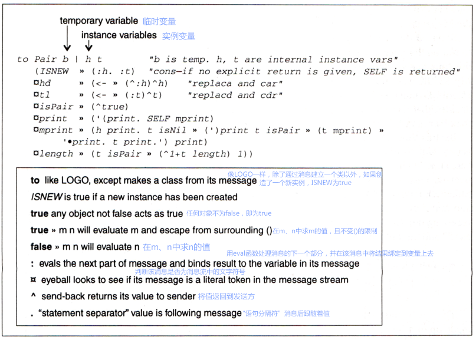

1. 一切皆对象
2. 对象间通过发送和接收（与对象相关的）消息交流
3. 对象有自己的内存（与对象相关）
4. 每个对象都是一个[类（class）](http://baike.baidu.com/subview/2390/8109879.htm#viewPageContent)（这个类也必须是一个对象）中的[实例（instance）](http://baike.baidu.com/item/Instance/5156585)
5. 类中包含着各个实例共有的性态（behavior）（在程序列表中以对象的形态呈现）
6. 为了用[eval函数](http://baike.baidu.com/item/eval%28%29)处理某个程序列表，电脑会控制第一个对象，余下的则被当做消息进行处理

目前为止，我们已经按照设计解释器的初衷，对大部分Smalltalk计划进行了划分，于是他们被分为六个主要想法。
前三个原理围绕着Smalltalk的功能——“外部对象”如何看待与使用它们。
数年来我们不需要对它们进行任何修改。
而后三个——来自内部的对象——则需要根据不同版本的Smalltalk（和之后面向对象的设计）进行微调。
计划（1）和（4）中暗示类就是对象，并且它们是自身的实例。
（6）则暗含一个像LISP那样通用的句法，但接收对象需放在首位，随后是消息。
因此c<sub>i</sub> <- de（用“&deg;”预先渲染，并用“*”进行乘法运算）表示：
```
receiver | message
c        | ° i <- d*e
```
`c`与接收对象相关联，而`° i <- d*e`则是消息。
这则消息由文字标记“°”、i（在发送方的语境下需要被评估的表达）、另一个文字标记“<-”和之后的d*e（在发送方的语境下需要被评估的表达）组成。
由于“LISP”的搭配由两个元素对象构成，它们可以以更简洁的方式呈现：`c hd`、`c tl`和`c hd <- foo`等。

一开始，要表达像a+b和3+4这样“简单”的概念似乎更加麻烦。用下面的形式来思考它们真的合理吗：
```
receiver | message
a        | + b
3        | + 4
```
只考虑到整数的话它看上去挺蠢的，但“+”还有着其它隐喻，例如：


这就生成了一种为信息符号（message symbol）寻找通用行为（generic behaviors）风格。
[“多态性（polymorphism）”](http://baike.baidu.com/item/%E5%A4%9A%E6%80%81%E6%80%A7)是其官方表达（我认为这个词源自克里斯托弗・斯特雷奇（Strachey）），但它与最初的意义有所偏差。
最初它只应用在功能上，而这个功能可以携带不止一种类型的参数（argument）（译者注：parameter和argumentd的区别在于，前者指函数定义中的参数，后者指函数调用时的实际参数）。
在Smalltalk-72中，诸如cons对象（原文中为cons pairs，是LISP中constructs memory objects的别称，故此翻译）模型这样的object类可以是如下这样：



