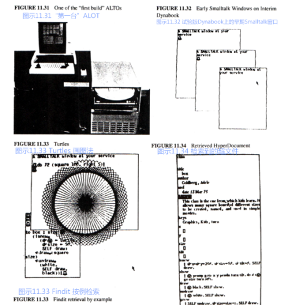
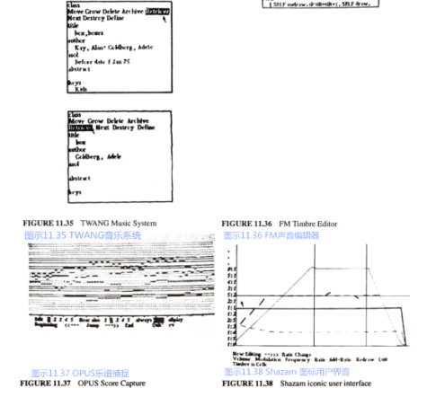
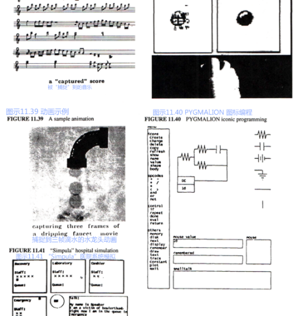

### Smalltalk-72系统的发展与应用
Smalltalk真正应用在机器上开始于平行路径（parallel path）的激增，他们很难执行过去那些严格的命令。
让我先大致介绍一下Smalltalk-72向Smalltalk-76转变的过程，在此之后，我花了几年时间让孩子们使用它，这也是这个项目的首要动力。
在试验版的Dynabook上Smalltalk-72解释器运行的并不那么灵活（按巴特勒的说法就是“并不那么叹为观止（pronouncement）”），但它容易改变，并且，对于即将纳入系统中的实时互动系统来说，它运行得足够快了。

在写好了用于读取键盘输入和创造文本字符串（string of text）代码后，我们（与戴安娜·玛丽（Diana Merry））第一个解决的问题就是重叠窗口。
为了让屏幕显示不同高度的字体，并且大致做到一边写字一边显示，戴安娜创造了一个早期的位域块转换系统。
第一个窗口版本是2½D的可拖拽的对象，但它运行起来有点慢，用处不大。
我们打算再等一等，直到史蒂夫·珀赛尔（Steve Purcell）在他的动画系统中成功地实现了这个功能（它更接近“2¼D”），并且一直沿用至今。
窗口可能是我们在Smalltalk中返工次数最多的类了，因为我们既没有足够的计算能力来持续观察[“世界坐标（world coordinates）”](http://baike.baidu.com/item/%E4%B8%96%E7%95%8C%E5%9D%90%E6%A0%87%E7%B3%BB)，也无法一直对其进行更新，而我之前在犹他大学的同事正着手在伊万斯（Evans）& 苏泽兰(Sutherland)的飞行模拟器项目中对其进行实验。
这个模型简洁而有力，但却很难实时实现，甚至是在 2½D中。第一个实用的Smalltalk窗口使用了GRAIL中移动、调整大小、克隆和关闭功能。
调整窗口时运用了一种简单的“无环（loopless）”控制方式，它把所有的窗口都串联在一起。

（在完成了数字、字符串等基本要素后）下一个要应用在试验版Dynebook上的就是一个面向对象的LOGO [turtle语言](http://biancheng.dnbcw.info/python/443280.html)版本，由泰德（Ted）负责。
它可以制作出任何turtle语言实例，既可以用在绘画上，也可以作为值用在图形转换（graphic transformation）上。
丹（Dan）创造了一种“turtle指挥官”类，它可以操控整个turtle军队。
很快，这些turtle图案便制作好了，这样我们就可以用窗口对其进行剪切。

约翰·肖奇（John Shoch）为Smalltalk代码创造了一种已鼠标为驱动的结构编辑器。


[拉里·特斯勒（Larry Tesler）](http://www.baike.com/wiki/%E6%8B%89%E9%87%8C%C2%B7%E7%89%B9%E6%96%AF%E5%8B%92)（后来为POLOS工作）并不喜欢NSL函数的模式性（modiness）与一般方法，他希望向之前的NLS使用者们提供一个可替代的方案，并组织进行编辑方面的用户调查（那时几乎闻所未闻）。
这促使他用Smalltalk编写miniMOUSE程序，这是帕克中心第一个[WYSIWYG](http://baike.baidu.com/item/%E6%89%80%E8%A7%81%E5%8D%B3%E6%89%80%E5%BE%97)编辑器。它（几乎）没什么模式，用起来也很有趣，不仅我们有这种感受，许多测试它的人皆是如此（我用相机运行了一下从前拍的片子，唤起了其中的愉悦与欣喜）。很快，miniMOUSE就成为了Smalltalk代码和一些demo的替代编辑器。

1974年春天，我在成人班打算实验的“小型”项目之一就是单页段落编辑器。它非常复杂，但我展示给大家的例子是完全无模式的（它即将被人们所了解），并且在接下来的这些年里，它成为了许多Smalltalk文本的基础。丹和戴安娜·玛丽（Diana Merry）完成了其大部分改进。
当然，对象也是多媒体文件，大部分你都可以免费阅览。
我们在早期就意识到，这些文件中每个部分的对象都需要掌控自身的编辑任务。
史蒂夫·韦耶（Steve Weyer）建立了一些最早的多媒体文件，在之后的许多年里，鲍勃·弗莱戈（Bob Flegal）、戴安娜·玛丽（Diana Merry）、拉里·特斯勒（Larry Tesler）、蒂姆·莫特（Tim Mott）和[Trygve Reenskaug](http://www.umlchina.com/Chat/TrygveReenskaug.htm)极大地扩展了它们。

史蒂夫·韦耶（Steve Weyer）和我设计了Findit，这是一个“通过例子来检索（retrieval by example）”的界面，它将类与其实例进行类比，形成了检索请求。
为了控制图书馆书本的流通，帕克图书馆使用了它许多年。

我在NOVA上开发的抽样合成音乐系统可以生成三种高清实时语音。
鲍勃·舒尔（Bob Shur）和恰克·塞克（Chuck Thacker）将这个功能转移到了试验版的Dynabook上，并且他们成功地实现了实时生成12种语音。低速设备（用于鼠标和键盘）使用的是256比特大小的一般输入，这使得其能够轻易连接两个风琴键盘和一个踏板，它们的大小超过154比特。
程序中还囊括了滑音（portamento）效果和衰减（decay）效果。
泰德·凯勒（Ted Kaehler）写了一个音乐捕捉与编辑系统，名叫TWANG，其中使用了我们为孩子们发明的符号谱（tablature notation）【凯 1977a】。
抽样中一个比较棘手的问题就是[压控振荡器（VCO）](http://baike.baidu.com/item/VCO)在“[平均律](http://baike.baidu.com/item/%E5%B9%B3%E5%9D%87%E5%BE%8B)合成器（Well Tempered Synthesizer）”中的普遍使用。
后来，有一个夏天，我们来了一个非常聪明的暑期生，名叫史蒂夫·桑德斯（Steve Saunders），他决心挑战将约翰·乔宁（John Chowning）非实时的调频合成（FM synthesis）音乐转换成ID上的实时音乐。
这意味着他得另辟蹊径，从“FM”以外的方面入手，而最终他获得了成功，将八条实时语音合并进了TWANG中【桑德斯 1977】。

然而克里斯·杰夫（Chris Jeffers）（他是音乐家和教育家，而非计算机科学家）的OPUS遂将我们排在了沙滩上，这是第一个实时乐谱捕捉系统（score capturing system）。
和现在大部分系统不一样的是，它并不需要有节奏地播放音乐，相反地，它第一遍追求的是节拍的强弱（乐句划分），据此建立一个相似的节奏波动局部模型，然后使用[曲线拟合（curve fitting）](http://baike.baidu.com/item/%E6%9B%B2%E7%BA%BF%E6%8B%9F%E5%90%88)和[外推法（extrapolation）](http://baike.baidu.com/item/%E5%A4%96%E6%8E%A8%E6%B3%95)来判断小节（measure）的位置、[时值（time value）](http://baike.baidu.com/item/%E6%97%B6%E5%80%BC/8998649)、敲击的[音符（note）](http://baike.baidu.com/item/%E9%9F%B3%E7%AC%A6/70459)。


NOVA上每秒能够运行2-3[帧（frame）](http://baike.baidu.com/item/%E5%B8%A7#2)动画，其中每帧包含3-5个对象。
这个速度足以让画面动起来了（如果速率是其两倍的话需要[缓冲（buffering）](http://baike.baidu.com/item/%E7%BC%93%E5%86%B2%E5%99%A8)），但我们并不满足于此。
我们想达到的是“迪士尼的速率（Disney rates）”，即每秒运行10-15帧，每帧包含十多个大型对象，或者更多小一些的对象。
这个任务交给了开了“金手指”的史蒂夫·珀赛尔（Steve Purcell）。
截止到1973年的秋天，他可以每秒运行10帧2½D的画面，其中包含80个乒乓球和10匹飞驰的骏马。
他的下一项任务是把这个demo做成一个普通的系统设备，这样我们就可以在其中建立动画系统了。
1974年5月，他的CHAOS系统开始运作，那时正值罗恩·贝克（Ron Baecker）、汤姆·霍斯利（Tom Horseeley）和专业动画大师埃里克·马丁（Eric Martin）夏季访问期间，他们还共同制作了SHAZAM—一个非常有效且简洁的动画系统。
该系统主要基于罗恩六十年代末关于TX-2的论文设计——GENESYS。







此时最主要的论文设计是戴夫·史密斯（Dave Smith）的PYGMALION【史密斯 75】。
这篇论文是关于图标编程的（是的，我们还没忘了它）。
一个人编写程序来告诉系统怎样进行改变，这就像一个人在黑板上画上图示来向另一个程序员阐释一样。
这个程序起到了良好的带头作用，后来涌现出许多“按例编程（progarmming by example）”的系统。

这里，我想提一下关于这些程序大小的事情。
PYGMALION是用Smalltalk-72写出的最大的程序，它的代码有20页左右——都能够在试验版dynabook ALTO上运行——史密斯的论文上可以看见其完整的代码。
相比较而言，其他的应用就更小了。
拿SHAZAM动画系统举个例子：1974年夏天，经过几次撰写和设计，我们最终做出了这个系统，它的代码只有5-6页，其中还包含了图标控制的多窗口用户界面。

Simpula来自于[仿真语言（simulation language）](http://baike.baidu.com/item/%E4%BB%BF%E7%9C%9F%E8%AF%AD%E8%A8%80)，它是SIMULA排序方法的一个简易版本，它写起来很容易，篇幅也不长。
这时我们认为，通过将各个单独的方法归类为模拟阶段（simulation phase），可以让协同程序（coroutine）更加简洁明了。
一个最普通的SIMULA例子就是加工车间，它们可以被划分成许多有用的部分，就像医院有不同的科室来诊断不同的病人（见右侧）一样。
孩子们对医院没什么兴趣，但他们完全可以模拟像迪士尼乐园一样的游乐场、学校、他们和父母常去的商店，等等。
后来，这个模型成为了Smalltalk Sim-kit的基石，这是一个高级的终端用户编程环境（此前已介绍过）。

我们可以用Smalltalk-72来完成多种“计算机科学类的（computer sciency）”设计。
例如我们争论的话题之一就是是否要加入[goto语句](http://baike.baidu.com/item/Goto/12755716)（之前我们并没有），如果不加入的话，我们如何详细说明那些非常有用的控制结构——例如一个[loop中的多个exit](https://zhidao.baidu.com/question/1733646605296283627.html)？
来自SLAC的恰克·扎恩（Chuck Zahn）提议建立一个以事件为驱动的结构，一系列事件将在其中被定义，这样如果发生了某个事件，该loop就会停止（exit），并且在代码块（case block）中可以选择相对应的表达【扎恩，1974 克努特，1974】。
假设我们打算写一个很简单的loop，它用来读取键盘上打下的字母，并将其显示出来。我们希望敲击键盘时整个loop可以正常停止，进入exit，而误触键盘时则不会（此时为error）。
附录IV解释了约翰·肖奇（John Shoch）是如何定义这个控制结构的。

```
(until Return or Delete do
    ('character <- display <- keyboard.
    character = ret » (Return)
    character = del » (Delete)
    )
then case
    Return: ('deal with this normal exit')
    Delete: ('handle the abnormal exit'))
```

