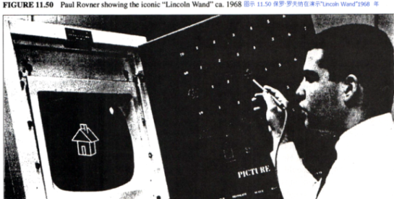
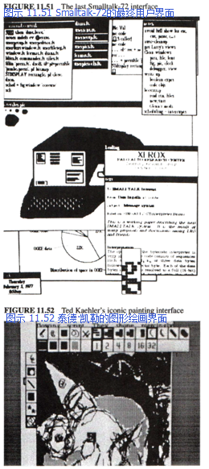

#### Smalltalk用户界面

由于目前全球有超过两千万人在使用“Smalltalk类型的”重叠窗口用户界面的衍生品，有几个评论家希望我多谈一些这个界面的发展过程。
它沿袭下去的历史和这个章节一样长，且迄今为止没人在它的身上倾尽笔墨。
我1989年的论文对其中的一些想法做了总结——这里让我再增加一些要点。

Smalltalk界面中最终应用的部分都能在六十年代的想法里找到——它们带来了存取数据的不同方式，并且激发了交互式系统的功能。
而这些想法有两个核心发源地——[林肯实验室（Lincoln Lab）](http://baike.baidu.com/item/%E6%9E%97%E8%82%AF%E5%AE%9E%E9%AA%8C%E5%AE%A4)和[兰德公司（Rand）](http://baike.baidu.com/item/%E5%85%B0%E5%BE%B7%E5%85%AC%E5%8F%B8)——它们皆由[美国国防部高级研究计划署（ARPA）](http://baike.baidu.com/item/ARPA)赞助。
后来由于学习型研究小组（LRG）将眼光放在了孩子们身上，一切发生了巨大的改变，这种改变将这些想法凝聚成强有力的理论，并带来了经久不衰的例证。
因此，过去我们一直在思考，学习可能是我们所喜闻乐见的主要影响之一。
早些时候，它使得用户界面的目的产生了九十度的转弯——从“使用功能”到“制造一个环境，用户们可以在操作中学习”。
这个新的目的可以与[蒙台梭利（Montessori ）](http://baike.baidu.com/item/%E7%8E%9B%E5%88%A9%E4%BA%9A%C2%B7%E8%92%99%E5%8F%B0%E6%A2%AD%E5%88%A9)和[杜威（Dewey）](http://baike.baidu.com/item/%E7%BA%A6%E7%BF%B0%C2%B7%E6%9D%9C%E5%A8%81)的回声共振，尤其是与前者。
它也让我重新阅读了[杰罗姆·布鲁纳（Jerome Bruner）](http://baike.baidu.com/item/%E6%9D%B0%E7%BD%97%E5%A7%86%C2%B7%E5%B8%83%E9%B2%81%E7%BA%B3)，这样我的思考就能超越孩子们现有的课程，跳转到“用户界面的课程”上面。

LRG小组有个特殊的目的就是寻找写作的等价物——就是在一个媒介中边学习边思考——这是我们新的“掌中宇宙（pocket universe）”。
出于多重原因，我决定通过“图标化编程（iconic programming）”来达到这个目的，这里我运用了六十年代ARPA所使用的图形表达。
我的朋友[尼古拉斯·尼葛洛庞帝（Nicholas Negroponte）](http://baike.baidu.com/item/%E5%B0%BC%E5%8F%A4%E6%8B%89%E6%96%AF%C2%B7%E5%B0%BC%E8%91%9B%E6%B4%9B%E5%BA%9E%E5%B8%9D?sefr=enterbtn)是位建筑师，他对环境如何对人的工作与创造性产生影响十分感兴趣。
他也着眼于将新兴电脑技术植入我们所熟悉的环境中去。
过去，我曾在剧院中呆过不少时日，也牢牢记住了[柯勒律治（Coleridge）](http://baike.baidu.com/item/%E6%9F%AF%E5%8B%92%E5%BE%8B%E6%B2%BB?sefr=enterbtn)的格言：“人们希望自己的记忆在‘糟糕的剧院’中流失，确竭力记住‘美好的剧院’中发生的一切”。
换句话说就是，激发观众智慧与体验的能力使得剧院一直运转下去。

把这些结合在一起，我们想营造一个自由的环境，探索于其中，我们能各得其所（蒙台梭利）；
这个环境能够容我们进行动觉上、图标上和符号上的学习——“用图像来创造符号”（皮亚杰&布鲁纳）；
用户不会被一种模式所限（GRAIL）；
它的神奇之处也往往植根于为我们所熟知的地方（内格罗蓬特）；
对于用户自身智慧，它也是台放大镜（柯勒律治）。
如果我们对此清楚明了，我们就能够直接过度到今天的设计阶段——这样的故事结尾棒极了。
实际上，[用户界面设计（UI design）](http://baike.baidu.com/item/%E7%94%A8%E6%88%B7%E7%95%8C%E9%9D%A2%E8%AE%BE%E8%AE%A1?sefr=enterbtn)始于扩充Smalltalk、设计针对儿童的实验、尝试理解图标的建立与不断探索其中的功能等等这样的开始与磨合中。
除了这些曲折的过程外，这一语境还迫使我们想出好的设计。
如同此时所有在帕克中心的人对UI设计都持有自己的见解，我们也不例外。
对于那数以百计的观点与讨论，我们也许能给予它们更具体的信任。
但将这些观点结合起来的人是丹·英格尔斯（Dan Ingalls），他不仅倾听了所有人的观点，为原创观点献言献策，并且一直坚持不懈进行设计以方便用户测试。
在确立语境、发明重叠窗口等等工作上我做了不少事情。
其中，阿黛尔（Adele）和我设计了大部分的实验。
除此之外，泰德·凯勒（Ted Kaehler）和访问学者罗恩·贝克尔（Ron Baecker）也做出了极大的贡献。
戴夫·史密斯（Dave Smith）设计出了SmallStar，这是[Xerox Star产品](http://www.baike.com/wiki/XEROX+8010)图形界面的原形【史密斯 83】。
同时，我还让道格·费尔班（Doug Fairbairn）对Notetaker产生了兴趣。
他设计出了一款极棒的“智能公交车（smart bus）”，它能够有效控制慢速[多处理器（multiple processors）](http://baike.baidu.com/item/%E5%A4%9A%E5%A4%84%E7%90%86%E5%99%A8%E7%B3%BB%E7%BB%9F?sefr=enterbtn)，且前景大好，尽管此时大部分帕克中心的成员认为我是疯了才会放弃ALTO运行迅速的双极硬件设备。
但我并不觉得这种双极设备能够安置进笔记本或Dynabook中。
另一方面，我很讨厌最近刚出现的8比特大小的[微指令（micros）](http://baike.baidu.com/item/%E5%BE%AE%E6%8C%87%E4%BB%A4?sefr=enterbtn)，这是因为它的设计又傻又天真——我并不觉得它的设计人员中有参与过软件设计。

