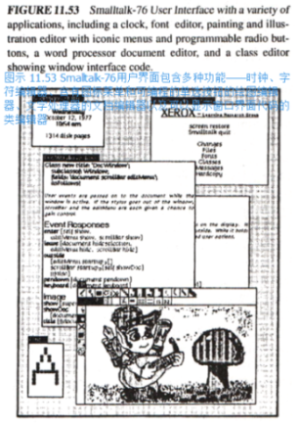
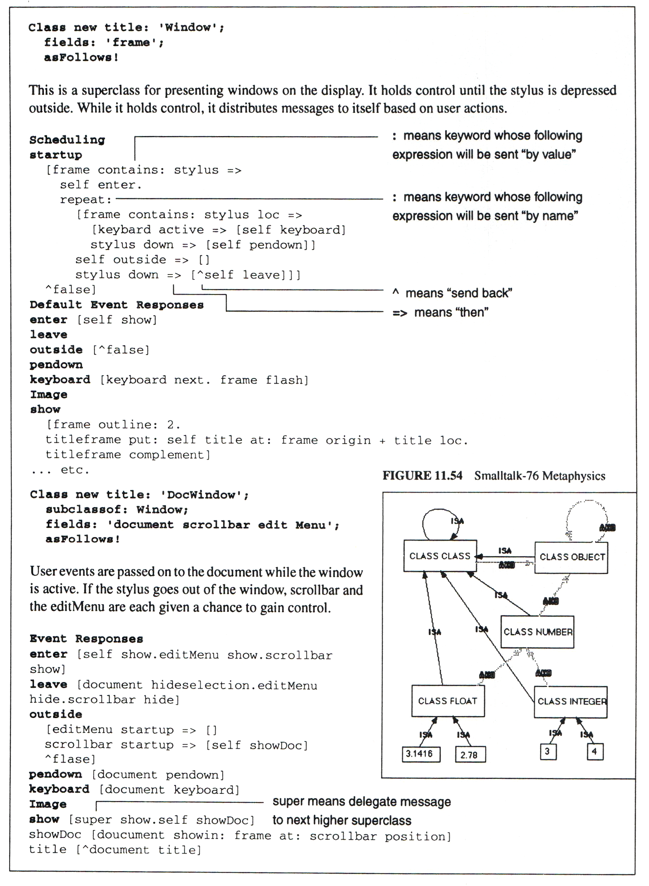
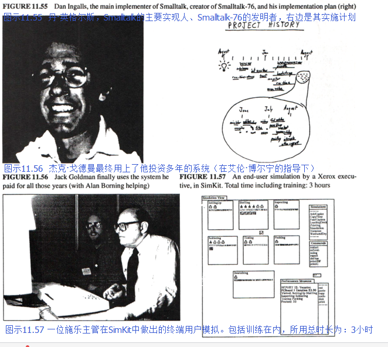
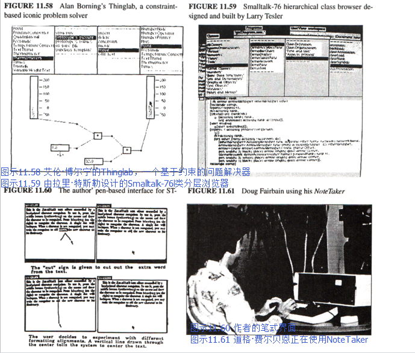

#### Smalltalk-76

11月丹（Dan）完成了Smalltalk-76的设计，并且在7个月的短短时间内，他、戴夫·罗伯森（Dave Robson）、泰德·凯勒（Ted Kaehler）和戴安娜·玛丽（Diana Merry）这个匆匆忙忙组成的小团队成功地将该系统投入使用（这一工作包含了重写所有现存类的定义）。
尽管我想要重新开始，他们的成绩还是令我颇为讶异。
这个系统很敏捷生动，能够解决“大”问题，并且使用起来很有趣。
它含有50个类，源代码约有180页。
这个系统包含所有OS功能、文件、打印和以太网服务、窗口界面、编辑器、绘图系统以及拉里·特斯勒（Larry Tesler）的两项贡献——继承等级中[静态方法（static method）](http://baike.baidu.com/item/%E9%9D%99%E6%80%81%E6%96%B9%E6%B3%95?sefr=enterbtn)所使用的浏览器和运行时间环境中调试所用的动态语境。
这是我们所有想法的集合，也是我们将Smalltalk一体化的愿景。
自此开始，所有Smalltalk的版本都牢牢围绕着这一概念。
这里诸多方面，如同[托尼·霍尔（Tony Hoare）](http://baike.baidu.com/item/%E6%89%98%E5%B0%BC%C2%B7%E9%9C%8D%E5%B0%94/65848?sefr=enterbtn)曾经评价ALTO的那样，在丹的Smalltalk-76面前，它的后代无出其右。

下面是丹所撰写的两种典型的Smalltalk-76的类：

尤其是在Window类中，为了使其他对象（或是代码本身）达到目标，要注意代码的表达方式。
Window超类的主要功能是关注各个事件，并将其当做消息分类至各个子类中。
这个例子说的是一个文件窗口（DocWindow的子类）要处理用户交互的影响。
Window类会注意到此时键盘的活动，并向其发送消息，该消息会被子类的方法（method）拦截。
如果这里没有方法，字母就会消失，而窗口也会一闪即逝。
在这种情况下，该类使用的是DocWindow的方法：键盘——它告诉暂存的文件要先检查一下。

1987年1月，Smalltalk进行了第一次真正意义上的测试。
CFL从施乐中心邀请了十名高层主管来帕克参加为期两天的软件研讨会。
该研讨会十分关注复杂性，并围绕着解决这一问题的方法进行讨论。
他们要求LRG小组让他们亲自体验终端用户编程，这样他们就能在每天1.5小时的会议中“做些实事”。
我当机立断，决定不教授他们如何使用Smalltalk-76（这显然是我“烧毁磁盘”的想法），取而代之，我们要在2个月内为那些非专业成人用户量身定做一款内容丰富的系统（丹的想法）。
于是，我们从“Simpula”[车间作业（job shop）](https://wenku.baidu.com/view/1fc939aef524ccbff12184dc.html)模拟模型开始，并打算为一般化的车间作业工具设计一个用户界面，这样这些主管们可以对其进行动态仿真，他们变化着的状态会通过将图标动画化在屏幕上显示出来。
我们把它称为Smalltalk SimKit。
在其中，每个人都倾尽了最大努力。
尽管那时阿黛尔（Adele）还生了孩子，她仍担任设计总监。
我仍记得那时她一边照顾蕾切尔（Rachell），一边在SimKit上进行调试的场景，这种记忆弥足珍贵。

那时有不少有趣的问题亟待解决。
该系统本身很直白，但它需要通过Smalltalk的proper函数密封起来，尤其是涉及错误消息的情况。
戴夫·罗宾森（Dave Robson）想出了一个不错的办法（它几乎是个专业系统）来捕捉Smalltalk中的申诉，并将其翻译成有意义的SimKit术语。
还有许多用户界面的细节——较为一般的如让浏览器只读取四个SimKit类（Station、Worker、Job、Report）；有些令人惊奇的如我们在十名同龄成人身上进行实验（他们是帕克中心的非技术人员），并发现他们并不能很好地阅读屏幕上的内容。
三十岁年龄段所习惯的小字体并不能被五十岁年龄段的人所接受。
不过这是介绍该系统的好时机，我们可以借此鼓励那些主管们选择不同的字体和大小，且他们能在不知不觉中学会使用鼠标。

这个“大日子”的早晨，泰德·凯勒（Ted Kaehler）打算对虚拟内存系统OOZE做出一些使其运行更快的改变。
我们紧张得都要忘了呼吸，但清晰的设计与操作人的自信使得一切进展顺利，主管们的亲身实践也取得了极大的成功。
第一场会议大概进行了一个小时，一位副总裁（他15年前用[FORTRAN](http://baike.baidu.com/item/FORTRAN?sefr=enterbtn)进行过一些编程）恍然发觉他正在编写程序，他一边若有所思道：“所以最终是这样啊。”
有十分之九的主管都能解决他们所感兴趣的模拟问题。
其中最有趣也最复杂的例子之一是施乐的一位高层完成了PC板的生产线模拟，他用真实的数字（他一直记在脑子里）来制作模型，而使用[闭型（closed form）](https://www.zhihu.com/question/51616557?from=profile_question_card)则很难解决这一问题——这就揭示出了在进行人员安排时一个重大的缺陷，这会提升产品制造平均缺陷率。

这时还出现了另一个重要的系统，它是艾伦•博宁（Alan Borning）【博宁 1979】的Thinglab——这是试图超越伊凡•苏泽兰（Ivan Sutherland）Sketchpad第一次真正意义上的尝试。
艾伦想出了一个非常巧妙的办法来处理约束，这些约束不需要处理人具备丰富的知识（或具有解决[费马大定理](http://baike.baidu.com/item/%E8%B4%B9%E9%A9%AC%E5%A4%A7%E5%AE%9A%E7%90%86/80363?sefr=enterbtn)的能力）。

我们能够看见，Smalltalk的“pushing”模式最终会被“pulling”模式所取代，这是由奠定不同方法的change函数和value函数推动的。
这个想法挺旧的，但Thinglab向我们展示了面向对象的定义如何自动应用于限制事件驱动的处理过程的语境。
并且，我们很快就会发现，“原型”比那些类更合适。
如果针对那些方法的类大体知道我们的打算（灵感来自帕特·温斯顿<Pat Winston>第二种模型），那么就能很好地服务于多重继承。

同时，NoteTaker变得更加真实、更大也更慢了。
此时我想运用的西部数据（Western Digital）仿真类芯片显示出要向“扩件（diffusion-ware）”发展的迹象，但我并不觉得最终这会实现。
我们开始寻找那些真正可靠的芯片，尽管它们的设计不尽如人意。
1978年，最好的备选就是[因特尔8086（Intel 8086）](http://baike.baidu.com/item/Intel%208086?sefr=enterbtn)这种16比特大小的芯片（它身上有不少8008和8080的缺点），但它（勉强）拥有胜任这些工作的能力——在ALTO身上我们将安装三块这种芯片，一块用于解释器，一块用于位映射图形（bitmapped graphic），还有一块用于i/o（联网等）。

