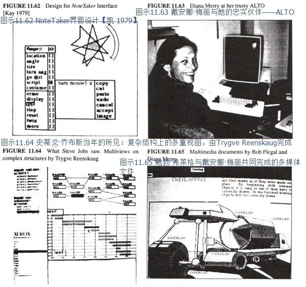

#### Smalltalk-76

11月丹（Dan）完成了Smalltalk-76的设计，并且在7个月的短短时间内，他、戴夫·罗伯森（Dave Robson）、泰德·凯勒（Ted Kaehler）和戴安娜·玛丽（Diana Merry）这个匆匆忙忙组成的小团队成功地将该系统投入使用（这一工作包含了重写所有现存类的定义）。
尽管我想要重新开始，他们的成绩还是令我颇为讶异。
这个系统很敏捷生动，能够解决“大”问题，并且使用起来很有趣。
它含有50个类，源代码约有180页。
这个系统包含所有OS功能、文件、打印和以太网服务、窗口界面、编辑器、绘图系统以及拉里·特斯勒（Larry Tesler）的两项贡献——继承等级中[静态方法（static method）](http://baike.baidu.com/item/%E9%9D%99%E6%80%81%E6%96%B9%E6%B3%95?sefr=enterbtn)所使用的浏览器和运行时间环境中调试所用的动态语境。
这是我们所有想法的集合，也是我们将Smalltalk一体化的愿景。
自此开始，所有Smalltalk的版本都牢牢围绕着这一概念。
这里诸多方面，如同[托尼·霍尔（Tony Hoare）](http://baike.baidu.com/item/%E6%89%98%E5%B0%BC%C2%B7%E9%9C%8D%E5%B0%94/65848?sefr=enterbtn)曾经评价ALTO的那样，在丹的Smalltalk-76面前，它的后代无出其右。

下面是丹所撰写的两种典型的Smalltalk-76的类：

尤其是在Window类中，为了使其他对象（或是代码本身）达到目标，要注意代码的表达方式。
Window超类的主要功能是关注各个事件，并将其当做消息分类至各个子类中。
这个例子说的是一个文件窗口（DocWindow的子类）要处理用户交互的影响。
Window类会注意到此时键盘的活动，并向其发送消息，该消息会被子类的方法（method）拦截。
如果这里没有方法，字母就会消失，而窗口也会一闪即逝。
在这种情况下，该类使用的是DocWindow的方法：键盘——它告诉暂存的文件要先检查一下。

1978年1月，Smalltalk进行了第一次真正意义上的测试。
CFL从施乐中心邀请了十名高层主管来帕克参加为期两天的软件研讨会。
该研讨会十分关注复杂性，并围绕着解决这一问题的方法进行讨论。
他们要求LRG小组让他们亲自体验终端用户编程，这样他们就能在每天1.5小时的会议中“做些实事”。
我当机立断，决定不教授他们如何使用Smalltalk-76（这显然是我“烧毁磁盘”的想法），取而代之，我们要在2个月内为那些非专业成人用户量身定做一款内容丰富的系统（丹的想法）。
于是，我们从“Simpula”[车间作业（job shop）](https://wenku.baidu.com/view/1fc939aef524ccbff12184dc.html)模拟模型开始，并打算为一般化的车间作业工具设计一个用户界面，这样这些主管们可以对其进行动态仿真，他们变化着的状态会通过将图标动画化在屏幕上显示出来。
我们把它称为Smalltalk SimKit。
在其中，每个人都倾尽了最大努力。
尽管那时阿黛尔（Adele）还生了孩子，她仍担任设计总监。
我仍记得那时她一边照顾蕾切尔（Rachell），一边在SimKit上进行调试的场景，这种记忆弥足珍贵。

那时有不少有趣的问题亟待解决。
该系统本身很直白，但它需要通过Smalltalk的proper函数密封起来，尤其是涉及错误消息的情况。
戴夫·罗宾森（Dave Robson）想出了一个不错的办法（它几乎是个专业系统）来捕捉Smalltalk中的申诉，并将其翻译成有意义的SimKit术语。
还有许多用户界面的细节——较为一般的如让浏览器只读取四个SimKit类（Station、Worker、Job、Report）；有些令人惊奇的如我们在十名同龄成人身上进行实验（他们是帕克中心的非技术人员），并发现他们并不能很好地阅读屏幕上的内容。
三十岁年龄段所习惯的小字体并不能被五十岁年龄段的人所接受。
不过这是介绍该系统的好时机，我们可以借此鼓励那些主管们选择不同的字体和大小，且他们能在不知不觉中学会使用鼠标。

这个“大日子”的早晨，泰德·凯勒（Ted Kaehler）打算对虚拟内存系统OOZE做出一些使其运行更快的改变。
我们紧张得都要忘了呼吸，但清晰的设计与操作人的自信使得一切进展顺利，主管们的亲身实践也取得了极大的成功。
第一场会议大概进行了一个小时，一位副总裁（他15年前用[FORTRAN](http://baike.baidu.com/item/FORTRAN?sefr=enterbtn)进行过一些编程）恍然发觉他正在编写程序，他一边若有所思道：“所以最终是这样啊。”
有十分之九的主管都能解决他们所感兴趣的模拟问题。
其中最有趣也最复杂的例子之一是施乐的一位高层完成了PC板的生产线模拟，他用真实的数字（他一直记在脑子里）来制作模型，而使用[闭型（closed form）](https://www.zhihu.com/question/51616557?from=profile_question_card)则很难解决这一问题——这就揭示出了在进行人员安排时一个重大的缺陷，这会提升产品制造平均缺陷率。

这时还出现了另一个重要的系统，它是艾伦•博宁（Alan Borning）【博宁 1979】的Thinglab——这是试图超越伊凡•苏泽兰（Ivan Sutherland）Sketchpad第一次真正意义上的尝试。
艾伦想出了一个非常巧妙的办法来处理约束，这些约束不需要处理人具备丰富的知识（或具有解决[费马大定理](http://baike.baidu.com/item/%E8%B4%B9%E9%A9%AC%E5%A4%A7%E5%AE%9A%E7%90%86/80363?sefr=enterbtn)的能力）。

我们能够看见，Smalltalk的“pushing”模式最终会被“pulling”模式所取代，这是由奠定不同方法的change函数和value函数推动的。
这个想法挺旧的，但Thinglab向我们展示了面向对象的定义如何自动应用于限制事件驱动的处理过程的语境。
并且，我们很快就会发现，“原型”比那些类更合适。
如果针对那些方法的类大体知道我们的打算（灵感来自帕特·温斯顿<Pat Winston>第二种模型），那么就能很好地服务于多重继承。

同时，NoteTaker变得更加真实、更大也更慢了。
此时我想运用的西部数据（Western Digital）仿真类芯片显示出要向“扩件（diffusion-ware）”发展的迹象，但我并不觉得最终这会实现。
我们开始寻找那些真正可靠的芯片，尽管它们的设计不尽如人意。
1978年，最好的备选就是[因特尔8086（Intel 8086）](http://baike.baidu.com/item/Intel%208086?sefr=enterbtn)这种16比特大小的芯片（它身上有不少8008和8080的缺点），但它（勉强）拥有胜任这些工作的能力——在ALTO身上我们将安装三块这种芯片，一块用于解释器，一块用于位映射图形（bitmapped graphic），还有一块用于i/o（联网等）。

丹一直以来都对NoteTaker很感兴趣，并且他想尝试把NoteTaker系统安装进Smalltalk-76中。
为了实现这一想法，该系统需要以256K的大小运行，这是我们为机器[RAM](http://baike.baidu.com/item/%E9%9A%8F%E6%9C%BA%E5%AD%98%E5%8F%96%E5%AD%98%E5%82%A8%E5%99%A8?sefr=enterbtn)设计的最大值。
ALTO中没有任何一个类似NOVA的模拟“[机器码（machine code）](http://baike.baidu.com/item/%E6%9C%BA%E5%99%A8%E7%A0%81?sefr=enterbtn)”能够胜任这些工作，并且系统还与内存相适应——只有磁盘，没有交换内存（swapping memory）。
在这些挑战驱动下，系统设计得到了显著改善。
泰德·凯勒（Ted Kaehler）的系统追踪（system tracer）（它可以为旧的版本写出新的虚拟内存）用于将Smalltalk-76克隆至NoteTaker中。
这里第一次出现了索引对象表（indexed object table）（它也用在Smalltalk-80中），其简化了访问对象的过程。
在堆栈语境下，他坚持做着一种实验：目的是为了节约空间并提升速度。
他重写了Smalltalk中大部分旧的机器码，并且整个机器内核的大小都缩减至6千比特的8086代码（并不是很强大）。

这些重建带来了颇为有趣的成效。
尽管在8086中，[BitBlt](http://baike.baidu.com/item/BitBlt?sefr=enterbtn)不如在ALTO中运行良好（且之前相当一部分用于图形的机器代码现在都用在了Smalltalkl中），但其解释器的整体速度则是ALTO的两倍（这是由于在ALTO上，有些Smalltalk的位码解释器不能适应其4k大小的微码内存）。
在进行了无数种形式的尝试后，（按丹的话来说）图形显示的缺憾得到了“最大程度上的弥补”。
这主要是由于ALTO没有足够大的微码内存来容纳所有Smalltalk仿真代码——其中有一部分不得不成为仿真的“NOVA”代码，它有两层解释。
事实上，NoteTaker运行得非常良好，尽管任何一台这样的笔记本都有崩溃的可能。
我们也曾重新回归台式机，它看上去与miniCOM如出一辙（若干年后又出现了几台这样的计算机）。
在电池的驱动下，NoteTaker运行良好，我们都很享受将它带上飞机、在35000英尺的高空运行这个面向对象且有着窗口界面的系统。

最终，我们又生产了大约10台这样的机器。
尽管在很多方面它都取得了设计上的成功，但我们的任务是通过它们培养出真正的终端用户，这也是我们最初的目标所在。
如果施乐（和帕克）大体支持这类想法，我们本有更多人力物力来实现这些梦想，且早在70年代它们初现端倪之时，我们就能一举成功。
因特尔CPU和惠普显示器的错误使用带来了遗憾，因为我们缺乏一种共同意愿——利用内部的技术专长。

现在是1979年，我们在正在做其中的一个demo，而这一次的观众们对此非常感兴趣，他们是[史蒂文·乔布斯（Steve Jobs）](http://baike.baidu.com/item/%E5%8F%B2%E8%92%82%E5%A4%AB%C2%B7%E4%B9%94%E5%B8%83%E6%96%AF/85300?sefr=enterbtn)、[杰夫·拉斯金（Jef Raskin）](http://baike.baidu.com/item/%E6%9D%B0%E5%A4%AB%C2%B7%E6%8B%89%E6%96%AF%E9%87%91?sefr=enterbtn)及其他苹果公司的技术人员。
他们启动了一个叫Lisa的项目，但并不知道去往何方，直到杰夫对史蒂夫说：“你应当参观一下帕克，看看他们在做什么”。
于是，在重叠窗口发明八年后、ALTO运行六年后，可以真正实现那些想法的人们出现了。
我们当时使用的机器叫Dorado，这是ALTO的“老大哥”，速度很快。
上面相当大一部分Smalltalk微码由布鲁斯·霍恩（Bruce Horn）写就，他是最初几个参与Smalltalk教学的孩子之一，那时他还是个青少年。
拉里·特斯勒（Larry Tesler）在丹（Dan）的从旁协助下向大家展示了demo的主要内容，而阿黛尔（Adele）和我则在后面观看。
其中最棒的部分就是，当乔布斯提出他不喜欢blt模式的滚动形式，问我们能否换一种更流畅而连续的形式。
丹花了不到一分钟就想出了办法，他做出了（相当大的）改变，并且滚动形式真的变成了连续形式！
这让来访者倍感惊讶，尤其是那些程序员们，因为他们从未见过如此强大的增量系统。

史蒂夫曾试图从施乐（当时它是苹果少数几个风险投资人之一）获取/购买我们的技术，但施乐并不打算将技术卖给别人，也不提供资源和资金让我们继续在研究中心里发展NoteTaker和Smalltalk。
