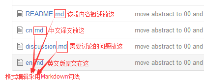

# EHS-CN

## The Early History of Smalltalk (Collaborative Chinese Translation)

[进展 | progress](progress/README.md)

## Smalltalk的早期歷史（中文聯合翻譯）

[Original | 原文](https://github.com/steam-maker/EarlyHistoryOfSmalltalk)

- [Abstract](00)
- [Introduction](01)
- [I. 1960-66—Early OOP and other formative ideas of the sixties](02)
- [II. 1967-69—The FLEX Machine, a first attempt at an OOP-based personal computer](03)
- [III. 1970-72—Xerox PARC: The KiddiKomp, miniCOM, and Smalltalk-71](04)
- [IV. 1972-76—The first real Smalltalk (-72), its birth, applications, and improvements](05)
- [V. 1976-80—The first modern Smalltalk (-76), its birth, applications, and improvements](06)
- [VI. 1980-83—The release version of Smalltalk (-80)](07)

## 规则：
* 根据参加的人数来分配每个人负责翻译的段落
* 每个人都可以做审译，通过pull request来对译文进行修改
* 值得商讨的问题可以专门开一个Issue进行讨论，解决后我们会把该Issue关闭
* 希望所有人先对[全文](http://worrydream.com/EarlyHistoryOfSmalltalk)有个整体的把握
* [报名和进度报告](https://github.com/steam-maker/EHS-CN/issues/18)

## 基本布局
* 上面的章节
* 文件夹内如图所示：
  
  

* 几个页面间的切换

  
  
## 格式
* 用Markdown句法编辑格式（见[Wiki页](https://github.com/steam-maker/EHS-CN/wiki)）

## 编辑媒介
* 简单：GitHub
* 高效：Git（见Wiki页）

## 预期结果
* 据说。。完成以后会发给[作者本人](https://en.wikipedia.org/wiki/Alan_Kay)( ╯▽╰)
* 并不可知。因为，[BBN](https://en.wikipedia.org/wiki/BBN_Technologies)在成为[发明互联网](https://monoskop.org/images/e/ee/Hafner_Katie_Lyon_Matthew_Where_Wizards_Stay_Up_Late_The_Origins_Of_The_Internet.pdf)的BBN之前，他们也不知道未来自己会这么牛（⊙ ω ⊙ ）

## 翻译方法：
* 先做到“信”，摸清楚作者的**意图**和**逻辑**（作者的point of view）
* 翻译计算机类术语时保留英文，译文在后面加括号呈现，如：
  
  > class （类）

* 原文中尚不明确要通过上下文以及其它资料推断的概念可以先用加粗在译文中标出，并用括号标注对应的单词，然后写在discussion文件里，如`02/01/cn.md`（这是我们在合作中很重要的一环，因为**每个人的观点**都很重要）：

 > 新**观点**（idea）在**内外**（within and without）方面都经历了许多阶段才被接受。
 
 > discussion文件中**写清楚你的问题和可能的推断**：这个idea具体指什么？within and without又指什么？
 
 > 可能的推断：within指这个idea本身，without指外界对这个idea的认可 （该判断基于下文内容）
 
* 完成一段翻译后如果可能的话，请尝试用一个**第一次看到这篇文字的普通读者的角度**来读译文，这样可以帮助您在第一环节发现一些不自然的地方，保证语言的通顺流畅
 
## 相关资料
* Alan Kay：
  * [1](https://en.m.wikipedia.org/wiki/Alan_Kay)
  * [2](http://www.well.com/user/hlr/texts/Alan%20Kay)
  * [3](http://amturing.acm.org/award_winners/kay_3972189.cfm)
  

