## 摘要

大多数想法都有源可溯。六十年代，尤其是在ARPA社区，由于互动分时计算器、图形屏幕以及点控设备的发明，“人机共存”这一理念开始进入人们的视野。**为了模仿炼油厂和半智能行为之类的复杂系统**（simulate complex systems such as oil refineries and semi-intelligent behavior），人们发明了高级计算机语言。随着人们不再简单地把六十年代的工作看成是“**新瓶装旧酒**”（better old thing），对个人电脑、重叠操作窗口界面（overlapping window interfaces）和面向对象设计（object-oriented design）的看法也会不可避免地发生改变。这带来了方方面面的发展：实行大型机计算、实现终端用户自行调用功能、让数据结构更加抽象。为了取代过去让计算/美元/产量呈指数增长的目的，我们需要把六十年代看成是“一瓶新酒”，同时进一步探索什么可能成为真正“新的东西”。例如，人们可能在不连接公共主机的情况下操作[Dynabook掌上电脑](http://baike.baidu.com/link?url=vEmk8r_cNg1vHEhdY-0B7PXxBX6Qa0brLPg7nPJojGZ6CCqrRLMAu2Kr1_dOM4D95iiZOHzuNyCxUktP51oIAK)；而上百万个潜在用户的存在则意味着用户界面可能会变成如[蒙台梭利](http://baike.baidu.com/link?url=xye4sDiepagjrQsB50tjIcTv2jOIHaSaNnRqCyoEEuHOaFXkgZc29OTxFd8EZpI_NK8YAeRK1ZxzPZHGfoO3kuobOuD2Ethb_7ihn_-CuVLMh_6KSVER9OrxD3it-bdI0U6LUGOEF9ZPgEAp5ZO5mK)和[布鲁纳](http://baike.baidu.com/link?url=ryJJZjvXbPim8VoWFtZrisrqdTwcujOYtbk7YNsQAfFijBE8_xKjFdRoUGFfr-OWadAf8YMCUXx9geKjVKYMCa#2)所构想的学习环境；针对扩大范围、减小复杂度和提高终端用户使用能力的需要，**我们要找到一个更加安全、且更为人普遍接受的方式来取代过去的数据和控制结构——即仅仅通过消息的交互就能模拟出任何用户想要的行动**（would require that data and control structures be done away with in favor of a more biological scheme of protected universal cells interacting only through messages that could mimic any desired behavior）。

## Abstract

Most ideas come from previous ideas. The sixties, particularly in the ARPA community, gave rise to a host of notions about "human-computer symbiosis" through interactive time-shared computers, graphics screens and pointing devices. Advanced computer languages were invented to simulate complex systems such as oil refineries and semi-intelligent behavior. The soon-to-follow paradigm shift of modern personal computing, overlapping window interfaces, and object-oriented design came from seeing the work of the sixties as something more than a "better old thing." This is, more than a better way: to do mainframe computing; for end-users to invoke functionality; to make data structures more abstract. Instead the promise of exponential growth in computing/$/volume demanded that the sixties be regarded as "almost a new thing" and to find out what the actual "new things" might be. For example, one would compute with a handheld "Dynabook" in a way that would not be possible on a shared mainframe; millions of potential users meant that the user interface would have to become a learning environment along the lines of Montessori and Bruner; and needs for large scope, reduction in complexity, and end-user literacy would require that data and control structures be done away with in favor of a more biological scheme of protected universal cells interacting only through messages that could mimic any desired behavior.

早期的Smalltalk语言首当其冲，把从硬件、语言和用户界面设计这些方面由来已久的观点变为现实。从某种程度上看来，它是新计算范型的榜样，因为那时，我们确实尝试着对大家深信不疑的结构做出质的调整——本着与发明印刷媒体相同的精神，我们发明了新型的库恩范式——也正是因为如此，我们占领了这个领域的制高点，这让我们几乎成为了发明这些新形式的推手。

Early Smalltalk was the first complete realization of these new points of view as parented by its many predecessors in hardware, language and user interface design. It became the exemplar of the new computing, in part, because we were actually trying for a qualitative shift in belief structures—a new Kuhnian paradigm in the same spirit as the invention of the printing press—and thus took highly extreme positions which almost forced these new styles to be invented.


## 介绍

我在三万五千尺的高空撰写这篇介绍。我膝上的写作工具是台五磅重的笔记本电脑——1992年出品的Interim Dynabook——到该年的年底，这款笔记本的售价低于700美元。它的屏幕扁平且干净，拥有很高的分辨率、位图显示。该款笔记本还拥有重叠视窗、图标、定位装置、相当大的内存和计算能力，它最好的软件是面向对象设计的。它有内置的先进网络体系，也可使用无线网。这一系统是我目前在给孩子们使用的主要系统之一，由Smalltalk语言运行。一方面，（从分量上来看）这不仅仅是个Dynabook笔记本电脑，而另一方面，（质量上看来），这离理想还有相当大的距离。总而言之，它几乎凝聚了六十年代末的所有想法。

## Introduction

I'm writing this introduction in an airplane at 35,000 feet. On my lap is a five pound notebook computer—1992's "Interim Dynabook"—by the end of the year it sold for under $700. It has a flat, crisp, high-resolution bitmap screen, overlapping windows, icons, a pointing device, considerable storage and computing capacity, and its best software is object-oriented. It has advanced networking built-in and there are already options for wireless networking. Smalltalk runs on this system, and is one of the main systems I use for my current work with children. In some ways this is more than a Dynabook (quantitatively), and some ways not quite there yet (qualitatively). All in all, pretty much what was in mind during the late sixties.

Smalltalk是[美国国防部高级研究计划署（ARPA）](http://baike.baidu.com/view/68809.htm)，以及之后[施乐帕克研究中心（Xerox PARC）](http://baike.baidu.com/view/616837.htm)所研究的项目之一，我把它叫做个人计算（Personal Computing）。由于参与每个环节的人数不胜枚举，我们很难准确地把某个想法的诞生归功于个人。于是，正如**鲍勃·巴顿（Bob Barton）**热衷于引用的歌德名言，我们应当“用分享发现的兴奋取代论功行赏的徒然”。

Smalltalk was part of this larger pursuit of ARPA, and later of Xerox PARC, that I called personal computing. There were so many people involved in each stage from the research communities that the accurate allocation of credit for ideas is intractably difficult. Instead, as Bob Barton liked to quote Goethe, we should "share in the excitement of discovery without vain attempts to claim priority."


这里，我会告诉您这些影响大多来自哪里、在新的个人计算的迷人领域中，它们又是如何进行转变的。行走在发明Smalltalk的道路上，好点子与态度同等重要。这一时期，许多我所敬佩的人们——如[伊凡·苏泽兰（Ivan Sutherland）](http://baike.baidu.com/view/734359.htm)、[马文·明斯基（Marvin Minsky）](http://baike.baidu.com/view/406805.htm)、[西蒙·派珀特（Seymour Papert）](http://baike.baidu.com/view/4370843.htm)、[戈登·摩尔（Gordon Moore）](http://baike.baidu.com/view/59874.htm)、鲍勃·巴顿（Bob Barton）、戴夫·埃文斯（Dave Evans）、[巴特勒·拉姆泼逊（Butler Lampson）](http://baike.baidu.com/view/2009279.htm)、[杰罗姆·布鲁纳（Jerome Bruner）](http://baike.baidu.com/view/250170.htm)等——他们都极为严谨，尽管他们的发明在一定的标准下都很完美，但他们深知自己离跨过专业领域的[绝对阈限（absolute threshold）](http://baike.baidu.com/view/660654.htm)还有很长一段距离。狭隘的人只把目光放在接受万人膜拜的结果上，真正伟大的人却只致力于寻找攻克难题的捷径。牛顿说他站在巨人的肩膀上可以看得更远，而这些所谓的“计算机科学家”往往只把眼光放在互踩脚趾的掐架上。但即便是站在了巨人的肩膀上，很多人还是目光短浅——比起埋头审视这个圈内的东西，我们更该把目光放在圈外更遥远的地方——当然，如果你带着对审美和批评及其敏感的有色眼镜，那你也是看不远的。

I will try to show where most of the influences came from and how they were transformed in the magnetic field formed by the new personal computing metaphor. It was the attitudes as well as the great ideas of the pioneers that helped Smalltalk get invented. Many of the people I admired most at this time—such as Ivan Sutherland, Marvin Minsky, Seymour Papert, Gordon Moore, Bob Barton, Dave Evans, Butler Lampson, Jerome Bruner, and others—seemed to have a splendid sense that their creations, though wonderful by relative standards, were not near to the absolute thresholds that had to be crossed. Small minds try to form religions, the great ones just want better routes up the mountain. Where Newton said he saw further by standing on the shoulders of giants, computer scientists all too often stand on each other's toes. Myopia is still a problem where there are giants' shoulders to stand on—"outsight" is better than insight—but it can be minimized by using glasses whose lenses are highly sensitive to esthetics and criticism.


编程语言有好几种分类：[命令式（imperative）](http://baike.baidu.com/view/12112865.htm)、应用式（applicative）、基于逻辑（logic-based）、[面向问题（problem-oriented）](http://baike.baidu.com/view/1775690.htm)。但它们不是“黏着式（agglutination of features）”，就是“结晶式（crystallization of style）”。前者有[ COBOL](http://baike.baidu.com/view/90933.htm)、PL/1、[Ada](http://baike.baidu.com/subview/163225/9550548.htm#viewPageContent)等，而[LISP](http://baike.baidu.com/subview/293795/6732872.htm)、[APL](http://baike.baidu.com/item/APL/17767419#viewPageContent)和Smalltalk则属于后者。无独有偶，集体都提倡使用黏着语，而个人则强调结晶语。

Programming languages can be categorized in a number of ways: imperative, applicative, logic-based, problem-oriented, etc. 
But they all seem to be either an "agglutination of features" or a "crystallization of style." 
COBOL, PL/1, Ada, etc., belong to the first kind; LISP, APL— and Smalltalk—are the second kind. 
It is probably not an accident that the agglutinative languages all seem to have been instigated by committees, and the crystallization languages by a single person.

Smalltalk的设计——和存在——源于一种深刻见解：**对任何事物的描述都可以通过一种递归组合来呈现，这种递归组合由单一的行为构件组成，这些构件隐藏了自身内部的规定和进程，并且仅仅通过消息的交换就能对其进行处理。**（is due to the insight that everything we can describe can be represented by the recursive composition of a single kind of behavioral building block that hides its combination of state and process inside itself and can be dealt with only through the exchange of messages）

哲学上来看，Smalltalk的对象与[莱布尼茨（Leibniz）](http://baike.baidu.com/view/277584.htm)提出的[单子（monads）](http://baike.baidu.com/view/782383.htm)以及一些20世纪的物理学和生物学概念有许多共同之处。

它创造对象的方式很柏拉图，其中的一些对象是些理想化的概念——想法（ideas）——从中可以衍生出其他表现（manifestation）。

**这些想法是（“想法-想法（Idea-Idea）”的）自我表现，而“想法-想法”则是一种“表现-想法（Manifestation-Idea）”——这也是其自身的一种属性**（That the Ideas are themselves manifestations (of the Idea-Idea) and that the Idea-Idea is a-kind-of Manifestation-Idea—which is a-kind-of itself, so that the system is completely self-describing），因此，这一系统完全是自描述的——柏拉图会把它当成一个相当实用的玩笑来欣赏[【柏拉图（Plato）】](http://baike.baidu.com/subview/996/11214863.htm)。

Smalltalk's design—and existence—is due to the insight that everything we can describe can be represented by the recursive composition of a single kind of behavioral building block that hides its combination of state and process inside itself and can be dealt with only through the exchange of messages. Philosophically, Smalltalk's objects have much in common with the monads of Leibniz and the notions of 20th century physics and biology. Its way of making objects is quite Platonic in that some of them act as idealizations of concepts—Ideas—from which manifestations can be created. That the Ideas are themselves manifestations (of the Idea-Idea) and that the Idea-Idea is a-kind-of Manifestation-Idea—which is a-kind-of itself, so that the system is completely self-describing— would have been appreciated by Plato as an extremely practical joke [Plato].


在计算机术语中，Smalltalk是基于计算机本身概念的一种递归（recursion）(见[讨论](discussion.md))。它并没有把“计算机中的事物”分割成一个个弱化了的部分——如数据结构（ data structures）、流程（procedures）和函数（functions），它们都是编程语言中不可或缺的部分——在计算机整个运行过程中，每个Smalltalk的对象都是递归的。因此，语义上来看，这就像一个非常迅速的网络连接着成千上万的计算机。由于我们主要关心的是电脑行为是否恰当，或者如何具体解决结果意外关闭或返回太慢的问题，于是到了要解决具体呈现的问题时，我们会无限期地拖延。

In computer terms, Smalltalk is a recursion on the notion of computer itself. Instead of dividing "computer stuff" into things each less strong than the whole—like data structures, procedures, and functions which are the usual paraphernalia of programming languages—each Smalltalk object is a recursion on the entire possibilities of the computer. Thus its semantics are a bit like having thousands and thousands of computers all hooked together by a very fast network. Questions of concrete representation can thus be postponed almost indefinitely because we are mainly concerned that the computers behave appropriately, and are interested in particular strategies only if the results are off or come back too slowly.

尽管Smalltalk有着高贵的血统，它仍是个新兴范式——无论是专业程序员用其来解决一些大问题，还是新手做一些小项目——我都把它称为面向对象的范式。在模拟那些尤其复杂的动力系统以及用户关系时，这种面向对象的设计都让效率有了质的提升。

Though it has noble ancestors indeed, Smalltalk's contribution is a new design paradigm—which I called object-oriented—for attacking large problems of the professional programmer, and making small ones possible for the novice user. Object-oriented design is a successful attempt to qualitatively improve the efficiency of modeling the ever more complex dynamic systems and user relationships made possible by the silicon explosion.


> “我们可从他人的成果中窥见其所思所想。”——[理查德·哈明（Richard Hamming）](http://baike.baidu.com/view/406803.htm)

> “记忆与想象乃属同源。”——[托马斯·霍布斯（Thomas Hobbes）](http://baike.baidu.com/view/881849.htm)

在这篇历史中，我将依照哈明和霍布斯的指引。先前，由于我一直将个人感情——而非编程系统的设计——看作是个人电脑拓展人类认知范围的核心，于是对我来说，描述Smalltalk是困难的——当然，我们现在也还没进行到那步。尽管发明Smalltalk是我起的头，但这一成果永远属于实现其在实际中的运用及推广的人们，这些人中尤其值得提到的是丹·英戈尔斯（Dan Ingalls）和阿黛勒·戈德堡（Adele Goldberg）。每个LRG的成员们都为这个项目进行了深入的探讨、花费了巨大的心血，我多希望能有足够的空间把每个人的功绩娓娓道来。但我想，把丹封为Smalltalk研发中的核心人物是众望所归。编程的本质是种实践艺术，通过编程，我们能创造新的事物，而这些新事物又推动我们去**实际使用它们**（implementation）。事实上，许多小众的计算机语言仍在使用的原因不是它们具备多少优点，而是有一、两种机器仍在使用它们、它们拥有**引导程序**（bootstrap）的能力等等。然而，丹不仅仅是个伟大的**实践者**（implementer），无论是发明语言本身还是Smalltalk在实际运用中与用户的互动方面，他都越来越像个设计者了。

> "We would know what they thought when they did it."
> — Richard Hamming

> "Memory and imagination are but two words for the same thing."
> — Thomas Hobbes

In this history I will try to be true to Hamming's request as moderated by Hobbes' observation. I have had difficulty in previous attempts to write about Smalltalk because my emotional involvement has always been centered on personal computing as an amplifier for human reach—rather than programming system design—and we haven't got there yet. Though I was the instigator and original designer of Smalltalk, it has always belonged more to the people who make it work and got it out the door, especially Dan Ingalls and Adele Goldberg. Each of the LRGers contributed in deep and remarkable ways to the project, and I wish there was enough space to do them all justice. But I think all of us would agree that for most of the development of Smalltalk, Dan was the central figure. Programming is at heart a practical art in which real things are built, and a real implementation thus has to exist. In fact many if not most languages are in use today not because they have any real merits but because of their existence on one or more machines, their ability to be bootstrapped, etc. But Dan was far more than a great implementer, he also became more and more of the designer, not just of the language but also of the user interface as Smalltalk moved into the practical world.


这里，我想把重心着重放在Smalltalk-72的发明及其向现代版的Smalltalk-76的转型上面。大多数的观点都来源于此，并且那些早期的[面向对象编程（OOP）](http://baike.baidu.com/view/63596.htm)鲜有踪迹可循。

Here, I will try to center focus on the events leading up to Smalltalk-72 and its transition to its modern form as Smalltalk-76. Most of the ideas occurred here, and many of the earliest stages of OOP are poorly documented in references almost impossible to find.


这段历史太漫长了，但是那一大串仅仅带来了负面影响或完全没有任何好处的人名和系统着实令我讶异。很抱歉，我无法用更多的笔墨来介绍Bob Balzer、Bob Barton、 Danny Bobrow、Steve Carr、 Wes Clark、 Barbara Deutsch,、 Peter Deutsch、Bill Duvall、 Bob Flegal、 Laura Gould、 Bruce Horn、 Butler Lampson、 Dave Liddle、 William Newman、 Bill Paxton、 Trygve Reenskaug、Dave Robson、Doug Ross、 Paul Rovner、 Bob Sproull、 Dan Swinehart、 Bert Sutherland、 Bob Taylor、Warren Teitelman、 Bonnie Tennenbaum、 Chuck Thacker、 和 John Warnock。更抱歉的是，我没有花些笔墨在那些我个人不喜却在反馈中带来一些相当有用的想法和观点的系统上。换句话说就是，不要太较真地相信“历史”，把它们当成是演员散场已久的“动作回放”。

This history is too long, but I was amazed at how many people and systems that had an influence appear only as shadows or not at all. I am sorry not to be able to say more about Bob Balzer, Bob Barton, Danny Bobrow, Steve Carr, Wes Clark, Barbara Deutsch, Peter Deutsch, Bill Duvall, Bob Flegal, Laura Gould, Bruce Horn, Butler Lampson, Dave Liddle, William Newman, Bill Paxton, Trygve Reenskaug, Dave Robson, Doug Ross, Paul Rovner, Bob Sproull, Dan Swinehart, Bert Sutherland, Bob Taylor, Warren Teitelman, Bonnie Tennenbaum, Chuck Thacker, and John Warnock. Worse, I have omitted to mention many systems whose design I detested, but that generated considerable useful ideas and attitudes in reaction. In other words "histories" should not be believed very seriously but considered as "FEEBLE GESTURES OFF" done long after the actors have departed the stage.


谢谢那些试读者不厌其烦地为草稿提出自己的看法。尤其感谢Mike Mahoney的无私帮助，我仔细考虑了他的建议，这让整篇文章更上一层楼——也要感谢我的故交Jean Sammet，他一直“恐吓”我快点完成——我不敢想象我的拖延会带来什么后果。同时也要感谢Sherri McLoughlin 和 Kim Rose，他们在整合所有的材料方面给予了巨大帮助。

Thanks to the numerous reviewers for enduring the many drafts they had to comment on. Special thanks to Mike Mahoney for helping so gently that I heeded his suggestions and so well that they greatly improved this essay—and to Jean Sammet, an old old friend, who quite literally frightened me into finishing it—I did not want to find out what would happen if I were late. Sherri McLoughlin and Kim Rose were of great help in getting all the materials together.


尽管有诸多动机导致面向对象程序的发明，其中有两个是核心的。大范围上的动机就是为需要隐藏细节的复杂系统想出一个更好的模块方案；而小范围上的则是找到一个更灵活的任务版本，然后尝试着一并解决。与大多数新观点的产生一样，它的产生独立且断断续续。

Though OOP came from many motivations, two were central. The large scale one was to find a better module scheme for complex systems involving hiding of details, and the small scale one was to find a more flexible version of assignment, and then to try to eliminate it altogether. As with most new ideas, it originally happened in isolated fits and starts.


新观点在内外方面都经历了许多阶段才被接受。
在内部，
思想序列变动从几次“几乎不可见”模式，
到注意到但未感知它“广阔”的多样性，
接着在多个领域被使用，
然后经历大转变，
模式变成了新思考方式的核心，
最终转变为与它原始分离相同的僵化宗教。
在外部，
正如Schopenhauer指出，
新的观点被视作疯子的作品，
几年后被认为是显而易见的，
最终原谴责者会声称发明了它。

无论在内部还是外部，
新想法都要经历几番接受的过程。
在内部，
这种序列从若干次的“难以窥见”其模式开始转变；
然后人们注意到了它，
却无法理解它“包罗万象的”要义；
于是他们把其应用在一些领域的操作中，
随之而来的是一场“大循环”，
这一模式会在其中成为新的思考方式的核心；
最终，
它会变成顽固的信仰——与曾经从中分离出来的那个信仰异曲同工。
在外部，
诚如[叔本华（Schopenhauer）](http://baike.baidu.com/view/440746.htm)所言，
新观点总是被当成疯言疯语抨击，
但若干年后人们就会觉得它显而易见且理所当然，
最终，
那些曾经的抨击者会声称他们是这个观点的发明者。


New ideas go through stages of acceptance, both from within and without. 
From within, 
the sequence moves from "barely seeing" a pattern several times, 
then noting it but not perceiving its "cosmic" significance, 
then using it operationally in several areas, 
then comes a "grand rotation" in which the pattern becomes the center of a new way of thinking, 
and finally, 
it turns into the same kind of inflexible religion that it originally broke away from. 
From without, 
as Schopenhauer noted, 
the new idea is first denounced as the work of the insane, 
in a few years it is considered obvious and mundane, 
and finally the original denouncers will claim to have invented it.


**上述观点在进程中有迹可循，大约在1961年，一位程序员参与了美国空军b220文件的版式设计，经过了若干次操作，我“难于窥见”他的想法**（True to the stages, I "barely saw" the idea several times ca. 1961 while a programmer in the Air b220 file format Force）。
起初，他们将Burroughs 220用于把来自一个空军司令部设备的文件传输到另一个空军司令部的设备上去。
由于没有标准的操作系统或文件格式，一些设计者（如今我们并不知道他们是谁）想出了一种巧妙的方法解决这一问题，他们把每个文件都分成了三个部分。
其中，第三个部分包含了所有真正的数据，它们以任意的大小和形式存在。
第二个部分则包含了B220的程序，它知道如何处理记录与字段来对第三部分进行复制与更新。
第一个部分则是一组数列或是第二部分的程序里进入点中的相应指示（最初的指示存在于一个标准指令中，这个指令代表着一些标准含义）。
这个想法的妙处无需赘述，它也应用于后来的一些系统中，并且直到[COBOL](http://baike.baidu.com/view/90933.htm)的强制使用取代了它的存在。


第二次的“难于窥见”随后发生在ATC打算让B5000取代220的时候。
我当时并不真正的欣赏它，但我确实注意到它分段式的储存系统、[HLL](http://baike.baidu.com/view/1190296.htm)编译以及字节码执行（byte-coded execution）带来的效率、为子程序调用（subroutine calling）和多进程转换（multiprocess switching）的自动调整结构、可分享的干净代码、保护机制等。
同时，**我也看见其使用的程序参照表（Program Reference Table）就相当于220文件系统方案为组件提供的一个过程接口（procedural interface）**(I saw that the access to its Program Reference Table corresponded to the 220 file system scheme of providing a procedural interface to a modul)**。
但是，当时我在这个机器身上的重大发现不是它面向对象的想法，而是其中对HLL翻译与评估的一些洞见。【Barton, 1961】【Burroughs, 1961】

True to the stages, I "barely saw" the idea several times ca. 1961 while a programmer in the Air  b220 file format Force. 
The first was on the Burroughs 220 in the form of a style for transporting files from one Air Training Command installation to another.
There were no standard operating systems or file formats back then, so some (to this day unknown) designer decided to finesse the problem by taking each file and dividing it into three parts. 
The third part was all of the actual data records of arbitrary size and format. 
The second part contained the B220 procedures that knew how to get at records and fields to copy and update the third part. 
And the first part was an array or relative pointers into entry points of the procedures in the second part (the initial pointers were in a standard order representing standard meanings). 
Needless to say, this was a great idea, and was used in many subsequent systems until the enforced use of COBOL drove it out of existence.


The second barely-seeing of the idea came just a little later when ATC decided to replace the 220 with a B5000. 
I didn't have the perspective to really appreciate it at the time, but I did take note of its segmented storage system, its efficiency of HLL compilation and byte-coded execution, its automatic mechanisms for subroutine calling and multiprocess switching, its pure code for sharing, its protection mechanisms, etc. 
And, I saw that the access to its Program Reference Table corresponded to the 220 file system scheme of providing a procedural interface to a module. 
However, my big hit from this machine at this time was not the OOP idea, but some insights into HLL translation and evaluation. [Barton, 1961] [Burroughs, 1961]


继空军之后，我在课余会进行勤工俭学，而我大部分的工作是在为国家大气研究中心（National Center for Atmospheric Research）的大批量天气数据采集读取系统编程。
那时我对一般的仿真模拟产生了兴趣——尤其是用一个机器模仿另一个——但是除了在一台CDC6600上制作一个一维的域位块转换（[bitblt](http://baike.baidu.com/view/1080366.htm)）用以模仿各种机器的字体大小外，我大部分的注意力都分散在了学校上，或者我该具体点说，是学校的剧场里。
在奇帕瓦福尔斯（Chippewa Falls）对6600进行调试（debug）的同时，我读了[戈登·摩尔（Gordon Moore）](http://baike.baidu.com/view/59874.htm)的一篇文章，里面预测了芯片上集成硅（integrated silicon）的密度会呈指数般地上升，同时成本会下降【摩尔 65】。
1965年的这个时候，当我站在房间般大小、依靠氟利昂降温的10 MIP 6600旁时，摩尔惊骇世俗的预测对我来说遥远而缥缈。


After the Air Force, I worked my way through the rest of college by programming mostly retrieval systems for large collections of weather data for the National Center for Atmospheric Research. I got interested in simulation in general—particularly of one machine by another—but aside from doing a one-dimensional version of a bit-field block transfer (bitblt) on a CDC 6600 to simulate word sizes of various machines, most of my attention was distracted by school, or I should say the theatre at school. While in Chippewa Falls helping to debug the 6600, I read an article by Gordon Moore which predicted that integrated silicon on chips was going to exponentially improve in density and cost over many years [Moore 65]. At the time in 1965, standing next to the room-sized freon-cooled 10 MIP 6600, his astounding predictions had little projection into my horizons.


## Sketchpad和Simula

经历了几番波折，1966年的秋天，“懵懂无知”的我怀着激动的心情来到犹他大学攻读硕士学位。我所说的“懵懂无知”是指，我从未听过ARPA和它的项目，也不曾知晓犹他大学的主要目标是解决3D图案中的“隐藏线（hidden lines）”问题，直到我走进戴夫·埃文的办公室想要谋得一官半职。
戴夫的桌上堆着一英尺高的棕皮文件，他抽出了其中一本递给我：“拿去读一读。”

这份文件每个新来的人人手一本，它的题目叫《Sketchpad：一个人机图像交流系统》（Sketchpad: A man-machine graphical communication system）【苏泽兰 1963】。
这个机器的功能非常引人注目，并且我所认识的计算机用户对此一无所知。
这里有三个很好领悟的想法：这是一个现代交互式计算机制图方面的发明；那些“原图（master drawing）”最终都能够变成“实物（instance drawing）”；控制与动力都由“约束（constraints）”提供，它们以图形的方式存在，**这样就能被操作者应用在塑造相互关联的零部件中去**（that could be applied to the masters to shape an inter-related parts）。
**它的数据结构令人费解——唯一稍微有些熟悉的部分就是在程序中植入了指示器，并且用一种叫[“倒排索引（reverse index）”](http://baike.baidu.com/view/676861.htm)来运行程序**（the only vaguely familiar construct was the embedding of pointers to procedures and using a process called reverse indexing to jump through them to routines），就如同220的文件系统一般【罗斯 1961】。
它拥有第一个剪切和缩放窗口——缩略图在虚拟的纸张上实际面积能达到大约1/3平方英里。

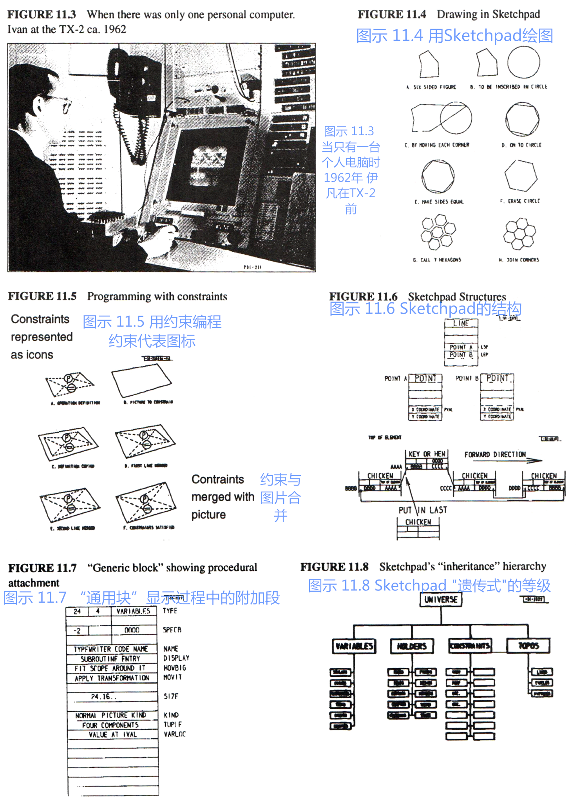

### Sketchpad and Simula

Through a series of flukes, I wound up in graduate school at the University of Utah in the Fall of 1966, "knowing nothing." That is to say, I had never heard of ARPA or its projects, or that Utah's main goal in this community was to solve the "hidden line" problem in 3D graphics, until I actually walked into Dave Evans' office looking for a job and a desk. On Dave's desk was a foot-high stack of brown covered documents, one of which he handed to me: "Take this and read it."

Every newcomer got one. The title was "Sketchpad: A man-machine graphical communication system" [Sutherland, 1963]. What it could do was quite remarkable, and completely foreign to any use of a computer I had ever encountered. The three big ideas that were easiest to grapple with were: it was the invention of modern interactive computer graphics; things were described by making a "master drawing" that could produce "instance drawings"; control and dynamics were supplied by "constraints," also in graphical form, that could be applied to the masters to shape an inter-related parts. Its data structures were hard to understand—the only vaguely familiar construct was the embedding of pointers to procedures and using a process called reverse indexing to jump through them to routines, like the 220 file system [Ross, 1961]. It was the first to have clipping and zooming windows—one "sketched" on a virtual sheet about 1/3 mile square!


兜兜转转，我终于找到了我的办公桌。
上面除了一堆磁带和清单，还有一则说明：“这是用于1108的[Algol](http://baike.baidu.com/view/459702.htm)程序，但是电脑无法运行，请解决这一问题。”
新来的研究生总的能得到最新的繁琐工作。

这份文件读起来令人费解。
据我推测，这原是[凯斯西储大学](http://baike.baidu.com/view/1123736.htm)为1107研发的Algol程序——但后来它被改成了一个新的语言，叫Simula;
整个文件读起来像从挪威语直译过来的一样，实际上就是如此。
这里面一些像“activity（活动）”和“process（过程）”这类词的用法似乎不符合正常使用英语的习惯。

最后，我和另一个研究生展开了这个份程序清单，它沿着大厅铺开，足足有80英尺长，我们就趴在上面研究，有了什么结果就向对方喊话。
最奇怪的地方在于它的储存分配程序部分（storage allocator），并没有按照Algol一贯的堆栈规则。
几天后，我们理出了些头绪。
Simula的分配结构和Sketchpad上的“实体（instances）”很像。
上面的“描述（discriptions）”有着“服务器（masters）”的功能，它们可以创造各自独立的“实体（instances）”。
在Sketchpad里面叫“服务器（masters）”和“实体（instances）”，在Simula里分别叫做“活动（activities）”和“过程（processes）”。
另外，Simula是种可以控制Sketchpad之类事物的程序性语言，因此它比起“约束（constraints）”更具灵活性（从语言的考究方面来看）。【尼高 1966；尼高 1983】

Head whirling, I found my desk. On it was a pile of tapes and listings, and a note: "This is the Algol for the 1108. It doesn't work. Please make it work." The latest graduate student gets the latest dirty task.

The documentation was incomprehensible. Supposedly, this was the Case-Western Reserve 1107 Algol—but it had been doctored to make a language called Simula; the documentation read like Norwegian transliterated into English, which in fact it was. There were uses of words like activity and process that didn't seem to coincide with normal English usage.

Finally, another graduate student and I unrolled the program listing 80 feet down the hall and crawled over it yelling discoveries to each other. The weirdest part was the storage allocator, which did not obey a stack discipline as was usual for Algol. A few days later, that provided the clue. What Simula was allocating were structures very much like the instances of Sketchpad. There were descriptions that acted like masters and they could create instances, each of which was an independent entity. What Sketchpad called masters and instances, Simula called activities and processes. Moreover, Simula was a procedural language for controlling Sketchpad-like objects, thus having considerably more flexibility than constraints (though at some cost in elegance) [Nygaard, 1966, Nygaard, 1983].

这是个大发现，也因此改变了我。
我认为，这个发现之所以带来这样的影响，是因为在此之前我已经在足够多的不同案例下足够多次见证了这一想法，并且最后一次是在如此综合的术语中，以至于它给予了我灵光一现的顿悟。
我主修的数学主要是抽象代数，里面的运算很少能在一般应用中用进一些结构中去。
而我主修的生物则注重细胞的新陈代谢以及大范围的形态发育，在其中有简单机制控制复杂过程的概念，也有在所有所需的构件中能够区分出其中一种的概念。
220的文件系统、B5000、Sketchpad，以及最终的Simula，尽管它们的目的各有不同，却分享着同一个想法。
鲍勃·巴顿（Bob Barton）是B5000的主要设计者，他也是犹他大学的一位教授，在其早年的谈话里他曾这么说过：“递归设计的主要原则是让部分与整体迸发出相同的能量。”
一开始我以为整体是指整个电脑，也疑惑着为什么每个人都想把它分解成更弱小的数据结构和程序。随着分时操作的出现，我想，为何不把它们分解成一台台小型电脑？但是不要成打的出现。
还有就是，何不让这上千台小型电脑分别模拟一种有用的结构?

This was the big hit, and I've not been the same since. I think the reason the hit had such impact was that I had seen the idea enough times in enough different forms that the final recognition was in such general terms to have the quality of an epiphany. My math major had centered on abstract algebras with their few operations generally applying to many structures. My biology major had focused on both cell metabolism and larger scale morphogenesis with its notions of simple mechanisms controlling complex processes and one kind of building block able to differentiate into all needed building blocks. The 220 file system, the B5000, Sketchpad, and finally Simula, all used the same idea for different purposes. Bob Barton, the main designer of the B5000 and a professor at Utah had said in one of his talks a few days earlier: "The basic principal of recursive design is to make the parts have the same power as the whole." For the first time I thought of the whole as the entire computer and wondered why anyone would want to divide it up into weaker things called data structures and procedures. Why not divide it up into little computers, as time sharing was starting to? But not in dozens. Why not thousands of them, each simulating a useful structure?

我想起的莱布尼茨的单子(monad)、柏拉图"连结之处见本质(dividing nature at its joints)"的箴言，以及其它关于"复杂(complexity)"的见解。
诚然，哲学提供观点(opinions)，工程学诉诸行动(deeds)，科学夹在中间的某处，成为维系它们的媒介。
可以毫不夸张地说，自那时起，我大部分的想法都来自Simula--但这些想法不是用来改进它的。
吸引我兴趣的是一个承诺，一个会有一条通向结构计算(structure computations)的全新道路的承诺。
当道路显现，我们会花上好几年时间去理解如何使用这些洞见，并发明一些有效的机制来将它们一一实现。

I recalled the monads of Leibniz, the "dividing nature at its joints" discourse of Plato, and other attempts to parse complexity. Of course, philosophy is about opinion and engineering is about deeds, with science the happy medium somewhere in between. It is not too much of an exaggeration to say that most of my ideas from then on took their roots from Simula—but not as an attempt to improve it. It was the promise of an entirely new way to structure computations that took my fancy. As it turned out, it would take quite a few years to understand how to use the insights and to devise efficient mechanisms to execute them.

戴夫·埃文斯并不觉得研究生院应当作为一个研究机构而存在。
和许多ARPA的**“承包人（contractors）”**，一样，他希望自己的学生能做些“真正的东西”；
研究生应当尽快完成他们的学业；
并且他们的论文应当超越当前的发展。
戴夫经常给他的学生一些咨询类的工作，1967年年初，他把我介绍给了艾德· 奇德尔，对方是个友善的硬件天才，在一家当地的航空航天公司任职，那时他正在捣鼓一台“小机器”。
那台机器并不是第一台个人电脑——第一台个人电脑是韦斯·克拉克的LINC——但是戴夫希望这台电脑能够为非计算机专业的人所用，具体说来就是，他希望能用像BASIC这样的高阶语言来为这台电脑编程。
我提议道：“用JOSS怎么样？”
他说：“好啊，随你怎么来。”，这就是我们愉快合作的开始，我们把那台机器叫做FLEX。
随着设计的深入，我们意识到我们需要的是一种可以自如地模拟以及延展的语言，JOSS（或者其它任何我所知的语言）并不精于此道。
而用Simula的话，机器又太小了，所以我们把Simula也淘汰了。
JOSS的美丽之处在于，对于终端用户来说，它的设计足够博人眼球——并且在该领域无出其右【Joss 1960，Joss 1978】。
但用在精确计算方面（除了cf. Lampson 65），JOSS运行得太慢了，它也缺少真正的程序、变量作用域等等。
和JOSS类似但显然潜能更大的是沃斯的EULER【沃斯 1966】。
它是对Algol的概括，首先由韦恩哈登提出【凡·韦恩哈登 1963】。为此，他做了一系列的改造，摒了范式、统一了特性、并把程序作为第一对象等等。
实际上，这个语言有点像LISP，但没有LISP那么深刻的内涵。


Dave Evans was not a great believer in graduate school as an institution. As with many of the ARPA "contractors" he wanted his students to be doing "real things"; they should move through graduate school as quickly as possible; and their theses should advance the state of the art. Dave would often get consulting jobs for his students, and in early 1967, he introduced me to Ed Cheadle, a friendly hardware genius at a local aerospace company who was working on a "little machine." It was not the first personal computer—that was the LINC of Wes Clark—but Ed wanted it for noncomputer professionals, in particular, he wanted to program it in a higher level language, like BASIC. I said; "What about JOSS? It's nicer." He said: "Sure, whatever you think," and that was the start of a very pleasant collaboration we called the FLEX machine. As we got deeper into the design, we realized that we wanted to dynamically simulate and extend, neither of which JOSS (or any existing language that I knew of) was particularly good at. The machine was too small for Simula, so that was out. The beauty of JOSS was the extreme attention of its design to the end-user—in this respect, it has not been surpassed [Joss 1964, Joss 1978]. JOSS was too slow for serious computing (but cf. Lampson 65), did not have real procedures, variable scope, and so forth. A language that looked a little like JOSS but had considerably more potential power was Wirth's EULER [Wirth 1966]. This was a generalization of Algol along lines first set forth by van Wijngaarden [van Wijngaarden 1963] in which types were discarded, different features consolidated, procedures were made into first class objects, and so forth. Actually kind of LISPlike, but without the deeper insights of LISP.


但EULER可以算得上是“几乎全新的事物”，它说明了这种技术可以用于简化Simula。
EULER的编译器是它形式定义的一部分，它能简单地将一种语言转化为与B5000类似的字节码（byte-code）。
这很引人注目，**因为这说明了艾德的小型机器能够在又长又慢的[微码（microcode）](http://baike.baidu.com/view/4883022.htm)中运行仿真的字节码**（Ed's little machine could run byte-codes emulated in the longish slow microcode that was then possible）。
但是EULER的编译器的使用却不合事宜，它被用在了一个“扩充优先（extended precedence）”的文法中，而实际上使用这种文法需要对语言句法进行让步（例如，“，”只能代表一种意思，因为这个优先级里没有[状态空间<state space>](http://baike.baidu.com/view/3821785.htm)）。
我最初采用了倒置的弗洛伊德-伊万斯解析（Floyd-Evans parser）（该解析改编自杰瑞·费尔德曼最初的编译器-编译器思想【费尔德曼 1977】），后来我又从各种严密的组合中寻求帮助，其中一些与Schorre的META II息息相关【Schorre 1963】，他最终在META II的[命名空间（name space）](http://baike.baidu.com/view/94233.htm?fromtitle=%E5%91%BD%E5%90%8D%E7%A9%BA%E9%97%B4&fromid=2887476&type=syn)里放置了翻译机（translater）。

But EULER was enough of "an almost new thing" to suggest that the same techniques be applied to simplify Simula. The EULER compiler was a part of its formal definition and made a simple conversion into B5000-like byte-codes. This was appealing because it suggested that Ed's little machine could run byte-codes emulated in the longish slow microcode that was then possible. The EULER compiler however, was tortuously rendered in an "extended precedence" grammar that actually required concessions in the language syntax (e.g. "," could only be used in one role because the precedence scheme had no state space). I initially adopted a bottom-up Floyd-Evans parser (adapted from Jerry Feldman's original compiler-compiler [Feldman 1977]) and later went to various top-down schemes, several of them related to Schorre's META II [Schorre 1963] that eventually put the translater in the name space of the language.

现在被叫做FLEX的语言，在语义上应当多参考一些Simula，而非Algol或EULER。
但具体通过什么方式还不明了。
同样不明朗的还有用户如何与这个系统互动。
艾德甚至在他的第一台机器上安装了显示屏（为了绘制图形等），LINC也有“字符电脑终端（glass teletype）”，但是搭建一个类似Sketchpad的系统似乎远远超过了我们的能力范围，我们的预算最大只能供我们打出16k大小的16位字符。

The semantics of what was now called the FLEX language needed to be influenced more by Simula than by Algol or EULER. But it was not completely clear how. Nor was it clear how the users should interact with the system. Ed had a display (for graphing, etc.) even on his first machine, and the LINC had a "glass teletype," but a Sketchpad-like system seemed far beyond the scope that we could accomplish with the maximum of 16k 16-bit words that our cost budget allowed.

### [道格·恩格尔巴特（Doug Engelbart）](http://baike.baidu.com/view/686586.htm)与NLS
1967年初，当我们还在苦思冥想着FLEX机器的时候，道格·恩格尔巴特访问了犹他大学。
像是圣经中类似的先知，他毫无疑问地可以被称之为FLEX机器的奠基人之一，而那时我开始把FLEX叫做“个人电脑”。
他随身携带着16mm长的投影仪，上面可以进行远程遥控，这样他就能通过随时随地开始和结束任务来展示发生的事情（对此人们还不是很习惯，目光也不能跟随着光标移动）。
他对ARPA之梦的见解是，**oNLine Systems （NLS）将会是交互式的交通工具承载着“人类放大的智慧（augmentation of human intellect）”从“概念空间里的思维向量（thought vectors in concept space）”中穿梭而过**（ the destiny of oNLine Systems (NLS) was the "augmentation of human intellect" via an interactive vehicle navigating through "thought vectors in concept space."）。
他的系统所能做的——甚至是从今天的标准来看——都令人叹为观止。
不仅仅是超文本（hypertext），还有制图（graphics）、多窗口工作（multiple panes）、高效导航（efficient navigation）以及命令输入、交互式合作任务（command input, interactive collaborative work）等，
这是个完完全全的观念世界，有着完整的世界观。
这一观念带来的影响则是，它会为那些“迫切地想被放大”的人们提供一个引入注目的隐喻，这个隐喻会告诉他们交互式计算应当是什么样子，于是，我立刻将很多想法应用在了FLEX身上。

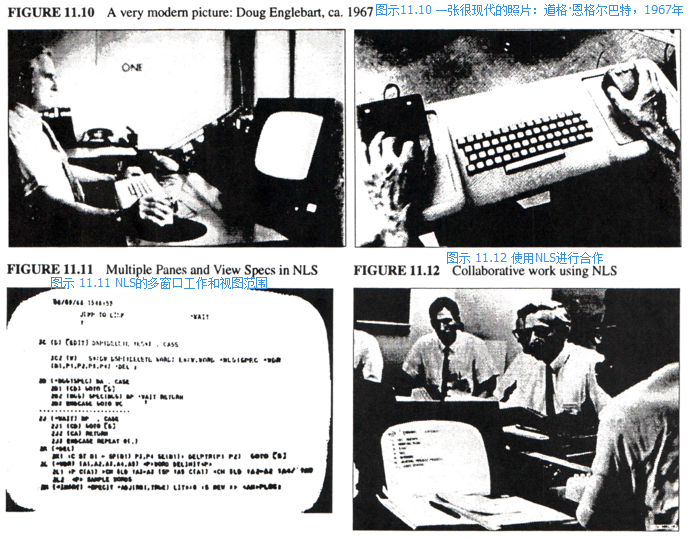

### Doug Engelbart and NLS

This was in early 1967, and while we were pondering the FLEX machine, Utah was visited by Doug Engelbart. A prophet of Biblical dimensions, he was very much one of the fathers of what on the FLEX machine I had started to call "personal computing." He actually traveled with his own 16mm projector with a remote control for starting and stopping it to show what was going on (people were not used to seeing and following cursors back then). His notion on the ARPA dream was that the destiny of oNLine Systems (NLS) was the "augmentation of human intellect" via an interactive vehicle navigating through "thought vectors in concept space." What his system could do then—even by today's standards—was incredible. Not just hypertext, but graphics, multiple panes, efficient navigation and command input, interactive collaborative work, etc. An entire conceptual world and world view [Engelbart 68]. The impact of this vision was to produce in the minds of those who were "eager to be augmented" a compelling metaphor of what interactive computing should be like, and I immediately adopted many of the ideas for the FLEX machine.


当我沉浸于ARPA人机共存的概念，也见证了艾德“小型机器”的存在，戈登·摩尔的“定律”再次回到了我的脑海里，这一次，它带来了极大的影响。
这是我第一次产生了把房间般大小的TX-2或者10 MIP 6000放置于桌上的想法。
而可能带来的结果几乎让我胆怯；
我们所知的计算无法幸免于难——这个词的真实含义发生了变化——这种感觉就跟人类第一次读完哥白尼（Copernicus）一样，他们从上到下打量着这方陌生的天地，满脸茫然。

In the midst of the ARPA context of human-computer symbiosis and in the presence of Ed's "little machine", Gordon Moore's "Law" again came to mind, this time with great impact. For the first time I made the leap of putting the room-sized interactive TX-2 or even a 10 MIP 6600 on a desk. I was almost frightened by the implications; computing as we knew it couldn't survive—the actual meaning of the word changed—it must have been the same kind of disorientation people had after reading Copernicus and first looked up from a different Earth to a different Heaven.

与最多会有上千台大型主机的预测不同，这世上理当存在数百万台个人机器以及与之旗鼓相当的个人机器用户，他们将独立于统一的管理之外——但现实是，1992年的今天，据估计，全世界只有4000台IBM主机——并且，接受了培训、知道如何使用它们的用户仅寥寥千人。
这些应用和培训本该来自哪里？
为什么在数百万的潜在用户当中，我们只指望应用程序员开发其中的某一个需求？
也许，我们真正需要的是一个可以延展的系统，并且工具的选择权掌握在终端用户手中（甚至，有些用户可以直接建造工具）。
而早在分时操作取得初步成功的时候，ARPA就想到了这一层。
后来因为提出了人机共存这个意义更深远的隐喻，社区避免了错把目光放在完成子目标上面，相反，所有人都专注于啜饮玩味“放大（augmentation）”这只圣杯里的奥义。

Instead of at most a few thousand institutional mainframes in the world—even today in 1992 it is estimated that there are only 4000 IBM mainframes in the entire world—and at most a few thousand users trained for each application, there would be millions of personal machines and users, mostly outside of direct institutional control. Where would the applications and training come from? Why should we expect an applications programmer to anticipate the specific needs of a particular one of the millions of potential users? An extensional system seemed to be called for in which the end-users would do most of the tailoring (and even some of the direct construction) of their tools. ARPA had already figured this out in the context of their early successes in time-sharing. Their larger metaphor of human-computer symbiosis helped the community avoid making a religion of their subgoals and kept them focused on the abstract holy grail of "augmentation."

NSL有个有趣的特性，就是它用户界面可以定制参量，并且终端用户可以使用TreeMeta编译器-编译器中的“交互语法（grammar of interaction）”来编辑界面。
这与威廉·纽曼（William Newman）早期的“Reaction Handler”定制界面有些相似，**终端用户或者开发者使用平板和触控笔、通过特定的程序，创建一种形象且有规律的表达语法**（construct through tablet and stylus an iconic regular expression grammar with action procedures at the states）（NSL允许用户根据其自由语境规则<context free rule>进行嵌入）。
这在很多方面都很引人注目，尤其是威廉的**组合（scheme）**，但在我看来，这里面还是有个大bug。
换句话说就是，**这些语法把用户局限在系统的状态（state）里，这个状态需要用户避免同时完成其他新的交互**（these grammars forced the user to be in a system state which required getting out of before any new kind of interaction could be done）。
因此，为了做另一件事情，用户必须通过等级菜单（hierarchical menus）或“屏幕（screen）”返回初始状态（master state）。
这里面似乎需要不同的状态，这些状态当中会有一个转移箭头（transition arrow）负责各个状态的切换——但在正式的语法理论中，这个概念并不有效。
也就是说，我们似乎需要一个“层次更少的（flatter）”界面——但是这个界面会更有趣、更丰富，也足够有用吗？

One of the interesting features of NLS was that its user interface was parametric and could be supplied by the end user in the form of a "grammar of interaction" given in their compiler-compiler TreeMeta. This was similar to William Newman's early "Reaction Handler" [Newman 66] work in specifying interfaces by having the end-user or developer construct through tablet and stylus an iconic regular expression grammar with action procedures at the states (NLS allowed embeddings via its context free rules). This was attractive in many ways, particularly William's scheme, but to me there was a monstrous bug in this approach. Namely, these grammars forced the user to be in a system state which required getting out of before any new kind of interaction could be done. In hierarchical menus or "screens" one would have to backtrack to a master state in order to go somewhere else. What seemed to be required were states in which there was a transition arrow to every other state—not a fruitful concept in formal grammar theory. In other words, a much "flatter" interface seemed called for—but could such a thing be made interesting and rich enough to be useful?

我们还遇到了一个问题，就是迷你版的NSL对FlEX机器来说还是太大了，因此，我们不得不寻找其他设计，这个设计不仅仅要涵盖一些新的想法，在某些地方也要对他们进行改进。
我认为，和有限的窗格（restricted horizontal panes）相比，Sketchpad的主窗口（general window）更具优势，它拥有更开阔的虚拟空间视野，并且辅以艾德提出的**分割算法**（clipping algorithm），这和苏泽兰和其哈佛学生的3D“虚拟现实（virtual reality）”头盔项目有异曲同工之妙。

Again, the scope of the FLEX machine was too small for a miniNLS, and we were forced to find alternate designs that would incorporate some of the power of the new ideas, and in some cases to improve them. I decided that Sketchpad's notion of a general window that viewed a larger virtual world was a better idea than restricted horizontal panes and with Ed came up with a clipping algorithm very similar to that under development at the same time by Sutherland and his students at Harvard for the 3D "virtual reality" helmet project [Sutherland 1968].

作为B5000描述符（descriptors）的一般化，对象引用（object reference）被用于FLEX。
与一些提供参考号（referencing number）、阵列（array）和程序（procedure）的版式不同，FLEX的描述符包含两个指针（pointer）：
第一个指向对象的“主干（master）”，第二个则指向对象实例（object instance）（后来我们意识到，为了节省空间，我们应当把主干指针放置在实例中）。
为了完成一般任务，我们需要采用不同的方法。
B5000使用的是[左值（l-values）与右值（r-values）](http://baike.baidu.com/view/9489098.htm)，它们可以在一些情况下使用，但无法胜任更复杂的对象。
**例如，`a[55]:=0`，如果`a`是[稀疏数组（sparse array）](http://www.tuicool.com/articles/AfYnEf)，即便它的元素默认值为0，这个数组中也将产生一个值，因为`:=`是一个[算子（operator）](http://baike.baidu.com/view/53313.htm)，并且在任何人意识到右值是默认值前，`a[55]`就已经进入左值，不管`a`到底是一个数组还是数组中的前置程序。**（ For example:a[55] := 0, if a was a sparse array whose default element was 0 would still generate an element in the array because := is an "operator" and a[55] is dereferenced into an l-value before anyone gets to see that the r-value is the default element, regardless of whether a is an array or a procedure fronting for an array）
这时我们需要的是像`a(55, ':=', 0)` 这样的命令，在进行任何储存之前，它可以先总览一遍所有的操作。
换句话说就是，这里`:=`不是算子，而是一种指数，它可以从复杂的对象中选取一个行为（behavior）。
为了见证这一过程，我着实花了不少时间。
我认为，其中一部分要归因于：为了使对象主宰它们自己的行为，人们不得不扭转传统的算子和功能等的概念：这些对象是[映射（mapping）](http://baike.baidu.com/view/21249.htm)的一种，它们的价值就在于这些行为。
[卡尔纳普（Carnap）](http://baike.baidu.com/view/111023.htm)有本关于逻辑的书，它通过解释：**同范围内的“内涵（intensional）”定义可被看成更传统的外延（extensional）技术，并且更直观也更方便**（ "intensional" definitions covered the same territory as the more traditional extensional technique and were often more intuitive and convenient），来辅助阐释这一概念。


Object references were handled on the FLEX machine as a generalization of B5000 descriptors. Instead of a few formats for referencing numbers, arrays, and procedures, a FLEX descriptor contained two pointers: the first to the "master" of the object, and the second to the object instances (later we realized that we should put the master pointer in the instance to save space). A different method was taken for handling generalized assignment. The B5000 used l-values and r-values [Strachey*] which worked for some cases but couldn't handle more complex objects. For example: a[55] := 0, if a was a sparse array whose default element was 0 would still generate an element in the array because := is an "operator" and a[55] is dereferenced into an l-value before anyone gets to see that the r-value is the default element, regardless of whether a is an array or a procedure fronting for an array. What is needed is something like: a(55, ':=', 0), which can look at all relevant operands before any store is made. In other words, := is not an operator, but a kind of index that can select a behavior from a complex object. It took me a remarkably long time to see this, partly I think because one has to invert the traditional notion of operators and functions, etc., to see that objects need to privately own all of their behaviors: that objects are a kind of mapping whose values are its behaviors. A book on logic by Carnap [Ca *] helped by showing that "intensional" definitions covered the same territory as the more traditional extensional technique and were often more intuitive and convenient.


在Simula中，有一种[协程](http://baike.baidu.com/view/2665148.htm)控制结构（ coroutining control structure）【康韦 1963】用于悬挂和重新开始对象。
像文件夹和文档这样的永久对象，应当被当做悬挂进程（suspended process）处理，同时也应当按照与Algol类似的[静态变量（static variable）](http://baike.baidu.com/view/675642.htm)作用域进行存储。
这些文件夹和文档会显示在屏幕上，当指针指向它们时，便可被打开。
协程也可被当做控制结构用于循环（looping）中。
当发生器（generator）出现错误，无法提供新的价值时，我们会用一个算子来对其进行测试。
[布尔运算（Boolean）](http://baike.baidu.com/view/638530.htm)则用于连接各个发生器。
因此，一个[for为当型的循环语句（"for-type" loop）](http://baike.baidu.com/view/961969.htm)应当如下：

`while i <= 1 to 30 by 2 ^ j <= 2 to k by 3 do j<-j * i;`

其中，“... to ... by ...”这样的结构是一种协程对象。
后来，在加强版的Smalltalk中重新运用了不少这样的观点。

As in Simula, a coroutining control structure [Conway, 1963] was used as a way to suspend and resume objects. Persistent objects like files and documents were treated as suspended processes and were organized according to their Algol-like static variable scopes. These were shown on the screen and could be opened by pointing at them. Coroutining was also used as a control structure for looping. A single operator while was used to test the generators which returned false when unable to furnish a new value. Booleans were used to link multiple generators. So a "for-type" loop would be written as:

```
while i <= 1 to 30 by 2 ^ j <= 2 to k by 3 do j<-j * i;
```

where the ... to ... by ... was a kind of coroutine object. Many of these ideas were reimplemented in a stronger style in Smalltalk later on.

FLEX中另一个有趣的控制结构叫做“when”，它是一种事件驱动的[“软中断（soft interrupt）”](http://baike.baidu.com/view/197370.htm)。
这种布尔表达式会以[树型选择排序（tournement）](http://baike.baidu.com/view/3108940.htm)的方式呈现，任何可能的中间结果（intermediate result）都将囊括在其中。
在所有的when结构中，相关变量（variable）都要通过这些树型结构，因此若产生变化，只要对布尔数据类型相应的部分进行计算即可。
它的效率很高，并且与现用于电子表格（spreadsheet）的技术相似。
其实它有些大材小用，因为困难总是发生在事件驱动系统中。
换言之就是，控制只有when结构的语境会很繁琐，when结构应当很灵敏。
一部分的布尔表达式会用于检验语境。
我觉得在这些语境中，不管怎样，程序的结构应当能够设置和取消[事件驱动（event driver）](http://baike.baidu.com/view/536048.htm#1)。
这一点FLEX系统还无法做到，并且实现它还亟待一个更好的[体系结构（architecture）](http://baike.baidu.com/view/1188494.htm)。


Another control structure of interest in FLEX was a kind of event-driven "soft interrupt" called when. Its boolean expression was compiled into a "tournement sort" tree that cached all possible intermediate results. The relevant variables were threaded through all of the sorting trees in all of the whens so that any change only had to compute through the necessary parts of the booleans. The efficiency was very high and was similar to the techniques now used for spreadsheets. This was an embarrassment of riches with difficulties often encountered in event-driven systems. Namely, it was a complex task to control the context of just when the whens should be sensitive. Part of the boolean expression had to be used to check the contexts, where I felt that somehow the structure of the program should be able to set and unset the event drivers. This turned out to beyond the scope of the FLEX system and needed to wait for a better architecture.


仍有相当一部分最初关于FLEX的想法应用在这个机器里，它们以原型对象（proto-object）的形式存在，且大小也合适运行。
当我在写第一个编辑器的时候，发生了一件不同寻常的事情：
那年，犹他大学的研究生受邀参加ARPA在犹他州阿尔塔举办的契约人会议。
会议结束三天前，接替伊万·苏泽兰担任ARPA信息处理（ARPA-IPTO）负责人的[鲍勃·泰勒（Bob Tylor）](http://baike.baidu.com/item/%E9%B2%8D%E5%8B%83%C2%B7%E6%B3%B0%E5%8B%92/17521768#viewPageContent)向我们这些研究生征询了意见（大家围成一圈，坐在二十来个契约人外面）。
于是约翰·沃诺克（John Warnock）举起了手，他提议道，既然这些研究生迟早要进入ARPA、成为同事（既然我们已经开始上手这些工作了），不如ARPA每年都邀请研究生参加这种契约人的会议。
泰勒觉得这个主意棒极了，遂将其纳入了明年夏天的会议议程。

Still, quite a few of the original FLEX ideas in their proto-object form did turn out to be small enough to be feasible on the machine. I was writing the first compiler when something unusual happened: the Utah graduate students got invited to the ARPA contractors meeting held that year at Alta, Utah. Towards the end of the three days, Bob Taylor, who had succeeded Ivan Sutherland as head of ARPA-IPTO, asked the graduate students (sitting in a ring around the outside of the 20 or so contractors) if they had any comments. John Warnock raised his hand and pointed out that since the ARPA grad students would all soon be colleagues (and since we did all the real work anyway), ARPA should have a contractors-type meeting each year for the grad students. Taylor thought this was a great idea and set it up for the next summer.

后来，那年春天，在帕克城（Park City）又举行了一场举足轻重的会议。
会议的主要内容关于教育，而这也是我第一次听到[马文·明斯基（Marvin Minsky）](http://baike.baidu.com/view/406805.htm)的演讲。
他三番五次地抨击了传统的教育方法，也是因为他，我第一次接触到[皮亚杰（Piaget）](http://baike.baidu.com/view/447847.htm?fromtitle=%E7%9A%AE%E4%BA%9A%E6%9D%B0&fromid=343170&type=search)和[派珀特（Papert）](http://baike.baidu.com/view/4370843.htm)的思想。
马文演讲的主要内容是关于我们对复杂情况的看法，以及为什么在学校学习这些技术是相当糟糕的主意。
他甚至都不用在演讲中提及“电脑+孩子”这样的观点。
因为，很明显，我们应当在20世纪[认知心理学（cognitive psychology）](http://baike.baidu.com/item/%E8%AE%A4%E7%9F%A5%E5%BF%83%E7%90%86%E5%AD%A6/4291)的观点和了解那些卓越思想家们的思考方式的基础上，重新思考教育与学习。
计算作为一个新的表征系统（representation system），暗含解决复杂情况、尤其是系统中复杂情况的新理念，当然这个理念也很有用。

Another ski-lodge meeting happened in Park City later that spring. The general topic was education and it was the first time I heard Marvin Minsky speak. He put forth a terrific diatribe against traditional education methods, and from him I heard the ideas of Piaget and Papert for the first time. Marvin's talk was about how we think about complex situations and why schools are really bad places to learn these skills. He didn't have to make any claims about computers+kids to make his point. It was clear that education and learning had to be rethought in the light of 20th century cognitive psychology and how good thinkers really think. Computing enters as a new representation system with new and useful metaphors for dealing with complexity, especially of systems [Minsky 70].

1968年的夏天，ARPA的研究生会议在伊利诺伊州（Illinois）的阿勒顿之家酒店（Allerton House）举行。
我把FLEX中所有的原理都写在一个2x3的图表里。
里面囊括了所有的“对象结构（object structure）”，包括[编译器（compiler）](http://baike.baidu.com/view/487018.htm)、字节码[解释器](http://baike.baidu.com/view/592974.htm)（byte-code interpreter）、[i/o](http://baike.baidu.com/subview/300881/11169495.htm)处理器（i/o handler），以及一个针对文本和图像的简易显示[编辑器](http://baike.baidu.com/view/499644.htm)（display editor）。
这帮研究生真的很出类拔萃，他们在随后几年里都成为了ARPA的一员。
我关于FLEX机器的演讲很成功，但在随后参观[伊利诺伊大学（U of Illinois）](http://baike.baidu.com/view/779059.htm)时我受到了很大打击。
在那里我看到了一块方形玻璃，里面的[氖气（neon gas）](http://baike.baidu.com/view/152336.htm)会根据指令发光——这是第一个[平板显示器（flat-panel display）](http://baike.baidu.com/view/1044802.htm)。
会议剩下来的时间我都在计算什么时候才能在显示器的背后装上FLEX的硅芯片。
根据戈登·摩尔（Gordon Moore）的“定律”，时间大约会在七十年代末或者八十年代初。
这得等到猴年马月才能实现——不过，鉴于它的时长，我们似乎也不用太担心它。

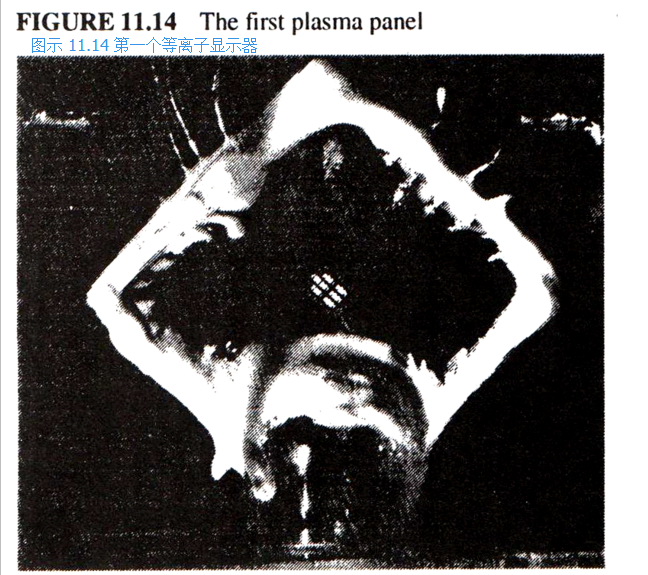

For the summer 1968 ARPA grad students meeting at Allerton House in Illinois, I boiled all the mechanisms in the FLEX machine down into one 2'x3' chart. This included all the "object structures", the compiler, the byte-code interpreter, i/o handlers, and a simple display editor for text and graphics. The grad students were a distinguished group that did indeed become colleagues in subsequent years. My FLEX machine talk was a success, but the big whammy for me came during a tour to U of Illinois where I saw a 1" square lump of glass and neon gas in which individual spots would light up on command—it was the first flat-panel display. I spent the rest of the conference calculating just when the silicon of the FLEX machine could be put on the back of the display. According to Gordon Moore's "Law", the answer seemed to be sometime in the late seventies or early eighties. A long time off—it seemed too long to worry much about it then.


但之后，那年在[兰德公司（RAND）](http://baike.baidu.com/view/31484.htm)我看到了一个真正美丽动人的系统。
它的名字叫GRAIL，是[JOSS](http://baike.baidu.com/view/1200937.htm)的图像衍生品。
第一个平板（著名的RAND平板）由汤姆·艾利斯（Tom Ellis）发明【Davis 1964】，其功能是捕捉人类的姿态；加韦·哥罗纳（Gave Groner）还写了个程序，让其有效地辨认动作并作出回应【Groner 1966】。
尽管所有的东西都由泡泡糖固定，系统也时常崩溃，我却不曾忘怀我与它的第一次互动。它的操作很直接，且它本身是模拟计算机的，无模式，也很美。
我意识到[FLEX](http://baike.baidu.com/subview/623340/13746390.htm)的界面完全跑偏了，但是一个像GRAIL这样的系统，需要整个单机的360/44来运行，如何才能把它装进一个微小的机器里去？

一个月后，我终于拜访了[西蒙·派珀特（Seymour Papert）](http://baike.baidu.com/view/4370843.htm)、沃利·冯茨（Wally Feurzig）、辛西娅·所罗门（Cynthia Solomon）等一些这个领域的先锋，他们创立了LOGO，同时把它应用在列克星敦市学校的教育中。
那里，孩子们在一个为他们量身定做的环境下，用为他们特别设计的语言开展真正的编程活动。
随着[Simula](http://baike.baidu.com/view/1112576.htm)引入了OOP的概念，我终于带着对“个人电脑真正何去何从”的疑问与其相遇。
正如[恩格尔巴特（Douglas C. Engelbart）](http://baike.baidu.com/view/686586.htm)反对IBM提出的“铁路运输（railroads）”所用的隐喻，个人电脑的未来不是个人的动力交通工具，而是一个意义要深远许多倍的事物：个人的动态媒介。
想要开车上路，人们必须等到高中并且得拥有“驾照”，但是媒介就不一样了，它会延伸进每个人的童年。

现在，与FLEX相悖的机器、扁平的屏显、GRAIL、巴顿关于“交流（communication）”的谈话、[麦克卢汉（McLuhan）](http://baike.baidu.com/view/978197.htm?fromtitle=Marshall+Mcluhan&type=syn)的媒介理论、以及派珀特对孩子的教育，这一切糅和在一起，编织出一幅未来个人电脑的真正图景。
我想起了奥尔德斯·马努蒂尔乌斯（Aldus Manutius ），他在印刷机出现40年后，为了让书本顺利地装入鞍囊中去，他发明了现代书籍的尺寸。
未来的个人电脑不会超过一个笔记本的大小，它需要如JOSS、GRAIL和LOGO那样友好的界面，**但也要向Simula和FLEX一样是面向对象的（but with the reach of Simula and FLEX）**。
清晰毕现而又浪漫的想象有种惊人的能力，它能让人们聚焦在自己的思想与意愿上。
现在，人们能够轻易知晓下一步该做些什么。
我用硬纸板做了一个模型来看看未来的个人电脑长什么样、用起来是什么感觉，我还使用铅粒填充，来预测它的质量（小于两磅）。
我还安装了键盘和触笔，因为尽管大家认为打字与书写已经能完美地被辨认出来了（其实我们没有理由这么期盼），但触笔带来的低速的触感上的自由和键盘带来的有限制的高速需要达到一个平衡。
从ARPA进行无线分组的实验开始，我就期待着Dynabook笔记本在十年或更久以后能够拥有一个无线网络系统。

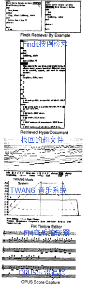

But later that year at RAND I saw a truly beautiful system. This was GRAIL, the graphical followon to JOSS. The first tablet (the famous RAND tablet) was invented by Tom Ellis [Davis 1964] in order to capture human gestures, and Gave Groner wrote a program to efficiently recognize and respond to them [Groner 1966]. Though everything was fastened with bubble gum and the system crashed often, I have never forgotten my first interactions with this system. It was direct manipulation, it was analogical, it was modeless, it was beautiful. I realized that the FLEX interface was all wrong, but how could something like GRAIL be stuffed into such a tiny machine since it required all of a stand-alone 360/44 to run in?

A month later, I finally visited Seymour Papert, Wally Feurzig, Cynthia Solomon and some of the other original researchers who had built LOGO and were using it with children in the Lexington schools. Here were children doing real programming with a specially designed language and environment. As with Simula leading to OOP, this encounter finally hit me with what the destiny of personal computing really was going to be. Not a personal dynamic vehicle, as in Engelbart's metaphor opposed to the IBM "railroads", but something much more profound: a personal dynamic medium. With a vehicle one could wait until high school and give "drivers ed", but if it was a medium, it had to extend into the world of childhood.

Now the collision of the FLEX machine, the flat-screen display, GRAIL, Barton's "communications" talk, McLuhan, and Papert's work with children all came together to form an image of what a personal computer really should be. I remembered Aldus Manutius who 40 years after the printing press put the book into its modern dimensions by making it fit into saddlebags. It had to be no larger than a notebook, and needed an interface as friendly as JOSS', GRAIL's, and LOGO's, but with the reach of Simula and FLEX. A clear romantic vision has a marvelous ability to focus thought and will. Now it was easy to know what to do next. I built a cardboard model of it to see what if would look and feel like, and poured in lead pellets to see how light it would have to be (less than two pounds). I put a keyboard on it as well as a stylus because, even if hand printing and writing were recognized perfectly (and there was no reason to expect that it would be), there still needed to be a balance between the low speed tactile degrees of freedom offered by the stylus and the more limited but faster keyboard. Since ARPA was starting to experiment with packet radio, I expected that the Dynabook when it arrived a decade or so hence, would have a wireless networking system.


1969年初召开了一场关于可扩展语言（Extensible Languages）的会议，与会者几乎囊括了所有这一领域中赫赫有名的人物。
讨论的场面壮观且严肃——这是场宗教战争，关乎那些还未被实现的想法。
计算机科学领域的重要人物[艾伦·佩利（Alan Perlis）](http://baike.baidu.com/view/406785.htm)用颇具代表性的语句描绘了当时的情况：

> 距我上一次看见这些熟悉的脸孔为了这些想法争论不休的场面以及很久远了。同其他的发现一样，在编程语言上有所突破，这感情就如同坠入爱河一般。得意洋洋过后是兴高采烈、是感到自己举世无双，最后却是游移不定（迫切地想概括一切）【ACM 69】。

但所有的这一切都是纸上谈兵——还没有人真正做成什么。
在这些提议中，跟那些不切实际的相比，内德·艾恩斯提出的IMP系统更加简洁，这个系统已经运作好几年了。
IMP系统的基本思想就是你可以在合乎语法的情况下用任何语句引导程序（procedure heading），并且可以根据语言当前的扩展情况界定语义（semantic definition）【艾恩斯 1970】。

Early next year (1969) there was a conference on Extensible Languages in which almost every famous name in the field attended. The debate was great and weighty—it was a religious war of unimplemented poorly thought out ideas. As Alan Perlis, one of the great men in Computer Science, put it with characteristic wit:

> It has been such a long time since I have seen so many familiar faces shouting among so many familiar ideas. Discovery of something new in programming languages, like any discovery, has somewhat the same sequence of emotions as falling in love. A sharp elation followed by euphoria, a feeling of uniqueness, and ultimately the wandering eye (the urge to generalize) [ACM 69].

But it was all talk—no one had done anything yet. In the midst of all this, Ned Irons got up and presented IMP, a system that had already been working for several years that was more elegant than most of the nonworking proposals. The basic idea of IMP was that you could use any phrase in the grammar as a procedure heading and write a semantic definition in terms of the language as extended so far [Irons 1970].

我已经完成了第一代FLEX的语法驱动，但是其中通用的语法定义是转化为程序自己翻译的。
这就将系统的编译器-延展器（compiler-extensor）与终端用户分离开来了。
对此，艾恩斯的解决办法是，系统中的每个程序都能够自行定义它们的语法，同时做到表达自然且有用。
我把这些想法应用在了第二代的FLEX机器上，同时我开始尝试着用[解释器（interpreter）](http://baike.baidu.com/view/592974.htm)来取代语法定向[编译器（syntax directed compiler）](http://baike.baidu.com/view/487018.htm)。
在这过程中，我意识到，想要建立一个以对象为基准的系统，可能每个对象都得被当作语法定向解释器，分别负责它们接收的消息。
它可以在一瞬间把面向对象的语义与一个完全的可扩展计算机语言相结合。
换成画面的话就是，在几台相互独立的计算机中，其中一台向其他几台发送请求，在执行任何命令之前，负责接收的计算机应当先接受并理解这些请求。
用今天的话来说就是，每个对象都是提供服务的服务者（server），它们的部署与判断完全依仗它们对与服务接受者（servee）关系的见解。
正如莱布尼茨所说：“**无中生有，仅一原理即可**（To get everything out of nothing, you only need to find one principle）。”
我还没能从中想出什么有助于FLEX的想法，但它真的助我形成了脱离我论文【凯 69】的好点子，这个点子就像伊凡·苏泽兰说的那样：“**会有三个人在你的博士论文上签字的**（anything you can get three people to sign）。”

I had already made the first version of the FLEX machine syntax driven, but where the meaning of a phrase was defined in the more usual way as the kind of code that was emitted. This separated the compiler-extensor part of the system from the end-user. In Irons' approach, every procedure in the system defined its own syntax in a natural and useful manner. I incorporated these ideas into the second versions of the FLEX machine and started to experiment with the idea of a direct interpreter rather than a syntax directed compiler. Somewhere in all of this, I realized that the bridge to an object-based system could be in terms of each object as a syntax directed interpreter of messages sent to it. In one fell swoop this would unify object-oriented semantics with the ideal of a completely extensible language. The mental image was one of separate computers sending requests to other computers that had to be accepted and understood by the receivers before anything could happen. In today's terms every object would be a server offering services whose deployment and discretion depended entirely on the server's notion of relationship with the servee. As Liebniz said: "To get everything out of nothing, you only need to find one principle." This was not well thought out enough to do the FLEX machine any good, but formed a good point of departure for my thesis [Kay 69], which as Ivan Sutherland liked to say was "anything you can get three people to sign."

三个人签完字以后（其中一个是伊凡），我去做了斯坦福的[人工智能（AI）](http://baike.baidu.com/item/%E4%BA%BA%E5%B7%A5%E6%99%BA%E8%83%BD/9180?fromtitle=AI&fromid=25417&type=syn)项目，但跟AI比起来，我花了更多的时间在KiddyKomputer笔记本上。
然而，仍有两个AI设计让我很感兴趣。
一是卡尔·休伊特（Carl Hewitt）的PLANNER，这是一个[可编程逻辑](http://baike.baidu.com/view/10018762.htm)系统（progarammable logic system），它形成了[维诺格拉德（Winograd）SHRDLU](http://blog.sina.com.cn/s/blog_72d083c70102dqkf.html)的演绎基础【萨斯曼 69，凯 69】。
后来，在结合了FLEX和PLANNER的[模式匹配（pattern matching）](http://baike.baidu.com/view/772065.htm)体系的基础上，我设计了几种语言。
而第二个有趣的设计则是帕特里克·温斯顿（Patrick Winston）的概念形成系统（concept formation system），这个体系是为了建立[语义网络（semantic network）](http://baike.baidu.com/view/157370.htm)以及将它们与形式类比（form analogies）和学习步骤（learning processes）相比较【温斯顿 70】。
从某种程度上来说，它是“面向对象的”。
其中，一个很棒的想法就是，**每个网上（net）的弧度（arc）充当AOV Triples属性，它们应当被模拟成网**（the arcs of each net which served as attributes in AOV triples should themselves be modeled as nets）。
因此，举例来说，如果第一个命令弧度叫做`LEFT-OF`，我们可以问它一个如“你的反义是什么？”这样更高级的问题，然后它的网会回答：`RIGHT-OF`。
这个观点后来形成了明斯基框架系统的基础【明斯基 75】。
我倒希望几年后的我能多关注一下这个想法。

After three people signed it (Ivan was one of them), I went to the Stanford AI project and spent much more time thinking about notebook KiddyKomputers than AI. But there were two AI designs that were very intriguing. The first was Carl Hewitt's PLANNER, a programmable logic system that formed the deductive basis of Winograd's SHRDLU [Sussman 69, Hewitt 69] I designed several languages based on a combination of the pattern matching schemes of FLEX and PLANNER [Kay 70]. The second design was Pat Winston's concept formation system, a scheme for building semantic networks and comparing them to form analogies and learning processes [Winston 70]. It was kind of "object-oriented". One of its many good ideas was that the arcs of each net which served as attributes in AOV triples should themselves be modeled as nets. Thus, for example a first order arc called LEFT-OF could be asked a higher order question such as "What is your converse?" and its net could answer: RIGHT-OF. This point of view later formed the basis for Minsky's frame systems [Minsky 75]. A few years later I wished I had paid more attention to this idea.

那年秋天，我听到了[巴特勒·拉姆泼逊（Butler Lampson）](http://baike.baidu.com/view/2009279.htm)一场精彩的谈话，内容是关于CAL-TSS，它是个基于用户能力的操作系统（capability-based operating system）([參考資料](discussion.md))，看上去十分具备“面向对象”的特性【拉姆泼逊 69】。
不可伪造的指针（ala B5000）由限制对象内部操作权限的位屏蔽（bit-mask）延伸。
这与我“对象即为服务者（objects as server）”的比喻不谋而合。
这个系统中异常情况处理（exception handling）的方法也很得宜，它提醒了我错误常常在模式匹配系统中解决。
这个系统唯一的问题就是——但CAL的设计者们从未把它看成是问题——只有几个对象（通常是那些占用内存大、运行慢的）。
而运行速度快、内存小的则不是对象。
我们需要改正这一点。

That fall, I heard a wonderful talk by Butler Lampson about CAL-TSS, a capability-based operating system that seemed very "object-oriented" [Lampson 69]. Unforgeable pointers (ala B5000) were extended by bit-masks that restricted access to the object's internal operations. This confirmed my "objects as server" metaphor. There was also a very nice approach to exception handling which reminded me of the way failure was often handled in pattern matching systems. The only problem— which the CAL designers did not see as a problem at all—was that only certain (usually large and slow) things were "objects". Fast things and small things, etc., weren't. This needed to be fixed.

1969年末，我在斯坦福人工智能实验室（SAIL）时遭受了极大的打击，这份打击来源于真正理解[LISP](http://baike.baidu.com/item/LISP/22083)。
诚然，每个学生都知道`car`、`cdr`和`cons`，但犹他大学的落后之处在于没人能真正洞悉[`eval`](http://baike.baidu.com/item/eval/9327484)`和apply`的奥秘。
我简直不敢相信LISP的美丽与动人【麦卡锡 1960】。
我之所以这么说是因为LISP不仅仅有一帮盲目的追随者，更严重的是，它的逻辑基础存在不少缺陷。
我想表达的是，纯正的语言理当基于功能，但它最重要的部分——如[Lambda表达式（lambda expression）](http://baike.baidu.com/view/3048187.htm)、引用（quotes）和[条件数（cond）](http://baike.baidu.com/view/1014731.htm)——他们完全不是功能，而是一些特殊形式（special form）。
兰丁（Landin）以及其它人可以耍些聪明又有用的小花招，用lambda表达式得到quote和cond，但是美中不足，宝石里的瑕疵仍然存在。
这在实用语言（practical language）中，会好那么一点。
里面不仅仅有[EXPR](http://baike.baidu.com/view/1229144.htm)（用于对争论进行评估），还有FEXPR（没有评估的功能）。
我的另一个问题是，为什么大家要称其为[函数式语言（functional language）](http://baike.baidu.com/view/10765316.htm)？
为什么不以FEXPR为基础，在需要的时候让接受端进行评估？
对此，我永远也无法给出一个完美的答案，但在发明Smalltalk的时候，这个问题给予了我极大的帮助，因为它让我想到了这样一句话：“**做好最难且意义最深远的部分，相对简单的问题随后便可迎刃而解**（take the hardest and most profound thing you need to do, make it great, and then build every easier thing out of it）”。
这是LISP的承诺，也是lampda的诱惑——我们所需的是一个更好的“最难且意义最深远的部分”。
对象应当是所谓的这个部分。

The biggest hit for me while at SAIL in late '69 was to really understand LISP. Of course, every student knew about car, cdr, and cons, but Utah was impoverished in that no one there used LISP and hence, no one had penetrated the mysteries of eval and apply. I could hardly believe how beautiful and wonderful the idea of LISP was [McCarthy 1960]. I say it this way because LISP had not only been around enough to get some honest barnacles, but worse, there were deep flaws in its logical foundations. By this, I mean that the pure language was supposed to be based on functions, but its most important components—such as lambda expressions, quotes, and conds—were not functions at all, and instead were called special forms. Landin and others had been able to get quotes and conds in terms of lambda by tricks that were variously clever and useful, but the flaw remained in the jewel. In the practical language things were better. There were not just EXPRs (which evaluated their arguments), but FEXPRs (which did not). My next question was, why on earth call it a functional language? Why not just base everything on FEXPRs and force evaluation on the receiving side when needed? I could never get a good answer, but the question was very helpful when it came time to invent Smalltalk, because this started a line of thought that said "take the hardest and most profound thing you need to do, make it great, and then build every easier thing out of it". That was the promise of LISP and the lure of lambda—needed was a better "hardest and most profound" thing. Objects should be it.

1970年1月，在首席科学家杰克·戈德曼（Jack Goldman）的敦促下，[施乐公司（Xerox）](http://baike.baidu.com/view/1175780.htm)打算在加利福尼亚州的[帕罗奥图（Palo Alto）](http://www.beimeigoufang.com/newsd/newsdetail_19986.html)建立起一系列的研究中心。
同年9月，华盛顿大学（韦斯·克拉克[ARPA](http://baike.baidu.com/view/68809.htm)的项目就设立在这）的前任校长乔治·佩克，聘请[鲍勃·泰勒（Bob Taylor）](http://baike.baidu.com/item/%E9%B2%8D%E5%8B%83%C2%B7%E6%B3%B0%E5%8B%92/17521768#viewPageContent)（那时他已经离开了ARPA办公室，同时正享受犹他大学的休假）负责建立“计算机科学实验室（Computer Science Laboratory）”。
鲍勃访问了帕罗奥图，并就此与我彻夜长谈。
那时，[曼斯菲尔德修正案（Mansfield Amendment）](http://m.zol.com.cn/article/4933054.html)限制了ARPA直接应用于军事研究的投资，这个新的机会也许会带来不一样的转机。
但是要直接为公司工作吗？
鲍勃希望我做顾问，我问他是什么样的顾问。
他说：随你的心意而定。
于是我开始研发KiddiKomp的新版本，我会制作足够数量的KiddiKomp来进行实验，最终设计出笔记本的用户界面。
鲍勃·巴顿经常把这句话挂在嘴边：“**好的想法常常不是万能钥匙**（good ideas don't often scale）。”
当我把这句话实现在FLEX机器上的时候，他说得完全应验了。
B5000不会按比例缩小成一个小型机器。
能够缩小的只有字节码（byte-code），尽管它们需要进行修正。
我打算重新研究韦斯·克拉克的LINC，并且这会我已经准备好了要领悟更多。


In July 1970, Xerox, at the urging of its chief scientist Jack Goldman, decided to set up a long range research center in Palo Alto, California. In September, George Pake, the former chancellor at Washington University where Wes Clark's ARPA project was sited, hired Bob Taylor (who had left the ARPA office and was taking a sabbatical year at Utah) to start a "Computer Science Laboratory." Bob visited Palo Alto and we stayed up all night talking about it. The Mansfield Amendment was threatening to blindly muzzle the most enlightened ARPA funding in favor of directly military research, and this new opportunity looked like a promising alternative. But work for a company? He wanted me to consult and I asked for a direction. He said: follow your instincts. I immediately started working up a new version of the KiddiKomp that could be made in enough quantity to do experiments leading to the user interface design for the eventual notebook. Bob Barton liked to say that "good ideas don't often scale." He was certainly right when applied to the FLEX machine. The B5000 just didn't directly scale down into a tiny machine. Only the byte-codes did, and even these needed modification. I decided to take another look at Wes Clark's LINC, and was ready to appreciate it much more this time [Clark 1965].


我仍旧偏爱面向模式（pattern-oriented）的解决方案以及OOP，于是我设计出了一种叫做“Simulation LOGO”的语言，它又简称为SLOGO（我有预感，第一个版本会运行得不错，但是会很慢）。
我会把它嵌入一个索尼的单枪三束彩色显像管（trinitron）中，通过粗糙的[位映射（bit-map）](http://baike.baidu.com/view/10257407.htm)显示，FLEX机器的橡胶片（rubber tablet）作为[定点设备（pointing device）](http://baike.baidu.com/view/3645603.htm)

I still liked pattern-directed approaches and OOP so I came up with a language design called "Simulation LOGO" or SLOGO for short (I had a feeling the first versions might run nice and slow). This was to be built into a SONY "tummy trinitron" and would use a coarse bit-map display and the FLEX machine rubber tablet as a pointing device.

另一个我无意中发现的优美系统叫PDP-1 LISP，由彼得·多伊奇（Peter Deutsch）（15岁时）设计【多伊奇 1966】。
它只用了2K大小（18位字）的代码，却在4K大小的机器中运行良好（它有自己的操作系统和界面）。
如果这个系统使用的是字节码，它似乎能运行得更好，于是，通过一个能适应各个系统的[体系结构（architecture）](http://baike.baidu.com/view/1188494.htm)运行、插入进更大的[只读内存（ROM）](http://baike.baidu.com/item/ROM/12424911)中去都将成为可能。
我从西蒙（Seymour）那里得到的见解之一就是，你不用大费周章地为孩子们把电脑设计成一个“用于思考的对象（object for thought）”，但是你所做的一切必须能够良好地运行且能深入地进行应用。

Another beautiful system that I had come across was Peter Deutsch's PDP-1 LISP (implemented when he was only 15) [Deutsch 1966]. It used only 2K (18-bit words) of code and could run quite well in a 4K machine (it was its own operating system and interface). It seemed that even more could be done if the system were byte-coded, run by an architecture that was hospitable to dynamic systems, and stuck into the ever larger ROMs that were becoming available. One of the basic insights I had gotten from Seymour was that you didn't have to do a lot to make a computer an "object for thought" for children, but what you did had to be done well and be able to apply deeply.

1971年的新年刚过，鲍勃·泰勒就组建了一个阵容庞大的团队，其中吸引了很大一部分伯克利计算机公司（Berkeley Computer Corp ）的成员，当时那个公司正处境艰难。
这个团队里的成员包括[巴特勒·拉姆泼逊（Butler Lampson）](http://baike.baidu.com/view/2009279.htm)、恰克·萨克（Chuck Thacker）、彼得·多伊奇（Peter Deutsch）、吉姆·米契尔（Jim Mitchell）、迪克·舒普（Dick Shoup）、威利·苏·海于格兰（Willie Sue Haugeland）和艾德·菲亚拉（Ed Fiala）。
吉姆·米契尔催促团队从CM挖来艾德·马克奎特（Ed McCreight），很快就实现了。
因为一意孤行地想要研发激光打印机（这和当地的宗教信仰相悖），[盖瑞·斯塔克伟泽（Gary Starkweather）](http://blog.sina.com.cn/s/blog_7756218e0101g8ef.html)被逐出施乐罗彻斯特研究所（Xerox Rochester Labs），因此他早就到这个团队里报到了。
很快，[道格·恩格尔巴特（Doug Englebart）](http://baike.baidu.com/view/686586.htm)手下的人也纷纷加入——一部分原因是由于他们希望把NLS系统当做分布式网络系统重新投入使用，道格也希望继续[分时系统（time-sharing）](http://baike.baidu.com/view/880784.htm)的研究。
这些人包括比尔·英格利希（Bill English）（鼠标的联合发明者）、杰夫·鲁里夫森（Jeff Rulifson）和比尔·帕克斯顿（Bill Paxton）。

Right after New Years 1971, Bob Taylor scored an enormous coup by attracting most of the struggling Berkeley Computer Corp to PARC. This group included Butler Lampson, Chuck Thacker, Peter Deutsch, Jim Mitchell, Dick Shoup, Willie Sue Haugeland, and Ed Fiala. Jim Mitchell urged the group to hire Ed McCreight from CM and he arrived soon after. Gary Starkweather was there already, having been thrown out of the Xerox Rochester Labs for wanting to build a laser printer (which was against the local religion). Not long after, many of Doug Englebart's people joined up—part of the reason was that they want to reimplement NLS as a distributed network system, and Doug wanted to stay with time-sharing. The group included Bill English (the co-inventor of the mouse), Jeff Rulifson, and Bill Paxton.

为了继续与ARPA合作，Xerox的团队打算为新的实验室引进一台PDP-10，这立刻给我们带来了麻烦。
听到他们头号竞争对手的电脑要用在自己的实验室里，Xerox（尤其还在几年前草率地重金收购了SDS的前提下）陷入了恐慌。
新成立的PARC团队开了一个会议，会议得出的结论是大家可能要花费3年才能为XDS SIGMA-7 写出一个优秀的操作系统，但研发出“团队自己的DPD-10”只要1年。
我当时对此的反应是：“我的天呐！”
但事实是，我们最终取得了引人注目的成绩。
MAXC实际上是DPD-10的微码仿真版，它第一次用集成芯片内存（integrated chip memories ）（一千比特!）代替[磁芯存储器（core memory）](http://baike.baidu.com/view/2790431.htm)。
针对发明更多的基础系统的愿望，关键的地方在于先让这些新技术应用在各个家庭中。

Almost immediately we got into trouble with Xerox when the group decided that the new lab needed a PDP-10 for continuity with the ARPA community. Xerox (which had bought SDS essentially sight unseen a few years before) was horrified at the idea of their main competitor's computer being used in the lab. They balked. The newly formed PARC group had a meeting in which it was decided that it would take about three years to do a good operating system for the XDS SIGMA-7 but that we could build "our own PDP-10" in a year. My reaction was "Holy cow!" In fact, they pulled it off with considerable panache. MAXC was actually a microcoded emulation of the PDP-10 that used for the first time the new integrated chip memories (1K bits!) instead of core memory. Having practical in house experience with both of these new technologies was critical for the more radical systems to come.

有一个小的插曲揭示了LISP的美妙之处，这发生在[艾伦·纽厄尔（Allen Newell）](http://baike.baidu.com/view/1633914.htm)访问PARC期间，那时他提出了分层思考（hierarchical thinking）的理论，我们请他证明。
为此，我们让他在[计算机协议（protocol）](http://baike.baidu.com/subview/36190/12517929.htm#viewPageContent)已经明确的情况下解决一个程序上的问题。
这个问题是：在提供了一系列项（item）的情况下，创造一个列表，里面区分所有的奇数项（odd indexed item）和偶数项（even indexed item）。
在纽厄尔的内部编程语言中，对指针的精确操控这一点和[IPL-V](http://baike.baidu.com/view/1199340.htm)相类似，并且在解决这个问题的过程中他遇到了麻烦。
而我则花了2秒：

```javascript
oddsEvens(x) = append(odds(x), evens(x))
```

我用的是兰丁（Landin）LISP语言的句法——这是解决办法的第一部分。
若干秒后我又写下了：

```javascript
where odds(x) = if null(x) ∨ null(tl(x)) then x
                   else hd(x) & odds(ttl(x))
     evens(x) = if null(x) ∨ null(tl(x)) then nil
                   else odds(tl(x))
```

这种用陈述形式表达解决办法以及把它们转化成程序的特性是这类语言迷人的地方之一。
看着一个比我聪明很多的人用他自己的办法（他的办法里有bug），花了30多分钟还未能完全解决问题，这着实令我印象深刻。
于是我再次深切地体会到：“视角（point of view）值80点的智商”。
我并没有很聪明，但是我的内部思考工具（internal thinking tool）拓展了我的能力。
这个插曲以及其它事情相互作用使得一点变得至关重要，那就是任何孩子使用的工具都必须具备极好的思维模式（thinking pattern），同时它的内置理当美丽且有内涵。

One little incident of LISP beauty happened when Allen Newell visited PARC with his theory of hierarchical thinking and was challenged to prove it. He was given a programming problem to solve while the protocol was collected. The problem was: given a list of items, produce a list consisting of all of the odd indexed items followed by all of the even indexed items. Newell's internal programming language resembled IPL-V in which pointers are manipulated explicitly, and he got into quite a struggle to do the program. In 2 seconds I wrote down:

```
oddsEvens(x) = append(odds(x), evens(x))
```

the statement of the problem in Landin's LISP syntax—and also the first part of the solution. Then a few seconds later:

```
where odds(x) = if null(x) ∨ null(tl(x)) then x
                   else hd(x) & odds(ttl(x))
     evens(x) = if null(x) ∨ null(tl(x)) then nil
                   else odds(tl(x))
```

This characteristic of writing down many solutions in declarative form and have them also be the programs is part of the appeal and beauty of this kind of language. Watching a famous guy much smarter than I struggle for more than 30 minutes to not quite solve the problem his way (there was a bug) made quite an impression. It brought home to me once again that "point of view is worth 80 IQ points." I wasn't smarter but I had a much better internal thinking tool to amplify my abilities. This incident and others like it made paramount that any tool for children should have great thinking patterns and deep beauty "built-in."

这时，在对Xerox的管理方面，我们又产生了冲突，跟规划主管唐·潘德瑞（Don Pendery）的冲突尤甚。
他其实完全不明白我们在说些什么，并且他感兴趣的是“发展趋势（trend）”、“未来会是什么样”以及Xerox如何继续“屹立不倒”。
我对此很反感，因此我对他说：“听着，对未来最好的预测就是我们创造它。不要太担心别人会做什么，在这个时代，只要我们对未来的展望足够清晰，我们就很可能实现它！”
他仍旧未被我说服，但这使得我们写出了著名的“潘德瑞的PARC规划目标（Pendery Papers for PARC Planning Purposes）”，这是一本文集，收录的文章涉及未来的放放面面。
其中，我建议我们未来的笔记本应当是“显示传感器（display transducer）”那样，而吉姆·米契尔（Jim Mitchell）的题目则是“在迷你计算机上运行NLS（NLS on a Minicomputer）。”

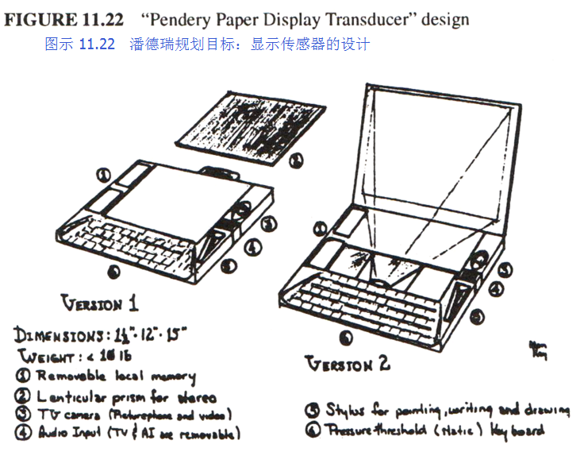

Right around this time we were involved in another conflict with Xerox management, in particular with Don Pendery the head "planner". He really didn't understand what we were talking about and instead was interested in "trends" and "what was the future going to be like" and how could Xerox "defend against it." I got so upset I said to him, "Look. The best way to predict the future is to invent it. Don't worry about what all those other people might do, this is the century in which almost any clear vision can be made!" He remained unconvinced, and that led to the famous "Pendery Papers for PARC Planning Purposes," a collection of essays on various aspects of the future. Mine proposed a version of the notebook as a "Display Transducer", and Jim Mitchell's was entitled "NLS on a Minicomputer."


看我一直孤军奋战，也毫无章法，比尔·英格利希（Bill English）做了我的领路人，并帮助我组建团队。
他给我的建议之一是我应当有个预算。
而我恐怕真的问了他：“预算是什么？”
这让我想起了犹他大学的日子，就是曼斯菲尔德修正案出台前的岁月，戴夫·埃文斯（Dave Evans）在他动身去ARPA前对我说：“我们几乎弹尽粮绝了，要开始多争取一些投资。”
我想他说得不错。
整个系列的过程就是：
别人给你投资、
你把那笔钱花在寻找下一步该做什么上面、
钱花完了、
他们就继续给你钱，
凡此种种，不一而足。
PARC从未按照这种牧歌式的标准行事，但是第一个五年里，我们还是离这个标准越来越近了。
我需要组建一个团队，是因为我意识到自己并不具备通过单打独斗完完全全完成一个想法的品质。
我把这个团队称为学习性研究小组（Learning Research Group，简称LRG），尽量模糊我们要做的事情。
关于小组的成员，我所选的人都是在听到笔记本想法时眼前一亮的人们。
我不喜欢开会：因为我从来都不觉得头脑风暴可以代替冷静持久的思考。
当有人问我该做什么，而我也没有一个确切的想法时，我就指着这台笔记本的模型对他说：“改进它。”
LRG小组的成员彼此之间关系紧密——就如丹·英戈尔斯（Dan Ingalls）后来所说的那样：“......整个小团队，连休息时间里彼此间都洋溢着爱与活力。”
许许多多个白天我们都是在PARC之外度过的，我们一起打网球、骑车、喝酒、吃中餐，期间也时不时地讨论Dynabook，以及它扩大人类视野的潜能和给予踟蹰不前的人类文明所急需的新道路的可能性（60年代的余兴未尽时，这个目标在加州很普遍）。

Bill English took me under his wing and helped me start my group as I had always been a lone wolf and had no idea how to do it. One of his suggestions was that I should make a budget. I'm afraid that I really did ask Bill, "What's a budget?" I remembered at Utah, in pre-Mansfield Amendment days, Dave Evans saying to me as he went off on a trip to ARPA, "We're almost out of money. Got to go get some more." That seemed about right to me. They give you some money. You spend it to find out what to do next. You run out. They give you some more. And so on. PARC never quite made it to that idyllic standard, but for the first half decade it came close. I needed a group because I had finally realized that I did not have all of the temperaments required to completely finish an idea. I called it the Learning Research Group (LRG) to be as vague as possible about our charter. I only hired people that got stars in their eyes when they heard about the notebook computer idea. I didn't like meetings: didn't believe brainstorming could substitute for cool sustained thought. When anyone asked me what to do, and I didn't have a strong idea, I would point at the notebook model and say, "Advance that." LRG members developed a very close relationship with each other—as Dan Ingalls was to say later: "... the rest has enfolded through the love and energy of the whole Learning Research Group." A lot of daytime was spent outside of PARC, playing tennis, bikeriding, drinking beer, eating chinese food, and constantly talking about the Dynabook and its potential to amplify human reach and bring new ways of thinking to a faltering civilization that desperately needed it (that kind of goal was common in California in the aftermath of the sixties).

同年夏天，我提炼了KiddiKomp的想法，于是设计出了miniCOM。
它所使用的是像NOVA 1200那样的位片处理方法（bit-slice approach），它还有位图显示器（bit-map display）、[定点设备（pointing device）](http://baike.baidu.com/view/3645603.htm)、二级存储（实际上是三级），当然还有它的语言，我现在把这个语言叫做“Smalltalk”——因为“编程语言应当具备类似Smalltalk的性质”、“孩子们应当用Smalltalk编程”。
这样命名也是为了和“印欧神论（IndoEuropean god theory）”的命名方式相抗衡，在那种方法下，系统都被叫做[宙斯（Zeus）](http://baike.baidu.com/subview/15931/11100791.htm)、[奥丁（Odin）](http://baike.baidu.com/item/%E5%A5%A5%E4%B8%81/32493)、[托尔（Thor）](http://baike.baidu.com/subview/1897765/5135462.htm#viewPageContent)等等，尽管高大上，却并没什么用。
我发现“Smalltalk”这个名字给人的感觉是无关痛痒的，因此，如果它运行良好，人们反倒会感到惊讶（这种惊讶是讨人喜欢的）。

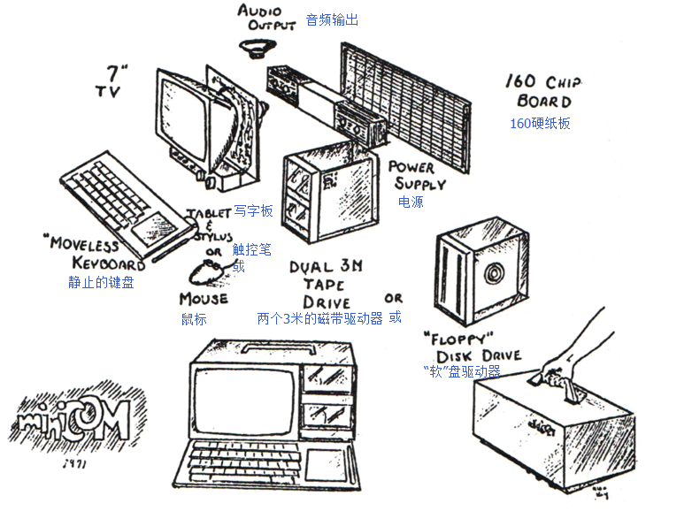

In the summer of '71 I refined the KiddiKomp idea into a tighter design called miniCOM. It used a bit-slice approach like the NOVA 1200, had a bit-map display, a pointing device, a choice of "secondary" (really tertiary) storages, and a language I now called "Smalltalk"—as in "programming should be a matter of ..." and "children should program in ...". The name was also a reaction against the "IndoEuropean god theory" where systems were named Zeus, Odin, and Thor, and hardly did anything. I figured that "Smalltalk" was so innocuous a label that if it ever did anything nice people would be pleasantly surprised.


这个Smalltalk语言（现在叫做Smalltalk-71）受FLEX、PLANNER、LOGO、META II以及我从中衍生出的语言影响很深。
它是一种具有可以直接执行命令的对象属性的分析程序。
（我认为里面那些碍手碍脚的引用约定来自META）。
我对把程序看成是代数模式兴趣索然，但我却有个清晰的计划，关于用一种系统实现多种语言的编程。
**这个带图标的终端可以进行简单的延伸、可以检索到作为“数据”的图标、可以用简单的办法将行为与对象相联系，它的eval虽然初级却表达清晰，这样我认为孩子们在有了几年的简单编程基础以后便可以理解它们。
程序的存储被分类到一个鉴别网络中，而评估则是直截了当地进行模式匹配**（The patterned front-end allowed simple extension, patterns as "data" to be retrieved, a simple way to attach behaviors to objects, and a rudimentary but clear expression of its eval in terms that I thought children could understand after a few years experience with simpler programming. Program storage was sorted into a discrimination net and evaluation was straightforward pattern-matching）

``` 
Smalltalk-71程序

to T 'and' :y do 'y'
to F 'and' :y do F

to 'factorial' 0 is 1
to 'factorial' :n do 'n*factorial n-1'

to 'fact' :n do 'to 'fact' n do factorial n. ^ fact n'

to :e 'is-member-of' [] do F
to :e 'is-member-of' :group
          do'if e = firstof group then T
                  else e is-member-of rest of group'

to 'cons' :x :y is self
to 'hd' ('cons' :a :b) do 'a'
to 'hd' ('cons' :a :b) '<-' :c do 'a <- c'
to 'tl' ('cons' :a :b) do 'b'
to 'tl' ('cons' :a :b) '<-' :c do 'b <- c'

to :robot 'pickup' :block
         do 'robot clear-top-of block.
         robot hand move-to block.
         robot hand lift block 50.
         to 'height-of' block do 50'
```

This Smalltalk language (today labeled -71) was very influenced by FLEX, PLANNER, LOGO, META II, and my own derivatives from them. It was a kind of parser with object-attachment that executed tokens directly. (I think the awkward quoting conventions come from META). I was less interested in programs as algebraic patterns than I was in a clear scheme that could handle a variety of styles of programming. The patterned front-end allowed simple extension, patterns as "data" to be retrieved, a simple way to attach behaviors to objects, and a rudimentary but clear expression of its eval in terms that I thought children could understand after a few years experience with simpler programming. Program storage was sorted into a discrimination net and evaluation was straightforward pattern-matching

```
Smalltalk-71 Programs

to T 'and' :y do 'y'
to F 'and' :y do F

to 'factorial' 0 is 1
to 'factorial' :n do 'n*factorial n-1'

to 'fact' :n do 'to 'fact' n do factorial n. ^ fact n'

to :e 'is-member-of' [] do F
to :e 'is-member-of' :group
          do'if e = firstof group then T
		          else e is-member-of rest of group'

to 'cons' :x :y is self
to 'hd' ('cons' :a :b) do 'a'
to 'hd' ('cons' :a :b) '<-' :c do 'a <- c'
to 'tl' ('cons' :a :b) do 'b'
to 'tl' ('cons' :a :b) '<-' :c do 'b <- c'

to :robot 'pickup' :block
         do 'robot clear-top-of block.
		 robot hand move-to block.
		 robot hand lift block 50.
		 to 'height-of' block do 50'
```

正如我之前所言，LISP的外在美被一些华而不实的名号所玷污了，人们非得把其中一些关键的部分称为“特殊形式”，实际上它们不过是一些功能不同的普通成分。
与实际模型相比，LISP最美的地方在于它的超异（Metastructure）。
我花了很大一部分时间来思考，在不扰乱**核心隐喻（central metaphor）**的情况下，对象如何拥有普通计算机的特性。
这里，我们所需要的似乎是完全控制消息传递中的要素；具体点说就是，完全控制对表达进行评估的时间和环境。

As I mentioned previously, it was annoying that the surface beauty of LISP was marred by some of its key parts having to be introduced as "special forms" rather than as its supposed universal building block of functions. The actual beauty of LISP came more from the promise of its metastructures than its actual model. I spent a fair amount of time thinking about how objects could be characterized as universal computers without having to have any exceptions in the central metaphor. What seemed to be needed was complete control over what was passed in a message send; in particular when and in what environment did expressions get evaluated?

戴夫·费舍尔（Dave Fisher）在卡耐基梅隆大学发表过一篇关于控制结构集合的论文【Fisher 70】，里面提到了一种简洁明了的解决办法。
[ALGOL60 ](http://baike.baidu.com/view/1626317.htm)语言需要一种独立的链接，它既要保证动态调用子程序，又要调用[静态全局变量（static global state）](http://baike.baidu.com/view/14039160.htm)。
费舍尔在他的论文里揭示了如何将这些链接一般化，并用来模拟各式各样的控制环境。
解决LISP“函数变元问题（funarg problem）”的方法之一是将适当的全局变量链接与表达和功能相结合，之后会对这些表达和功能进行评估，因此，它所引用的[自由变量（free veriables）](http://baike.baidu.com/view/10522936.htm)实际上是由该语言的静态形式呈现的。
该论文中也提前描述了[“惰性计算（lazy evaluation）”](http://baike.baidu.com/view/2300535.htm)的概念。

An elegant approach was suggested in a CMU thesis of Dave Fisher [Fisher 70] on the synthesis of control structures. ALGOL60 required a separate link for dynamic subroutine linking and for access to static global state. Fisher showed how a generalization of these links could be used to simulate a wide variety of control environments. One of the ways to solve the "funarg problem" of LISP is to associate the proper global state link with expressions and functions that are to be evaluated later so that the free variables referenced are the ones that were actually implied by the static form of the language. The notion of "lazy evaluation" is anticipated here as well.

这种方法现在叫做**反思设计**（reflective design）。
把它跟FLEX结合在一起说明了，所有“正确执行LISP”或者“正确执行OOP”的设计，应当在不考虑模块（module）自身细节的情况下，拥有管理模块间调用方式的能力。
然后，将LISP和OOP（或其他任何系统）区别开来的应当是它们具备了什么样的模块。
如果发送人和接收人能够达到一致，普通模块（对象）引用——B5000和LISP——和消息储存结构可以是虚拟的——并且所有做这些事的人都可以使用它们。

Nowadays this approach would be called reflective design. Putting it together with the FLEX models suggested that all that should be required for "doing LISP right" or "doing OOP right" would be to handle the mechanics of invocations between modules without having to worry about the details of the modules themselves. The difference between LISP and OOP (or any other system) would then be what the modules could contain. A universal module (object) reference —ala B5000 and LISP—and a message holding structure—which could be virtual if the senders and receivers were sympatico— that could be used by all would do the job.

一个消息发送结构的组成部分如下：

名称                | 注释
-------------------|---------------------------------------- 
GLOBAL             | **参数值环境**（the environment of the parameter values） 
SENDER             | 消息发送方
RECEIVER           | 消息接收方 
REPLY-STYLE        | 等待、分流......？
STATUS             | 发送进程
REPLY              | 最终结果 （如有）
OPERATION SELECTOR | 针对接收方
# OF PARAMETERS    | （参数编号）
P1                 | P1
...                | ......
Pn                 | Pn

这是堆栈结构的一般化，也应用于B5000。
当然，这也和CAL-TSS这样的操作系统所需的模块间的良好互动类似——每一次执行都有许多不同的方法来表达，但思考这些会带来些许帮助。

If all of the fields of a messenger structure were enumerated according to this view, we would have:

Field              | Note
-------------------|---------------------------------------- 
GLOBAL             | the environment of the parameter values 
SENDER             | the sender of the message
RECEIVER           | the receiver of the message 
REPLY-STYLE        | wait, fork, ...?
STATUS             | progress of the message
REPLY              | eventual result (if any)
OPERATION SELECTOR | relative to the receiver
# OF PARAMETERS    | 
P1                 | 
...                | 
Pn                 | 

This is a generalization of a stack frame, such as used by the B5000, and very similar to what a good intermodule scheme would require in an operating system such as CAL-TSS—a lot of state for every transaction, but useful to think about.

执行之前，许多关于某种表达好坏与否的思考都与我们试着去理解“在面向对象进行设计时，‘美丽’的涵义是什么”有关。
我们主观上对美丽事物的定义很简单，但却没什么帮助：我们认为一样东西是美丽的，那是因为它会激起我们某种感情。
这个陈词滥调忽略了旁观者的感受。
因此，站在他者的角度上去评判某个事物是否美丽是困难的，但如果换成是自己和这个事物之间，自我的倾向性就很重要了。

Much of the pondering during this state of grace (before any workable implementation) had to do with trying to understand what "beautiful" might mean with reference to object-oriented design. A subjective definition of a beautiful thing is fairly easy but is not of much help: we think a thing beautiful because it evokes certain emotions. The cliche has it lie "in the eye of the beholder" so that it is difficult to think of beauty as other than a relation between subject and object in which the predispositions of the subject are all important.

我们认为数学很美，这与它身上具备的简约、有概括性、发人深省和优雅息息相关。
例如，[勾股定理（Pythagorean Theorem）](http://baike.baidu.com/view/366.htm)只有短短一行公式，却适用于所有的直角三角形，用于理解其它关系时也惊人地有用，并且证明它只需要简短而深刻的几步。

One part of the perceived beauty of mathematics has to do with a wondrous synergy between parsimony, generality, enlightenment, and finesse. For example, the Pythagorean Theorem is expressible in a single line, is true for all of the infinite number of right triangles, is incredibly useful in understanding many other relationships, and can be shown by a few simple but profound steps.

如果世界上有那种放之四海而皆准的标准，那么我们应当在人类共有的基因里寻找。
但对于像LISP这样的事物来说，我们的判断则明显是建立在后天的学习之上的，并且我们也要考虑到其他美丽的地方，譬如数学。

If there are such a thing as universally appealing forms then we can perhaps look to our shared biological heritage for the predispositions. But, for an object like LISP, it is almost certain that most of the basis of our judgement is learned and has much to do with other related areas that we think are beautiful, such as much of mathematics.

当我们转而去研究那些五花八门的计算机语言时，我们会发现，其实它们大部分都很普通，但也有一些很简洁。
举例来说就是，我们可以花些口舌来解释那些通用的机器语言，但是它们绝大多数都算不上美丽，这其中有一部分原因是代码的做作与繁复。
要创造出一个既有趣又简单小巧的系统其实“门槛很高”——这里需要平衡兴趣度（interestingness）的级别和表达的复杂程度。

When we turn to the various languages for specifying computations we find many to be general and a few to be parsimonious. For example, we can define universal machine languages in just a few instructions that can specify anything that can be computed. But most of these we would not call beautiful, in part because the amount and kind of code that has to be written to do anything interesting is so contrived and turgid. A simple and small system that can do interesting things also needs a "high slope"—that is a good match between the degree of interestingness and the level of complexity needed to express it.

一颗受精卵最终可以演变出各种各样的生物，这些复杂的有机体需要具备简约、有概括性、发人深省和优雅的特性——总结起来就是它是美丽的，更加符合我审美的那种美丽。
我的意思是说，通过这样的方式我们会发现大自然在美和实用方面都有很深的造诣——其实可以用计算机术语来解释[细胞膜（cell membrane）](http://baike.baidu.com/view/32273.htm)，一方面它能够让一些有用且一直在进化的系统各司其职，另一方面，它也是一个零件，能够向世人提供一个统一界面（uniform interface）。

A fertilized egg that can transform itself into the myriad of specializations needed to make a complex organism has parsimony, generality, enlightenment, and finesse—in short, beauty, and a beauty much more in line with my own esthetics. I mean by this that Nature is wonderful both at elegance and practicality—the cell membrane is partly there to allow useful evolutionary kludges to do their necessary work and still be able act as component by presenting a uniform interface to the world.

此时一直困扰我的问题是位图显示屏的大小。
即便是使用了混合模式（[细粒度【fine-grained】](http://baike.baidu.com/view/3630593.htm)的文字和图形[粗粒度【coarse-grained】](http://blog.sina.com.cn/s/blog_4eaff65601000bxg.html)的位图显示），把所有的信息都呈现在屏幕上也是困难的。
后来我突然有了一个想法（这是在我洗澡的时候，我最喜欢在这种时间思考），FLEX的窗口可以像桌上堆放的文件那样显示在位图显示器上。
如果要更新中间的一份，可以把它取出，放在这一堆的最上面。
那时，它可能不是最棒的解决方案，但它的确无限放大了显示屏的有用区域，因此我打算这么去做。

One of my continual worries at this time was about the size of the bit-map display. Even if a mixed mode was used (between fine-grained generated characters and coarse-grained general bit-map for graphics) it would be hard to get enough information on the screen. It occurred to me (in a shower, my favorite place to think) that FLEXtype windows on a bit-map display could be made to appear as overlapping documents on a desktop. When an overlapped one was refreshed it would appear to come to the top of the stack. At the time, this did not appear as the wonderful solution to the problem but it did have the effect of magnifying the effective area of the display enormously, so I decided to go with it.

为了对视频作为显示媒体进行研究，比尔·英格里希（Bill English）和[巴特勒·拉姆泼逊（Butler Lampson）](http://baike.baidu.com/view/2009279.htm)为POLOS终端（帕克实验室的线上办公系统）指定了一个实验性的字符发生器（character generator ）（由罗杰·贝茨【Roger Bates】制造）。
那时，[盖瑞·斯塔克维（Gary Starkweather）](http://office.pconline.com.cn/319/3191447_5.html)刚刚发明了第一台激光打印机，我们有时跑到他的实验室去让他打印一些东西。
这个“SLOT机器”（激光扫描输出终端 Scanning Laser Output Terminal）简直令人惊艳。
那时候施乐公司唯一一台复印机以每秒打印一页的速度工作，盖瑞让他的激光打印机也按照这个速度运行，每英寸500像素。

To investigate the use of video as a display medium, Bill English and Butler Lampson specified an experimental character generator (built by Roger Bates) for the POLOS (PARC OnLine Office System) terminals. Gary Starkweather had just gotten the first laser printer to work and we ran a coax over to his lab to feed him some text to print. The "SLOT machine" (Scanning Laser Output Terminal) was incredible. The only Xerox copier Gary could get to work on went at 1 page a second and could not be slowed down. So Gary just made the laser run at that rate with a resolution of 500 pixels to the inch!

这个字符发生器的字型存储器（font memory）大到能够模拟位图显示（如果有人进行某种操作，并将内容写入字型储存器中的话）。
本·劳斯（Ben Laws）发明了一个很棒的字型编辑器，并且他和我花了好几个月来研究人类视觉系统的特性（显然，它是非线性的）。
我对显示器怎样呈现出高质量的图文很感兴趣，因为我认为，Dynabook电脑具备了这样的特性就会像[“特洛伊木马（trojan horse）”](http://baike.baidu.com/subview/2611/10982649.htm#viewPageContent)那样轻易地取代学校的书本，这样，为了把它用于学校教学，我们就不用大费周章地向老师和学校董事会解释个人电脑的有用之处。


The character generator's font memory turned out to be large enough to simulate a bit-map display if one displayed a fixed "strike" and wrote into the font memory. Ben Laws built a beautiful font editor and he and I spent several months learning about the peculiarities of the human visual system (it is decidedly non-linear). I was very interested in high-quality text and graphical presentations because I thought it would be easier to get the Dynabook into schools as a "trojan horse" by simply replacing school books rather than to try to explain to teachers and school boards what was really great about personal computing.


实验室一切进展顺利，直到1972年5月，那时我需要更多的资源来制造多台miniCOM。
但某位刚来不久的主管（我叫他“X”）并不打算如我愿。
我写了张便条试图向他解释这个主意的好处（见附录II），然后我们开了个会讨论这件事。
结果“X”完全否决了我们的要求，他的理由之一是施乐已经在我们的MAXC分时操作系统上花费了太多金钱，再转而投资个人机器会让他们感到困惑。
对此我大感惊讶。
我只好回去继续研究字符发生器，并打算生产超过四台。后来我又联系上了NOVAs公司，合作展开首次儿童实验。

Things were generally going well all over the lab until May of 1972 when I tried to get resources to build a few miniCOMs. A relatively new executive ("X") did not want to give them to me. I wrote a memo explaining why the system was a good idea (see Appendix II), and then had a meeting to discuss it. "X" shot it down completely saying among other things that we had used too many green stamps getting Xerox to fund the time-shared MAXC and this use of resources for personal machines would confuse them. I was shocked. I crawled away back to the experimental character generator and made a plan to get 4 more made and hooked to NOVAs for the initial kid experiments.

那时我找到了史蒂夫·博塞尔（Steve Purcell），彼时他是斯坦福的暑期生，负责把我的点阵画设想变为现实，这样孩子们就能在电脑上画画了。
约翰·肖奇（John Shoch）则负责线图（基于莱丁的设想【纽曼和斯普劳尔 72】）。
POLOS的比尔·杜瓦尔（Bill Duvall）设计了miniNLS，它的速度和功能令人印象深刻。
我们还制作出了第一个重叠窗口。
鲍勃·舒尔（Bob Shur）（在史蒂夫·博塞尔的帮助下）建立了2½D 动画系统。
而有了本·劳斯（Ben Laws）的字符编辑器，我们制作出了极为形象的demo，里面展示了往后几年我们所努力的方向。
我还记得我们递了一份demo给一位主管，甚至用我们的绘画系统为他画了自画像，然后嚣张地对他说：“它的绝妙之处在于，成功的可能性只有20%。我们正听你的话冒险！”
他直勾勾地看着我说：“孩子，这很不错，但务必取得成功。”
这是一名主管对风险的典型解读。
他要我们做那20%。


I got Steve Purcell, a summer student from Stanford, to build my design for bit-map painting so the kids could sketch as well as display computer graphics. John Shoch built a line drawing and gesture recognition system (based on Ledeen's [Newman and Sproull 72]) that was integrated with the painting. Bill Duvall of POLOS built a miniNLS that was quite remarkable in its speed and power. The first overlapping windows started to appear. Bob Shur (with Steve Purcell's help) built a 2½D animation system. Along with Ben Laws' font editor, we could give quite a smashing demo of what we intended to build for real over the next few years. I remember giving one of these to a Xerox executive, including doing a portrait of him in the new painting system, and wound it up with a flourish declaring: "And what's really great about this is that it only has a 20% chance of success. We're taking risk just like you asked us to!" He looked me straight in the eye and said, "Boy, that's great, but just make sure it works." This was a typical executive notion about risk. He wanted us to be in the "20%" one hundred percent of the time.


那个夏天我一边舔舐伤口，一边继续着demo里的工作。
巴特勒·拉姆泼逊（Butler Lampson）、彼得·多伊奇（Peter Deutsh）和我想出了一个方案来模拟[HLL机器语言](http://baike.baidu.com/item/hll#3)。
那时我推崇B5000的方案，但巴特勒不想给字节解码，他还指出既然8比特有256种编号的可能性，那么我们理当做的就是为“指令空间（instruction space）”里不同的部分赋予不同的意义。
最终，我们会创造出一种“穷人的[哈夫曼编码](http://baike.baidu.com/item/%E5%93%88%E5%A4%AB%E6%9B%BC%E7%BC%96%E7%A0%81)（poor man's Huffman code）”，它的身上兼具了灵活与简洁两种特性。
后来，这个方案应用在了帕克中心所有的模拟器上。

That summer while licking my wounds and getting the demo simulations built and going, Butler Lampson, Peter Deutsch, and I worked out a general scheme for emulated HLL machine languages. I liked the B5000 scheme, but Butler did not want to have to decode bytes, and pointed out that since an 8-bit byte had 256 total possibilities, what we should do is map different meanings onto different parts of the "instruction space." This would give us a "poor man's Huffman code" that would be both flexible and simple. All subsequent emulators at PARC used this general scheme.

我还尝试研究儿童计算机语言。
杰夫·鲁里夫森（Jeff Rulifson）非常推崇[皮亚杰理论](http://baike.baidu.com/item/%E7%9A%AE%E4%BA%9A%E6%9D%B0%E7%90%86%E8%AE%BA)（和符号学），我们曾多次讨论“儿童认知发展阶段”和符号学思想的涵义。
在读完皮亚杰（Piaget）和[杰罗姆·布鲁纳（Jerome Bruner）](http://baike.baidu.com/item/%E6%9D%B0%E7%BD%97%E5%A7%86%C2%B7%E5%B8%83%E9%B2%81%E7%BA%B3)后，尤其是杰罗姆·布鲁纳，我开始担心孩子们难以理解FLEX、LOGO（以及现在的Smalltalk）中直接使用的象征法，因为已有证据显示那时孩子们的象征阶段（或者说“认知”）才刚刚开启。
实际上，所有我推崇的教育家（包括[蒙台梭利<Montessori>](http://baike.baidu.com/item/%E7%8E%9B%E5%88%A9%E4%BA%9A%C2%B7%E8%92%99%E5%8F%B0%E6%A2%AD%E5%88%A9)、[霍尔特<Holt>](http://baike.baidu.com/item/%E7%BA%A6%E7%BF%B0%C2%B7%E9%9C%8D%E5%B0%94%E7%89%B9)和[铃木<Suzuki>](http://baike.baidu.com/item/%E9%93%83%E6%9C%A8%E9%95%87%E4%B8%80)），他们似乎都提倡一种更形象也更符号化的方法。
鲁道夫·安海姆（Rudolph Arnheim ）【安海姆 69】曾写过一本很经典的著作叫《视觉化思考》，艺术批评家[贡布里希（ Gombrich）](http://baike.baidu.com/item/%E8%B4%A1%E5%B8%83%E9%87%8C%E5%B8%8C)【贡布里希 60】也持相似的观点。
这一切似乎都佐证着这里该有所突破。
这个突破不会是GRAIL，因为它所谓的形象化是用来描绘与编辑流程图的，这与初衷相去甚远。
但罗夫纳（Rovner）的AMBIT-G似乎相当靠谱【罗夫纳 68】。
它像是可视化的 SNOBOL【法贝尔 63】，其中模式匹配的想法似乎可以用于我当时正采用的类似PLANNER的方案。

I also took another pass at the language for the kids. Jeff Rulifson was a big fan of Piaget (and semiotics) and we had many discussions about the "stages" and what iconic thinking might be about. After reading Piaget and especially Jerome Bruner, I was worried that the directly symbolic approach taken by FLEX, LOGO (and the current Smalltalk) would be difficult for the kids to process since evidence existed that the symbolic stage (or mentality) was just starting to switch on. In fact, all of the educators that I admired (including Montessori, Holt, and Suzuki) all seemed to call for a more figurative, more iconic approach. Rudolph Arnheim [Arnheim 69] had written a classic book about visual thinking, and so had the eminent art critic Gombrich [Gombrich 60]. It really seemed that something better needed to be done here. GRAIL wasn't it, because its use of imagery was to portray and edit flowcharts, which seemed like a great step backwards. But Rovner's AMBIT-G held considerably more promise [Rovner 68]. It was kind of a visual SNOBOL [Farber 63] and the pattern matching ideas looked like they would work for the more PLANNERlike scheme I was using.

比尔·英格利希（Bill English）建议我多做些类似制定预算、写计划和重要进程报告等的表面工作来增加可信度。
于是我写了个计划，计划中描述了在未来的几年中我们会在字符发生器和 NOVA上建立一个真正的系统，这个系统是面向对象的，它有窗口、音乐、动画，并且可以进行“符号编程（iconic programming）”。
后面的事情是最困难的，我们也会采取解决难题惯常使用的手段，即把它们丢给研究生们。

“简事当简做，繁事应可成。”

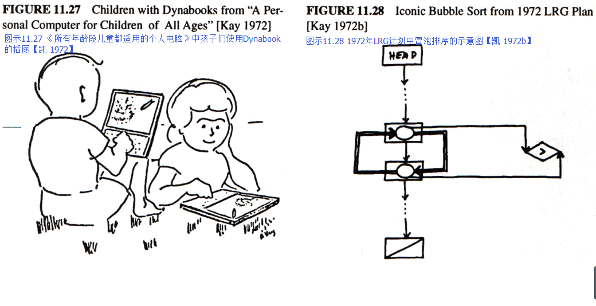

Bill English was still encouraging me to do more reasonable appearing things to get higher credibility, like making budgets, writing plans and milestone notes, so I wrote a plan that proposed over the next few years that we would build a real system on the character generators cum NOVAs that would involve OOP, windows, painting, music, animation, and "iconic programming." The latter was deemed to be hard and would be handled by the usual method for hard problems, namely, give them to grad students.

“Simple things should be simple, complex things should be possible.”


九月份，数周来打下的两项赌约改变了我的大部分计划。
巴特勒和恰克前来问我：“你有钱吗？”
我说：“有的，NOVA和CG的投资有大约23万美元。你们问这个做什么？”
他们又问：“你想让我们把小型机器做成什么样呢？”
我回答说：“我要它们令人满意。你们到底想说什么？”
巴特勒回答道：“我想做个价值500美元的PDP-10，恰克想做个速度快10倍的NOVA，而你则倾心于kiddicomp，你到底想把它做成什么样？”
我告诉他们这个机器大多数的功能来自我们对字体、绘图、分辨率、动画和音乐功能的研究。
然后我又询问他们怎么突然冒出了这个念头，巴特勒则回答我不管怎样他们就是想做这些，况且那位X主管这几个月正外出忙于某项“特殊任务”，这正是他们“浑水摸鱼”的好时机。
而恰克还跟比尔·维提科（Bill Vitic）打赌说他能在3个月内做出整个机器。
“哦，这样。”我恍然大悟。

In Sept, within a few weeks of each other, two bets happened that changed most of my plans. First, Butler and Chuck came over and asked: "Do you have any money?" I said, "Yes, about $230K for NOVAs and CGs. Why?" They said, "How would you like us to build your little machine for you?" I said, "I'd like it fine. What is it?" Butler said: "I want a '$500 PDP-10', Chuck wants a '10 times faster NOVA', and you want a 'kiddicomp'. What do you need on it?" I told them most of the results we had gotten from the fonts, painting, resolution, animation, and music studies. I asked where this had come from all of a sudden and Butler told me that they wanted to do it anyway, that Executive "X" was away for a few months on a "task force" so maybe they could "Sneak it in", and that Chuck had a bet with Bill Vitic that he could do a whole machine in just 3 months. "Oh," I said.

第二个赌约所带来的结果就更令人惊奇了。
我一直希望新的Smalltalk语言会是一种符号语言，并且至少要花费两年来研发，但命运弄人。
一天，在帕尔中心走廊上一次日常闲聊中，泰德·凯勒（Ted Kaehler）、丹·英戈尔斯（Dan Ingalls）和我讨论起了编程语言。
当我们讨论到计算机语言的能力时，他们提出了一个疑问：多大的计算机语言才能拥有巨大的能力？
我字字珠玑，夸下海口道：“世界上最强大的计算机语言只要一页代码。”
他们则甩给我一句话：“眼见为实，耳听为虚。”

The second bet had even more surprising results. I had expected that the new Smalltalk would be an iconic language and would take at least two years to invent, but fate intervened. One day, in a typical PARC hallway bullsession, Ted Kaehler, Dan Ingalls, and I were standing around talking about programming languages. The subject of power came up and the two of them wondered how large a language one would have to make to get great power. With as much panache as I could muster, I asserted that you could define the "most powerful language in the world" in "a page of code." They said, "Put up or shut up."

泰德回到了卡内基梅隆大学（CMU），但丹仍旧阴魂不散地怂恿我。
为了这个问题，后面的两周我每天凌晨4点就到了帕克中心，一直工作到八点，那时亨利·福克斯（Henry Fuchs）、约翰·肖奇（John Shoch）和史蒂文·珀赛尔（Steve Purcell）都加入进了丹晨间滔滔不绝的游说队伍。

Ted went back to CMU but Dan was still around egging me on. For the next two weeks I got to PARC every morning at four o'clock and worked on the problem until eight, when Dan, joined by Henry Fuchs, John Shoch, and Steve Purcell showed up to kibbitz the morning's work.

我之所以最先夸下海口，是因为那时麦卡锡的LISP自描述解释器已经能够自行转译了。
它的篇幅大概也就是“一页”，并且从头至尾[函数式语言（functional language）](http://baike.baidu.com/item/%E5%87%BD%E6%95%B0%E5%BC%8F%E8%AF%AD%E8%A8%80)除了LISP外，没有其他。
我很确信，在面向对象的语言中我也能这么做，当然，除此之外，我还能为一些FLEX机器的代码创造出一种合适的句法。

I had originally made the boast because McCarthy's self-describing LISP interpreter was written in itself. It was about "a page", and as far as power goes, LISP was the whole nine-yards for functional languages. I was quite sure I could do the same for object-oriented languages plus be able to do a reasonable syntax for the code a la some of the FLEX machine techniques.

和我最初的想法相比，一切似乎难度更大，这有三个原因。
其一是我希望这个程序更像麦卡锡（McCarthy）第二种非递归的解释器——这种解释器竭尽所能模仿[史蒂文·罗素（Steve Russell）](http://www.tvdcdl.com/xiaomengla/136.html)最初的709循环运行方式。
它更加“真实”。
其二，若要将“解析（parsing）”功能与信息接收相结合——在LISP中这种参数估值是分开作用的——需要我面向对象的解释器比LISP“更快”（实际上要快许多倍）再次进行自我运行。
最后，我尚不明确接收如何配合运作。

It turned out to be more difficult than I had first thought for three reasons. First, I wanted the program to be more like McCarthy's second non-recursive interpreter—the one implemented as a loop that tried to resemble the original 709 implementation of Steve Russell as much as possible. It was more "real". Second, the intertwining of the "parsing" with message receipt—the evaluation of parameters which was handled separately in LISP—required that my object-oriented interpreter re-enter itself "sooner" (in fact, much sooner) than LISP required. And, finally, I was still not clear how send and receive should work with each other.

第一种版本有些瑕疵，受到了小组成员的诟病。
但在早上8点多钟的时候，我们做出了一个似乎可用的版本（解释器的设计梗概见附录III）。
第一个版本与官方Smalltalk-72最大的不同在于这些符号都由[字节码（byte-code）](http://baike.baidu.com/item/%E5%AD%97%E8%8A%82%E7%A0%81)构成，而从发送方接收[返回值（return-value）](http://baike.baidu.com/item/%E8%BF%94%E5%9B%9E%E5%80%BC)这一过程是对称的——例如接收可像[参数绑定（parameter binding）](http://document.thinkphp.cn/manual_3_2.html#param_bind)那样——这对多个值的返回尤其有用。
为了追求一个更倾向以表达为导向的函数返回形式，我们放弃了它。

The first few versions had flaws that were soundly criticized by the group. But by morning 8 or so, a version appeared that seemed to work (see Appendix III for a sketch of how the interpreter was designed). The major differences from the official Smalltalk-72 of a little bit later were that in the first version symbols were byte-coded and the receiving of return-values from a send was symmetric—i.e. receipt could be like parameter binding—this was particular useful for the return of multiple values. For various reasons, this was abandoned in favor of a more expression-oriented functional return style.

当然，对于这个赌约，我好不容易才勉强让自己“置身事外”，但我觉得它的确印证了我的观点。
在追求我们官方的“符号编程（iconic programming）”之余，这样浑水摸鱼的确有趣，当时我觉得这就是全部了。
然而出乎我意料的是，几天后丹·英戈尔斯（Dan Ingalls）在NOVA上向我展示了这个成果。
一切都由代码写就（他用的是[(BASIC)](http://baike.baidu.com/item/BASIC%E8%AF%AD%E8%A8%80)！），他还添加了许多细节，诸如[记号扫描处理（token scanner）](http://baike.baidu.com/item/%E6%89%AB%E6%8F%8F%E5%A4%84%E7%90%86)、列表工具（list maker）等，并且一切都能顺利运行。
就如同他喜欢说的那样：“即做即现（You just do it and it's done）。”

Of course, I had gone to considerable pains to avoid doing any "real work" for the bet, but I felt I had proved my point. This had been an interesting holiday from our official "iconic programming" pursuits, and I thought that would be the end of it. Much to my surprise, only a few days later, Dan Ingalls showed me the scheme working on the NOVA. He had coded it up (in BASIC!), added a lot of details, such as a token scanner, a list maker, etc., and there it was—running. As he liked to say: "You just do it and it's done."

在计算3+4时它运行得很慢（按巴特勒的说法就是“跟冻僵了一样（glacial）”），但无论如何最终的答案都是7。
因此，接下来我们所要做的就是勇往直前。
丹喜欢在可以“一直运行”的系统上添加[引导程序（bootstrap）](http://baike.baidu.com/item/%E5%BC%95%E5%AF%BC%E7%A8%8B%E5%BA%8F)，接下来的十年里，他至少发表了八十多种不同类型的Smalltalk。

It evaluated 3+4 v e r y  s l o w l y (it was "glacial", as Butler liked to say) but the answer always came out 7. Well, there was nothing to do but keep going. Dan loved to bootstrap on a system that "always ran," and over the next ten years he made at least 80 major releases of various flavors of Smalltalk.

11月，我向麻省理工的AI实验室展示了这些想法，并阐释了翻译程序。
这最终让卡尔·休伊特（Carl Hewitt）想出了更正式的“Actor”解决方案（休伊特 73）。
第一篇Actor论文中所用的计算机语言和Smalltalk是最相近的。
但之后就不一样了，一方面因为跟理论比起来，我们更想做些实际的东西，另一方面则是因为我们有独一无二的法宝：恰克·塞克（Chuck Thacker）的Dynabook个人电脑（后来叫做[ALTO](http://mt.sohu.com/20160803/n462300251.shtml)）。

In November, I presented these ideas and a demonstration of the interpretation scheme to the MIT AI lab. This eventually led to Carl Hewitt's more formal "Actor" approach [Hewitt 73]. In the first Actor paper the resemblance to Smalltalk is at its closest. The paths later diverged, partly because we were much more interested in making things than theorizing, and partly because we had something no one else had: Chuck Thacker's Interim Dynabook (later known as the "ALTO").

就在恰克（Chuck）着手研究这个机器之前，我向全国英语教师委员会【凯 72c】递交了一份文件。
文件的内容是关于Dynabook，以及它在提升孩子们学习与思考能力方面的潜能——它其实是《20件可用Dynabook做的事》的影印版。
当我从明尼苏达州回来时，[斯图尔特·布兰德（Stewart Brand）](http://sanwen8.cn/p/L23Adq.html)在[《滚石》（Rolling Stone）](http://www.rollingstone.com/)上发表了一篇关于帕克中心【布兰德 1972】和周围黑客社区的文章，并大获成功。
出乎我们意料的是，它在位于[康涅狄格州斯坦福市](http://baike.baidu.com/subview/46775/5111725.htm#viewPageContent)的施乐总部掀起了轩然大波。
尽管这篇文章很棒，牢牢抓住了整个文化的精髓，但施乐中心还是非常生气，它迫使我们佩戴徽章（经过多年的发展，有些徽章直接印在T恤上），并且严格限制此类文章的发表。
这对我们学习型研究小组来说是场灾难，因为我们都是群“狂热分子”（其他计算机科学家这样叫我们），那时我们正打算深入各个校园，并与西蒙·派珀特（Seymour Papert）和多恩·诺曼（Don Norman）这样的同事分享这些想法（和计划）。

Just before Chuck started work on the machine I gave a paper to the National Council of Teachers of English [Kay 72c] on the Dynabook and its potential as a learning and thinking amplifier—the paper was an extensive rotogravure of "20 things to do with a Dynabook" [Kay 72c]. By the time I got back from Minnesota, Stewart Brand's Rolling Stone article about PARC [Brand 1972] and the surrounding hacker community had hit the stands. To our enormous surprise it caused a major furor at Xerox headquarters in Stamford, Connecticut. Though it was a wonderful article that really caught the spirit of the whole culture, Xerox went berserk, forced us to wear badges (over the years many were printed on t-shirts), and severely restricted the kinds of publications that could be made. This was particularly disastrous for LRG, since we were the "lunatic fringe" (so-called by the other computer scientists), were planning to go out to the schools, and needed to share our ideas (and programs) with our colleagues such as Seymour Papert and Don Norman.

显然，在斯坦福市，X主管听到了不少关于我们的风言风语。
当他圣诞节回来，发现了试验版的Dynabook后，他非常愤怒，甚至想毁了这台电脑。
后来，巴特勒（Butler）撰文进行了强烈反击，X主管最终败兴而归，继续他的“特殊任务”。

Executive "X" apparently heard some harsh words at Stamford about us, because when he returned around Christmas and found out about the interim Dynabook, he got even more angry and tried to kill it. Butler wound up writing a masterful defense of the machine to hold him off, and he went back to his "task force."

1972年11月22日，恰克（Chuck）开始了他“赌约”。
除了磁盘接口由艾德·麦克特（Ed McCreight）完成外，机器其余的部分都由两名技术人员负责。
它的位图显示器约有五十万像素（606x808），微码平均运行速度为6[MIPS](http://baike.baidu.com/item/MIPS/20188911#viewPageContent)，大小共计128k，整台机器（除内存外）都依托于两个160MSI芯片。
这台机器非常美丽【赛克 1972,1986】。
它突出的特点之一就是“zero-over-head”任务分配模式。
它有16个[程序计数器（program counter）](http://baike.baidu.com/item/%E7%A8%8B%E5%BA%8F%E8%AE%A1%E6%95%B0%E5%99%A8)，各负责一个任务。
[状态标志（condition flags）](http://baike.baidu.com/item/%E7%8A%B6%E6%80%81%E6%A0%87%E5%BF%97)与特殊的事件相关联（例如“水平回扫脉冲（horizonal retrace pulse）”和“磁盘扇区脉冲（disk sector pulse）”）。
在机器运行时，后备逻辑（lookaside logic）会扫描这些标志，并先选取优先级最高的程序计数器，依次类推。
整台机器在运行时无需等待，而大部分的硬件功能（尤其是涉及[i/o](http://baike.baidu.com/item/i%2Fo/84718)的，例如显示与控制磁盘）都能被微码取代。
一个任务甚至可以更新MOS动态[随机存取存储器（RAM）](http://baike.baidu.com/item/%E9%9A%8F%E6%9C%BA%E5%AD%98%E5%8F%96%E5%AD%98%E5%82%A8%E5%99%A8?fromtitle=RAM&fromid=144481&type=syn)。
换句话说就是，这是一种协同程序（coroutine）的架构。
恰克声称他的灵感来源于我几个月前关于协同程序的演讲，但在我的印象中则是韦斯·克拉克（Wes Clark）最先在TX-2（Sketchpad机器）中运用了这个想法，我可能只是在演讲中提到了它。

Chuck had started his "bet" on November 22, 1972. He and two technicians did all of the machine except for the disk interface which was done by Ed McCreight. It had a ~500,000 pixel (606x808) bitmap display, its microcode instruction rate was about 6 MIPS, it had a grand total of 128k, and the entire machine (exclusive of the memory) was rendered in 160 MSI chips distributed on two cards. It was beautiful [Thacker 1972, 1986]. One of the wonderful features of the machine was "zero-over-head" tasking. It had 16 program counters, one for each task. Condition flags were tied to interesting events (such as "horizontal retrace pulse", and "disk sector pulse", etc.). Lookaside logic scanned the flags while the current instruction was executing and picked the highest priority program counter to fetch from next. The machine never had to wait, and the result was that most hardware functions (particularly those that involved i/o (like feeding the display and handling the disk) could be replaced by microcode. Even the refresh of the MOS dynamic RAM was done by a task. In other words, this was a coroutine architecture. Chuck claimed that he got the idea from a lecture I had given on coroutines a few months before, but I remembered that Wes Clark's TX-2 (the Sketchpad machine) had used the idea first, and I probably mentioned that in the talk.

三个多月后，四月初，第一台试验版的Dynabook问世了，我们叫它“Bilbo”。
几分钟内它的屏幕上就显示出第一幅画面：我在绘画系统上画出的芝麻街“甜饼怪”。


In early April, just a little over three months from the start, the first Interim Dynabook, known as 'Bilbo,' greeted the world and we had the first bit-map picture on the screen within minutes: the Muppets' Cookie Monster that I had sketched on our painting system.


很快丹（Dan）就写出了不少Smalltalk辅助程序，数个月来，它是这台试验版Dynabook上运行的唯一系统。
在附录I里我添加了那时写的“回执”，这里面提到了资源的分配，以及各个部分的优先级。
我23万美元的投资足以完成原定30台计划中的一半（数年来，我们其实生产了近2000台Dynabook）。
叔本华（Schopenhauer）的言论也当真在此应验：X主管现在认为Dynabook是个绝妙的主意，他想把所有的Dynabook转移到自己的实验室里（除了我实验室里的两台）。
我费了九牛二虎之力才把它们要回来，幸好成功了。

Soon Dan had bootstrapped Smalltalk across, and for many months it was the sole software system to run on the Interim Dynabook. Appendix I has an "acknowledgements" document I wrote from this time that is interesting it its allocation of credits and the various priorities associated with them. My $230K was enough to get 15 of the original projected 30 machines (over the years some 2000 Interim Dynabooks were actually built). True to Schopenhauer's observation, Executive "X" now decided that the Interim Dynabook was a good idea and he wanted all but two for his lab (I was in the other lab). I had to go to considerable lengths to get our machines back, but finally succeeded.

1. 一切皆对象
2. 对象间通过发送和接收（与对象相关的）消息交流
3. 对象有自己的内存（与对象相关）
4. 每个对象都是一个[类（class）](http://baike.baidu.com/subview/2390/8109879.htm#viewPageContent)（这个类也必须是一个对象）中的[实例（instance）](http://baike.baidu.com/item/Instance/5156585)
5. 类中包含着各个实例共有的性态（behavior）（在程序列表中以对象的形态呈现）
6. 为了用[eval函数](http://baike.baidu.com/item/eval%28%29)处理某个程序列表，电脑会控制第一个对象，余下的则被当做消息进行处理

目前为止，我们已经按照设计解释器的初衷，对大部分Smalltalk计划进行了划分，于是他们被分为六个主要想法。
前三个原理围绕着Smalltalk的功能——“外部对象”如何看待与使用它们。
数年来我们不需要对它们进行任何修改。
而后三个——来自内部的对象——则需要根据不同版本的Smalltalk（和之后面向对象的设计）进行微调。
计划（1）和（4）中暗示类就是对象，并且它们是自身的实例。
（6）则暗含一个像LISP那样通用的句法，但接收对象需放在首位，随后是消息。
因此c<sub>i</sub> <- de（用“&deg;”预先渲染，并用“*”进行乘法运算）表示：
```
receiver | message
c        | ° i <- d*e
```
`c`与接收对象相关联，而`° i <- d*e`则是消息。
这则消息由文字标记“°”、i（在发送方的语境下需要被评估的表达）、另一个文字标记“<-”和之后的d*e（在发送方的语境下需要被评估的表达）组成。
由于“LISP”的搭配由两个元素对象构成，它们可以以更简洁的方式呈现：`c hd`、`c tl`和`c hd <- foo`等。

一开始，要表达像a+b和3+4这样“简单”的概念似乎更加麻烦。用下面的形式来表示它们真的合理吗：
```
receiver | message
a        | + b
3        | + 4
```
只考虑到整数的话它看上去挺蠢的，但“+”还有着其它意义，例如：

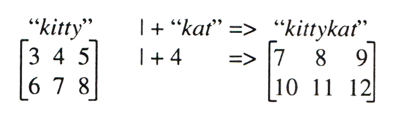

这就生成了一种为信息符号（message symbol）寻找通用行为（generic behaviors）风格。
[“多态性（polymorphism）”](http://baike.baidu.com/item/%E5%A4%9A%E6%80%81%E6%80%A7)是其官方表达（我认为这个词源自克里斯托弗・斯特雷奇（Strachey）），但它与最初的意义有所差异。
最初它只应用在功能上，而这个功能可以携带不止一种类型的参数（argument）（译者注：parameter和argumentd的区别在于，前者指函数定义中的参数，后者指函数调用时的实际参数）。
在Smalltalk-72中，诸如cons对象（原文中为cons pairs，是LISP中constructs memory objects的别称，故此翻译）模型这样的object类可以是如下这样：


由于在考虑处理余下的信息之前，已经对类进行了控制——类也可以自行决定不接受控制——整个程序是完全受保护的。
Smalltalk-72的对象是“耀眼的”，但不会受攻击的影响。
环境中有一部分是将“messenger对象”（一个广义上的活动记录）与发送方相关联，这样接收方就能赋予其不同的权利（更多细节见附录II）。
这一想法可以联系到未来Smalltalk作为网络操作系统的最终用途上（见【Goldstein & Bobrow 1980】），在我印象中，它并没怎么应用在Smalltalk-72上。

Smalltalk-71保留的形式之一就是混合功能与类的概念。在其他操作中，Smalltalk-72的类看上去像功能，并且可以作为功能而使用，但使用了ISNEW对象，它可以轻易地创造出实例（程序停止运行的一种情况）。
因此阶乘（factional）可以延伸为如下形式：
```
to fact n (^if :n=0 then 1 else n*fact n-1)
```
或者作为整数类的一种内化成以下形式：
```
(... ¤! » (^:n=1) » (1) (n-1)!)
```

当然，整个Smalltalk（一般来说是面向对象）的想法是将一切事物向内延伸。
它过去是我们学习如何用新的形式来编程的方向。
我一点都不喜欢这种句法（括号和嵌套结构太多），因此我希望在Smalltalk-71中使用更优美更注重语法的语言。
下面是句法的示例，摘取自之后的笔记。
几年后，我们会在丹为Smalltalk-76设计的程序中看见更多这样的例子。
我认为LISP身上也出现了相似的情况——我们从未设计出过真正简单又实用的句法。
```
建议采用的Smalltalk-72句法

Pair :h :t
    hd <- :h
    hd              » h
    tl <- :t
    tl              » t
    isPair          » true
    print           » '( print. SELF mprint.
    mprint          » h print. if t isNil then ') print
                               else if t isPair then t mprint
                               else '* print. t print. ') print
    length          » 1 + if t isList then t length else 0
```
    
1. Everything is an object
2. Objects communicate by sending and receiving messages (in terms of objects)
3. Objects have their own memory (in terms of objects)
4. Every object is an instance of a class (which must be an object)
5. The class holds the shared behavior for its instances (in the form of objects in a program list)
6. To eval a program list, control is passed to the first object and the remainder is treated as its message

By this time most of Smalltalk's schemes had been sorted out into six main ideas that were in accord with the initial premises in designing the interpreter. The first three principles are what objects "are about"—how they are seen and used from "the outside." These did not require any modification over the years. The last three—objects from the inside—were tinkered with in every version of Smalltalk (and in subsequent OOP designs). In this scheme (1 & 4) imply that classes are objects and that they must be instances of themself. (6) implies a LISPlike universal syntax, but with the receiving object as the first item followed by the message. Thus c<sub>i</sub> <- de (with subscripting rendered as "°" and multiplication as "*") means:

```
receiver | message
c        | ° i <- d*e
```

The c is bound to the receiving object, and all of ° i <- d*e is the message to it. The message is made up of literal token "°", an expression to be evaluated in the sender's context (in this case i), another literal token <-, followed by an expression to be evaluated in the sender's context (d*e). Since "LISP" pairs are made from 2 element objects they can be indexed more simply: c hd, c tl, and c hd <- foo, etc.

"Simple" expressions like a+b and 3+4 seemed more troublesome at first. Did it really make sense to think of them as:

```
receiver | message
a        | + b
3        | + 4
```

It seemed silly if only integers were considered, but there are many other metaphoric readings of "+", such as:


This led to a style of finding generic behaviors for message symbols. "Polymorphism" is the official term (I believe derived from Strachey), but it is not really apt as its original meaning applied only to functions that could take more than one type of argument. An example class of objects in Smalltalk-72, such as a model of CONS pairs, would look like:


Since control is passed to the class before any of the rest of the message is considered—the class can decide not to receive at its discretion—complete protection is retained. Smalltalk-72 objects are "shiny" and impervious to attack. Part of the environment is the binding of the SENDER in the "messenger object" (a generalized activation record) which allows the receiver to determine differential privileges (see Appendix II for more details). This looked ahead to the eventual use of Smalltalk as a network OS (See [Goldstein & Bobrow 1980]), and I don't recall it being used very much in Smalltalk-72.

One of the styles retained from Smalltalk-71 was the comingling of function and class ideas. In other works, Smalltalk-72 classes looked like and could be used as functions, but it was easy to produce an instance (a kind of closure) by using the object ISNEW. Thus factorial could be written "extensionally" as:

```
to fact n (^if :n=0 then 1 else n*fact n-1)
```

or "intensionally," as part of class integer:

```
(... ¤! » (^:n=1) » (1) (n-1)!)
```

Of course, the whole idea of Smalltalk (and OOP in general) is to define everything intensionally. And this was the direction of movement as we learned how to program in the new style. I never liked this syntax (too many parentheses and nestings) and wanted something flatter and more grammar-like as in Smalltalk-71. To the right is an example syntax from the notes of a talk I gave around then. We will see something more like this a few years later in Dan's design for Smalltalk-76. I think something similar happened with LISP—that the "reality" of the straightforward and practical syntax you could program in prevailed against the flights of fancy that never quite got built.

```
Proposed Smalltalk-72 Syntax

Pair :h :t
    hd <- :h
	hd              » h
	tl <- :t
	tl              » t
	isPair          » true
	print           » '( print. SELF mprint.
	mprint          » h print. if t isNil then ') print
                               else if t isPair then t mprint
                               else '* print. t print. ') print
	length          » 1 + if t isList then t length else 0
```

### Smalltalk-72系统的发展与应用
Smalltalk真正应用在机器上开始于平行路径（parallel path）的激增，他们很难执行过去那些严格的命令。
让我先大致介绍一下Smalltalk-72向Smalltalk-76转变的过程，在此之后，我花了几年时间让孩子们使用它，这也是这个项目的首要动力。
在试验版的Dynabook上Smalltalk-72解释器运行的并不那么灵活（按巴特勒的说法就是“并不那么叹为观止（pronouncement）”），但它容易改变，并且，对于即将纳入系统中的实时互动系统来说，它运行得足够快了。

在写好了用于读取键盘输入和创造文本字符串（string of text）代码后，我们（与戴安娜·玛丽（Diana Merry））第一个解决的问题就是重叠窗口。
为了让屏幕显示不同高度的字体，并且大致做到一边写字一边显示，戴安娜创造了一个早期的位域块转换系统。
第一个窗口版本是2½D的可拖拽的对象，但它运行起来有点慢，用处不大。
我们打算再等一等，直到史蒂夫·珀赛尔（Steve Purcell）在他的动画系统中成功地实现了这个功能（它更接近“2¼D”），并且一直沿用至今。
窗口可能是我们在Smalltalk中返工次数最多的类了，因为我们既没有足够的计算能力来持续观察[“世界坐标（world coordinates）”](http://baike.baidu.com/item/%E4%B8%96%E7%95%8C%E5%9D%90%E6%A0%87%E7%B3%BB)，也无法一直对其进行更新，而我之前在犹他大学的同事正着手在伊万斯（Evans）& 苏泽兰(Sutherland)的飞行模拟器项目中对其进行实验。
这个模型简洁而有力，但却很难实时实现，甚至是在 2½D中。第一个实用的Smalltalk窗口使用了GRAIL中移动、调整大小、克隆和关闭功能。
调整窗口时运用了一种简单的“无环（loopless）”控制方式，它把所有的窗口都串联在一起。

（在完成了数字、字符串等基本要素后）下一个要应用在试验版Dynebook上的就是一个面向对象的LOGO [turtle语言](http://biancheng.dnbcw.info/python/443280.html)版本，由泰德（Ted）负责。
它可以制作出任何turtle语言实例，既可以用在绘画上，也可以作为值用在图形转换（graphic transformation）上。
丹（Dan）创造了一种“turtle指挥官”类，它可以操控整个turtle军队。
很快，这些turtle图案便制作好了，这样我们就可以用窗口对其进行剪切。

约翰·肖奇（John Shoch）为Smalltalk代码创造了一种已鼠标为驱动的结构编辑器。

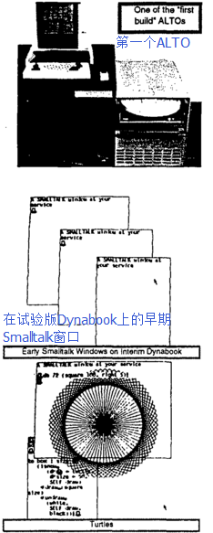

[拉里·特斯勒（Larry Tesler）](http://www.baike.com/wiki/%E6%8B%89%E9%87%8C%C2%B7%E7%89%B9%E6%96%AF%E5%8B%92)（后来为POLOS工作）并不喜欢NSL函数的模式性（modiness）与一般方法，他希望向之前的NLS使用者们提供一个可替代的方案，并组织进行编辑方面的用户调查（那时几乎闻所未闻）。
这促使他用Smalltalk编写miniMOUSE程序，这是帕克中心第一个[WYSIWYG](http://baike.baidu.com/item/%E6%89%80%E8%A7%81%E5%8D%B3%E6%89%80%E5%BE%97)编辑器。它（几乎）没什么模式，用起来也很有趣，不仅我们有这种感受，许多测试它的人皆是如此（我用相机运行了一下从前拍的片子，唤起了其中的愉悦与欣喜）。很快，miniMOUSE就成为了Smalltalk代码和一些demo的替代编辑器。

1974年春天，我在成人班打算实验的“小型”项目之一就是单页段落编辑器。它非常复杂，但我展示给大家的例子是完全无模式的（它即将被人们所了解），并且在接下来的这些年里，它成为了许多Smalltalk文本的基础。丹和戴安娜·玛丽（Diana Merry）完成了其大部分改进。
当然，对象也是多媒体文件，大部分你都可以免费阅览。
我们在早期就意识到，这些文件中每个部分的对象都需要掌控自身的编辑任务。
史蒂夫·韦耶（Steve Weyer）建立了一些最早的多媒体文件，在之后的许多年里，鲍勃·弗莱戈（Bob Flegal）、戴安娜·玛丽（Diana Merry）、拉里·特斯勒（Larry Tesler）、蒂姆·莫特（Tim Mott）和[Trygve Reenskaug](http://www.umlchina.com/Chat/TrygveReenskaug.htm)极大地扩展了它们。

史蒂夫·韦耶（Steve Weyer）和我设计了Findit，这是一个“通过例子来检索（retrieval by example）”的界面，它将类与其实例进行类比，形成了检索请求。
为了控制图书馆书本的流通，帕克图书馆使用了它许多年。

我在NOVA上开发的抽样合成音乐系统可以生成三种高清实时语音。
鲍勃·舒尔（Bob Shur）和恰克·塞克（Chuck Thacker）将这个功能转移到了试验版的Dynabook上，并且他们成功地实现了实时生成12种语音。低速设备（用于鼠标和键盘）使用的是256比特大小的一般输入，这使得其能够轻易连接两个风琴键盘和一个踏板，它们的大小超过154比特。
程序中还囊括了滑音（portamento）效果和衰减（decay）效果。
泰德·凯勒（Ted Kaehler）写了一个音乐捕捉与编辑系统，名叫TWANG，其中使用了我们为孩子们发明的符号谱（tablature notation）【凯 1977a】。
抽样中一个比较棘手的问题就是[压控振荡器（VCO）](http://baike.baidu.com/item/VCO)在“[平均律](http://baike.baidu.com/item/%E5%B9%B3%E5%9D%87%E5%BE%8B)合成器（Well Tempered Synthesizer）”中的普遍使用。
后来，有一个夏天，我们来了一个非常聪明的暑期生，名叫史蒂夫·桑德斯（Steve Saunders），他决心挑战将约翰·乔宁（John Chowning）非实时的调频合成（FM synthesis）音乐转换成ID上的实时音乐。
这意味着他得另辟蹊径，从“FM”以外的方面入手，而最终他获得了成功，将八条实时语音合并进了TWANG中【桑德斯 1977】。

然而克里斯·杰夫（Chris Jeffers）（他是音乐家和教育家，而非计算机科学家）的OPUS遂将我们排在了沙滩上，这是第一个实时乐谱捕捉系统（score capturing system）。
和现在大部分系统不一样的是，它并不需要有节奏地播放音乐，相反地，它第一遍追求的是节拍的强弱（乐句划分），据此建立一个相似的节奏波动局部模型，然后使用[曲线拟合（curve fitting）](http://baike.baidu.com/item/%E6%9B%B2%E7%BA%BF%E6%8B%9F%E5%90%88)和[外推法（extrapolation）](http://baike.baidu.com/item/%E5%A4%96%E6%8E%A8%E6%B3%95)来判断小节（measure）的位置、[时值（time value）](http://baike.baidu.com/item/%E6%97%B6%E5%80%BC/8998649)、敲击的[音符（note）](http://baike.baidu.com/item/%E9%9F%B3%E7%AC%A6/70459)。


NOVA上每秒能够运行2-3[帧（frame）](http://baike.baidu.com/item/%E5%B8%A7#2)动画，其中每帧包含3-5个对象。
这个速度足以让画面动起来了（如果速率是其两倍的话需要[缓冲（buffering）](http://baike.baidu.com/item/%E7%BC%93%E5%86%B2%E5%99%A8)），但我们并不满足于此。
我们想达到的是“迪士尼的速率（Disney rates）”，即每秒运行10-15帧，每帧包含十多个大型对象，或者更多小一些的对象。
这个任务交给了开了“金手指”的史蒂夫·珀赛尔（Steve Purcell）。
截止到1973年的秋天，他可以每秒运行10帧2½D的画面，其中包含80个乒乓球和10匹飞驰的骏马。
他的下一项任务是把这个demo做成一个普通的系统设备，这样我们就可以在其中建立动画系统了。
1974年5月，他的CHAOS系统开始运作，那时正值罗恩·贝克（Ron Baecker）、汤姆·霍斯利（Tom Horseeley）和专业动画大师埃里克·马丁（Eric Martin）夏季访问期间，他们还共同制作了SHAZAM—一个非常有效且简洁的动画系统。
该系统主要基于罗恩六十年代末关于TX-2的论文设计——GENESYS。


此时最主要的论文设计是戴夫·史密斯（Dave Smith）的PYGMALION【史密斯 75】。
这篇论文是关于图标编程的（是的，我们还没忘了它）。
一个人编写程序来告诉系统怎样进行改变，这就像一个人在黑板上画上图示来向另一个程序员阐释一样。
这个程序起到了良好的带头作用，后来涌现出许多“按例编程（progarmming by example）”的系统。

这里，我想提一下关于这些程序大小的事情。
PYGMALION是用Smalltalk-72写出的最大的程序，它的代码有20页左右——都能够在试验版dynabook ALTO上运行——史密斯的论文上可以看见其完整的代码。
相比较而言，其他的应用就更小了。
拿SHAZAM动画系统举个例子：1974年夏天，经过几次撰写和设计，我们最终做出了这个系统，它的代码只有5-6页，其中还包含了图标控制的多窗口用户界面。

Simpula来自于[仿真语言（simulation language）](http://baike.baidu.com/item/%E4%BB%BF%E7%9C%9F%E8%AF%AD%E8%A8%80)，它是SIMULA排序方法的一个简易版本，它写起来很容易，篇幅也不长。
这时我们认为，通过将各个单独的方法归类为模拟阶段（simulation phase），可以让协同程序（coroutine）更加简洁明了。
一个最普通的SIMULA例子就是加工车间，它们可以被划分成许多有用的部分，就像医院有不同的科室来诊断不同的病人（见右侧）一样。
孩子们对医院没什么兴趣，但他们完全可以模拟像迪士尼乐园一样的游乐场、学校、他们和父母常去的商店，等等。
后来，这个模型成为了Smalltalk Sim-kit的基石，这是一个高级的终端用户编程环境（此前已介绍过）。

我们可以用Smalltalk-72来完成多种“计算机科学类的（computer sciency）”设计。
例如我们争论的话题之一就是是否要加入[goto语句](http://baike.baidu.com/item/Goto/12755716)（之前我们并没有），如果不加入的话，我们如何详细说明那些非常有用的控制结构——例如一个[loop中的多个exit](https://zhidao.baidu.com/question/1733646605296283627.html)？
来自SLAC的恰克·扎恩（Chuck Zahn）提议建立一个以事件为驱动的结构，一系列事件将在其中被定义，这样如果发生了某个事件，该loop就会停止（exit），并且在代码块（case block）中可以选择相对应的表达【扎恩，1974 克努特，1974】。
假设我们打算写一个很简单的loop，它用来读取键盘上打下的字母，并将其显示出来。我们希望敲击键盘时整个loop可以正常停止，进入exit，而误触键盘时则不会（此时为error）。
附录IV解释了约翰·肖奇（John Shoch）是如何定义这个控制结构的。

```
(until Return or Delete do
    ('character <- display <- keyboard.
    character = ret » (Return)
    character = del » (Delete)
    )
then case
    Return: ('deal with this normal exit')
    Delete: ('handle the abnormal exit'))
```

### Development of the Smalltalk-72 System and Applications

The advent of a real Smalltalk on a real machine started off an explosion of parallel paths that are too difficult to intertwine in strict historical order. Let me first present the general development of the Smalltalk-72 system up to the transition to Smalltalk-76, and then follow that with the several years of work with children that were the primary motivation for the project. The Smalltalk-72 interpreter on the Interim Dynabook was not exactly zippy ("majestic" was Butler's pronouncement), but was easy to change and quite fast enough for many real-time interactive systems to be built in it.

Overlapping windows were the first project tackled (with Diana Merry) after writing the code to read the keyboard and create a string of text. Diana built an early version of a bit field block transfer (bitblt) for displaying variable pitch fonts and generally writing on the display. The first window versions were done as real 2½D draggable objects that were just a little too slow to be useful. We decided to wait until Steve Purcell got his animation system going to do it right, and opted for the style that is still in use today, which is more like "2¼D". Windows were perhaps the most redesigned and reimplemented class in Smalltalk because we didn't quite have enough compute power to just do the continual viewing to "world coordinates" and refreshing that my former Utah colleagues were starting to experiment with on the flight simulator projects at Evans & Sutherland. This is a simple, powerful model but it is difficult to do in real-time even in 2½D. The first practical windows in Smalltalk used the GRAIL conventions of sensitive corners for moving, resizing, cloning, and closing. Window scheduling used a simple "loopless" control scheme that threaded all of the windows together.

One of the next classes to be implemented on the Interim Dynabook (after the basics of numbers, strings, etc.) was an object-oriented version of the LOGO turtle implemented by Ted. This could make many turtle instances that were used both for drawing and as a kind of value for graphics transformations. Dan created a class of "commander" turtles that could control a troop of turtles. Soon the turtles were made so they could be clipped by the windows.

John Shoch built a mouse-driven structured editor for Smalltalk code.


Larry Tesler (then working for POLOS) did not like the modiness and general approach of NLS, and he wanted both show the former NLSers an alternative and to conduct some user studies (almost unheard of in those days) about editing. This led to his programming miniMOUSE in Smalltalk, the first real WYSIWYG galley editor at PARC. It was modeless (almost) and fun to use, not just for us but for the many people he tested it on (I ran the camera for the movies we took and remember their delight and enjoyment). miniMOUSE quickly became an alternate editor for Smalltalk code and some of the best demos we ever gave used it.

One of the "small program" projects I tried on an adult class in the Spring of '74 was a one-page paragraph editor. It turned out to be too complicated, but the example I did to show them was completely modeless (it was in the air) and became the basis for much of the Smalltalk text work over the next few years. Most of the improvements were made by Dan and Diana Merry. Of course, objects mean multi-media documents, you almost get them for free. Early on we realized that in such a document, each component object should handle its own editing chores. Steve Weyer built some of the earliest multi-media documents, whose range was greatly and variously expanded over the years by Bob Flegal, Diana Merry, Larry Tesler, Tim Mott, and Trygve Reenskaug.

Steve Weyer and I devised Findit, a "retrieval by example" interface that used the analogy of classes to their instances to form retrieval requests. This was used for many years by the PARC library to control circulation.

The sampling synthesis music I had developed on the NOVA could generate 3 high-quality real-time voices. Bob Shur and Chuck Thacker transferred the scheme to the Interim Dynabook and achieved 12 voices in real-time. The 256 bit generalized input that we had specified for low speed devices (used for the mouse and keyboard) made it easy to connect 154 more to wire up two organ keyboards and a pedal. Effects such as portamento and decay were programmed. Ted Kaehler wrote TWANG, a music capture and editing system, using a tablature notation that we devised to make music clear to children [Kay 1977a]. One of the things that was hard to do with sampling was the voltage controlled oscillator (VCO) effects that were popular on the "Well Tempered Synthesizer." A summer later, Steve Saunders, another of our bright summer students, was challenged to find a way to accomplish John Chowning's very non-real-time FM synthesis in real-time on the ID. He had to find a completely different way to think of it than "FM", and succeeded brilliantly with 8 real-time voices that were integrated into TWANG [Saunders *].


Shazam iconic user interface, PYGMALION Iconic Programming, Simpula Hospital Simulation
Chris Jeffers (who was a musician and educator, not a computer scientist) knocked us out with OPUS, the first real-time score capturing system. Unlike most systems today it did not require metronomic playing but instead took a first pass looking for strong and weak beats (the phrasing) to establish a local model of the likely tempo fluctuations and then used curve fitting and extrapolation to make judgements about just where in the measure, and for what time value, a given note had been struck.


The animations on the NOVA ran 3-5 objects at about 2-3 frames per second. Fast enough for the phi phenomenon to work (if double buffering was used), but we wanted "Disney rates" of 10-15 frames a second for 10 or more large objects and many more smaller ones. This task was put into the ingenious hands of Steve Purcell. By the fall of '73 he could demo 80 ping-pong balls and 10 flying horses running at 10 frames per second in 2½D. His next task was to make the demo into a general systems facility from which we could construct animation systems. His CHAOS system started working in May '74, just in time for summer visitors Ron Baecker, Tom Horseeley, and professional animator Eric Martin to visit and build SHAZAM a marvelously capable and simple animation system based on Ron's GENESYS thesis project on the TX-2 in the late sixties [Baecker 69].


The main thesis project during this time was Dave Smith's PYGMALION [Smith 75], an essay into iconic programming (no, we hadn't quite forgotten). One programmed by showing the system how changes should be made, much as one would illustrate on a blackboard with another programmer. This program became the starting place from which many subsequent "programming by example" systems took off.

I should say something about the size of these programs. PYGMALION was the largest program ever written in Smalltalk-72. It was about 20 pages of code—all that would fit in the interim dynabook ALTO—and is given in full in Smith's thesis. All of the other applications were smaller. For example, the SHAZAM animation system was written and revised several times in the summer of 1974, and finally wound up as a 5-6 page application which included its icon-controlled multiwindowed user interface.

Given its roots in simulation languages, it was easy to write in a few pages, Simpula, a simple version of the SIMULA sequencing set approach to scheduling. By this time we had decided that coroutines could be rendered more cleanly by scheduling individual methods as separate simulation phases. The generic SIMULA example was a job shop. This could be generalized into many useful forms such as a hospital with departments of resources serving patients (see to the right). The children did not care for hospitals but saw that they could model amusement parks, like Disneyland, their schools, the stores they and their parents shopped in, and so forth. Later this model formed the basis of the Smalltalk Sim-kit, a high-level end-user programming environment (described ahead).

Many nice "computer sciency" constructs were easy to make in Smalltalk-72. For example, one of the controversies of the day was whether to have gotos or not (we didn't), and if not, how could certain very useful control structures—such as multiple exits from a loop—be specified? Chuck Zahn at SLAC proposed an event-driven case structure in which a set of events could be defined so that when an event is encountered, the loop will be exited and the event will select a statement in a case block [Zahn 1974, Knuth 1974]. Suppose we want to write a simple loop that reads characters from the keyboard and outputs them to a display. We want it to exit normally when the <return> key is struck and with an error if the <delete> key is hit. Appendix IV shows how John Shoch defined this control structure.

```
(until Return or Delete do
    ('character <- display <- keyboard.
    character = ret » (Return)
    character = del » (Delete)
    )
then case
    Return: ('deal with this normal exit')
    Delete: ('handle the abnormal exit'))
```

#### Smalltalk-72的演变
Smalltalk-74是Smalltalk-72的改良版（有时我们叫它FastTalk），与Smalltalk-72的不同之处在于它拥有真正的“消息发送器（messenger）”对象、关于类的消息字典（message dictionaries）（这使得我们离真正的类对象又进了一步）、戴安娜·玛丽的[bitblt](http://baike.baidu.com/item/BitBlt)（它现在是著名的2D位图图像[算子（operator）](http://baike.baidu.com/item/%E7%AE%97%E5%AD%90)）——后来由丹（Dan）重新设计并用微码操作，和一个更强大也更常规的窗口界面。
戴夫·罗宾森（Dave Robinson）那时还是[加州大学欧文分校](http://baike.baidu.com/item/UCI)的学生，他听说了我们的项目，并在使用面向对象的编程语言（OOPL）方面给予了我们极大的帮助。
我们热情地邀请他来“过暑假”，然后就一直把他“扣留着”——他在表达Smalltalk的语义上面功不可没。

其中最瞩目的当属加入了OOZE（面向对象的分区环境）[虚拟储存系统](http://baike.baidu.com/item/%E8%99%9A%E6%8B%9F%E5%AD%98%E5%82%A8%E7%B3%BB%E7%BB%9F)，与在Smalltalk-74上的应用相比，它在Smalltalk-76上的应用更为重要【英格尔斯，1978 凯勒，1981】。
ALTO存储器并不大（128-256K），尤其是还要算上页面大小的显示（64k）和一些小程序，容量很快就不够用了。
与软盘相比，其中2.4兆字节的30号[磁盘驱动（disk drive）](http://baike.baidu.com/item/%E7%A3%81%E7%9B%98%E9%A9%B1%E5%8A%A8%E5%99%A8)速度更快也更大，而和今天的硬盘驱动（hard drive）相比则更慢也更小。
它和FLEX机器上的HP直接接触磁盘（direct contact disk）非常相似，关于后者，我曾在B5000的段交换进程（segment swapper）中试着安装了一个细粒（fine-grain）版。
但除了带来一些关于如何在清除时选择对象的好想法外，它没能达到我的预期。
于是，当大家提出想要使用它时，我反对道：“我还没能让它真正发光发热。”
我记得泰德·凯勒（Ted Kaehler）这样回答我：“别担心，我们会搞定的。”

这些系统有一个基本想法，就是它们能够把一系列最可能派上用场的对象聚集在一起。
实现这个想法最简单的方法就是调动各个单独的对象。
而现在的问题是如何除去那些无用的对象，以此给真正需要的对象省下空间。
（在这个方面，有时候分页（paging）更好用，因为你在每个磁盘分区中可以放置不止一个对象（OOZE）。）
此时有两个想法带来了很大帮助。
一是巴特勒（Butler）关于GENIE OS洞见，他认为，为了让核心尽可能的干净，花少量时间在清除无用的对象上面是很有必要的【拉姆泼逊 1966】。
这样电脑每次崩溃所造成的损失就不会那么大了，并且电脑随时都有干净的内存来运行磁盘中的页面或者对象。
第二个想法来自FLEX系统，我在里面设置了一个[随机决策机制（stochastic decision mechanism）](http://baike.baidu.com/item/%E9%9A%8F%E6%9C%BA%E5%86%B3%E7%AD%96)（基于对象的类），它用于决定是否清除某个对象。
这有两个好处：保证不错删那些重要的对象、发生了错误能够重新恢复并且再次分配，这样该对象重新被错误清除的概率就很低了。

另一个亟待解决的问题是[对象指针（object-pointer）](http://baike.baidu.com/item/%E5%AF%B9%E8%B1%A1%E6%8C%87%E9%92%88)的完整性（在这个问题上，我没能在FLEX机器上找到满意的解决办法）。
这里我所需的是一个完整的执行过程、一个全新的解决办法（好像是巴特勒想出的？），这个办法是关于在机器崩溃的情况下如何保证其有效恢复。
我们把它叫做“宇宙射线保护法（cosmic ray protection）”，因为先前ALTOS每天都会原因不明地崩溃那么一两次。
当然，没有任何人因此而感到烦恼，因为找到有问题的地方、并重新启动来保护其不受宇宙射线的影响是相当容易的一件事。
但是，对于主要基于指针的系统（pointer-based system）来说，它们有着自动内存管理功能，想要实现上述办法更加棘手。

泰德（Ted）和丹（Dan）打算用Resident Object Table来管理内存，**这是唯一一种机器地址，我们在其中可以找到对象（that was the only place machine addresses for objects would be found）。**
其他有用的信息也存放于此，用于辅助运行[LRU的老化算法（LRU aging）](http://www.cnblogs.com/wuyuegb2312/p/3418026.html)。
通过对类进行选择、**按照磁盘配置实例（positioning the disk to its instances）**（所有同一类型的类都储存在一起），然后运行ROT查看内存中是否有需要清除的对象并将其清除，机器能够在后台完成清理。
它非常高效，且与巴特勒（Butler）的洞见相契合，能够为我们提供一个大小适宜且可被覆盖的干净存储容量。这个设计的关键（也是运行这个处理机制的关键）是他们想出的[检查点（checkpoint）](http://baike.baidu.com/item/%E6%A3%80%E6%9F%A5%E7%82%B9)方案。
其保证了无论计算机何时崩溃，几秒钟内都会生成可恢复的图像。
OOZE在一个只有80kb大小的内存（working storage）里交换对象，并且它能够处理大约65k大小的对象（相当于几兆字节大小，对整个系统、界面和应用来说绰绰有余）。

### The Evolution of Smalltalk-72

Smalltalk-74 (sometimes known as FastTalk) was a version of Smalltalk-72 incorporating major improvements which included providing a real "messenger" object, message dictionaries for classes (a step towards real class objects), Diana Merry's bitblt (the now famous 2D graphics operator for bitmap graphics) redesigned by Dan and implemented in microcode, and a better, more general window interface. Dave Robson while a student at UC Irvine had heard of our project and made a pretty good stab at implementing an OOPL. We invited him for a summer and never let him go back—he was a great help in formulating an official semantics for Smalltalk.

The crowning addition was the OOZE (Object Oriented Zoned Environment) virtual memory system that served Smalltalk-74, and more importantly, Smalltalk-76 [Ing 78, Kae *]. The ALTO was not very large (128-256K), especially with its page-sized display (64k), and even with small programs, we soon ran out of storage. The 2.4 megabyte model 30 disk drive was faster and larger than a floppy and slower and smaller than today's hard drives. It was quite similar to the HP direct contact disk of the FLEX machine on which I had tried a fine-grain version of the B5000 segment swapper. It had not worked as well as I wanted, despite a few good ideas as to how to choose objects when purging. When the gang wanted to adopt this basic scheme, I said: "But I never got it to work well." I remember Ted Kaehler saying, "Don't worry, we'll make it work!"

The basic idea in all of these systems is to be able to gather the most comprehensive possible working set of objects. This is most easily accomplished by swapping individual objects. Now the problem becomes the overhead of purging non-working set objects to make room for the ones that are needed. (Paging sometimes works better for this part because you can get more than one object (OOZE) in each disk touch.) Two ideas help a lot. First, Butler's insight in the GENIE OS that it was worthwhile to expend a small percentage of time purging dirty objects to make core as clean as possible [Lampson 1966]. Thus crashes tend not to hurt as much and there is always clean storage to fetch pages or objects from the disk into. The other is one from the FLEX system in which I set up a stochastic decision mechanism (based on the class of an object) that determined during a purge whether or not to throw an object out. This had two benefits: important objects tended not to go out, and a mistake would just bring it back in again with the distribution insuring a low probability that the object would be purged again soon.

The other problem that had to be taken care of was object-pointer integrity (and this is where I had failed in the FLEX machine to come up with a good enough solution). What was needed really was a complete transaction, a brand new technique (thought up by Butler?) that ensured recovery regardless of when the system crashed. This was called "cosmic ray protection" as the early ALTOS had a way of just crashing once or twice a day for no discernible good reason. This, by the way did not particularly bother anyone as it was fairly easy to come up with undo and replay mechanisms to get around the cosmic rays. For pointer-based systems that had automatic storage management, this was a bit more tricky.

Ted and Dan decided to control storage using a Resident Object Table that was the only place machine addresses for objects would be found. Other useful information was stashed there as well to help LRU aging. Purging was done in background by picking a class, positioning the disk to its instances (all of a particular class were stored together), then running through the ROT to find the dirty ones in storage and stream them out. This was pretty efficient and, true to Butler's insight, furnished a good sized pool of clean storage that could be overwritten. The key to the design though (and the implementation of the transaction mechanism) was the checkpointing scheme they came up with. This insured that there was a recoverable image no more than a few seconds old, regardless of when a crash might occur. OOZE swapped objects in just 80kb of working storage and could handle about 65K objects (up to several megabytes worth, more than enough for the entire system, its interface, and its applications).

#### “面向对象”的模式

面向对象类型（OOP-type）和目前开始引起学术圈兴趣的[“抽象数据类型（abstract data type）”](http://baike.baidu.com/item/%E6%8A%BD%E8%B1%A1%E6%95%B0%E6%8D%AE%E7%B1%BB%E5%9E%8B)差别很大，后者从表面上看是一种[封装（encapsulation）](http://baike.baidu.com/subview/154910/12534703.htm#viewPageContent)。
我觉得我要在这里发表一些关于它们之间差别的观点。
我们先前对“LISP对（LISP pair）”的定义就是抽象数据类型的一个很好例子，因为它保留着“字段访问（ field access）”和“字段重绑（field rebinding）”两种功能，这两种功能皆是数据结构的特征。
60年代相当大一部分的工作重点都放在一般化这些结构上。
“官方”计算机科学界开始将Simula看做定义抽象数据类型的潜在工具（其中甚至有一名它的发明者【Dahl 1970】），后来它甚至成为了ADA基石的一部分。
它导致了堆栈数据类型（stack data-type）的例子如同幽灵般无处不在，数百份论文里都能看见它们的身影。
我们的态度，保守点来说就是大家对此感到很惊奇，因为在我们眼里，Simula向我们叙说的不仅仅是如何重新实现一个弱小又短暂的观点，而是一些更掷地有声的东西。
我从Simula中得出的是你可以用目标（goals）来取代[绑定（bindings）](https://msdn.microsoft.com/zh-cn/library/ms752347(v=vs.110).aspx?from=groupmessage)和[赋值（assignment）](https://developer.mozilla.org/zh-CN/docs/Web/JavaScript/Reference/Operators/Assignment_Operators?from=groupmessage)。
你最不想看到程序员们做的就是将对象与内部状态（internal state）纠缠不清，即便是最终形象地呈现出来也不行。
取而代之，对象应当被视为执行更高级别行为的场所，这些行为更加适合作为动态组件（dynamic components）来使用。

我们甚至将这些关于对象的思考用在孩子们的教育上（与之前的教育方法相比）。
这种方法对编程的舒适度、所需代码的大小和设计的完整性等都有着一些启发，但并没有太过惊艳。
不幸的是，今天存在着太多被冠以“面向对象编程”的产品，它们本质上还是维持着老样子，唯一不同的只是换了一身更光鲜亮丽的外衣。
许多程序都载有“赋值类型（assignment style）”运算，它们现在都由价格更高昂的附加程序完成。

是什么让这些面向对象的设计带来了不同凡响的效率？
这个问题很值得深思，我们可以把这个根源看成是某种跟过去稍有不同的方法，它将程序应用在数据结构中。
它的一部分影响来自于其中复杂的系统通过比从前更加清晰的方式呈现。
这个方法中，约束（constrain）和普遍性（generality）同样有用。
有四种技术结合在一起消耗了大部分的能量——持续状态（persistent state）、[多态性（polymorphism）](http://baike.baidu.com/item/%E5%A4%9A%E6%80%81%E6%80%A7)、[实例化（instantion）](http://baike.baidu.com/item/%E5%AE%9E%E4%BE%8B%E5%8C%96)、对象的方法即对象的目标（methods-as-goals）。
其中，没有一种技术有采用“面向对象”语言的需要——ALGOL68可以大致转换成这种模式——这是一种面向对象的编程语言（OOPL）——它仅仅在一个特殊且卓有成效的方向上才关注设计者的思想。
当然了，包装也不是一无是处，它做出贡献的领域不仅限于状态的抽象，它还消除了编程中[面向状态](http://ishare.iask.sina.com.cn/f/18642642.html)的语句（state-oriented metaphor）。

也许我们要思考的最重要的原则——它也是从操作系统中来的——是当你给某个人一个结构时，你只想给那个人一些有限的权限。
要做到这个，光有类型匹配（type-matching）远远不够。
当然，保护一些对象而放任另一些对象也是没用的。
所有对象应当被一视同仁地重视，并全部受到保护。

我认为，要想做出一个优秀且更小的OOP系统，不能只敦促大家深思熟虑、做出一种设计。
在我眼中，OOP的**“每一行代码都必须掷地有声（bang per line of code）”**。
对象身上承载着许多意义和目的；它的[method类](http://www.apihome.cn/api/java/Method.html)告诉我们它可以实现的最大目标；与大多数基于数据的程序结构（procedures-on-data-structures）相比，它的[超类（superclass）](http://baike.baidu.com/item/%E8%B6%85%E7%B1%BB)能够激发更多代码功能（code-functionality）。
任务描述——甚至是最抽象的任务描述——表达的是低等级的目标，当需要完成某个任务时，我们需要它们中大部分的参与。
总的来说，我们不希望程序员浪费时间在状态上，不管是模拟出的状态还是其他状态。
是否具备将对象实例化的能力会对代码的大小产生相当大的影响。
关于这一切还有另一种思考方式：尽管自动内存配置延迟绑定（ late-binding of automatic storage allocations ）没有突破任何程序员无法做到的事，但有了它的呈现，代码变得更加简洁有力了。
在一些情况下，OOP是一种延迟绑定方案，与过去的方法论相比，它们结合在一起能够降低脆弱性，防止代码大小带来的崩溃（size explosion）。
换句话说就是，人类程序员不是[图灵机（Turing machine）](http://baike.baidu.com/item/%E5%9B%BE%E7%81%B5%E6%9C%BA)，他们的编程系统对图灵机的依赖越小越好。

### "Object-oriented" Style

This is probably a good place to comment on the difference between what we thought of as OOP-style and the superficial encapsulation called "abstract data types" that was just starting to be investigated in academic circles. Our early "LISP-pair" definition is an example of an abstract data type because it preserves the "field access" and "field rebinding" that is the hallmark of a data structure. Considerable work in the 60s was concerned with generalizing such structures . The "official" computer science world started to regard Simula as a possible vehicle for defining abstract data types (even by one of its inventors [Dahl 1970]), and it formed much of the later backbone of ADA. This led to the ubiquitous stack data-type example in hundreds of papers. To put it mildly, we were quite amazed at this, since to us, what Simula had whispered was something much stronger than simply reimplementing a weak and ad hoc idea. What I got from Simula was that you could now replace bindings and assignment with goals. The last thing you wanted any programmer to do is mess with internal state even if presented figuratively. Instead, the objects should be presented as sites of higher level behaviors more appropriate for use as dynamic components.

Even the way we taught children (cf. ahead) reflected this way of looking at objects. Not too surprisingly this approach has considerable bearing on the ease of programming, the size of the code needed, the integrity of the design, etc. It is unfortunate that much of what is called "object-oriented programming" today is simply old style programming with fancier constructs. Many programs are loaded with "assignment-style" operations now done by more expensive attached procedures.

Where does the special efficiency of object-oriented design come from? This is a good question given that it can be viewed as a slightly different way to apply procedures to data-structures. Part of the effect comes from a much clearer way to represent a complex system. Here, the constraints are as useful as the generalities. Four techniques used together—persistent state, polymorphism, instantiation, and methods-as-goals for the object—account for much of the power. None of these require an "object-oriented language" to be employed—ALGOL 68 can almost be turned to this style—an OOPL merely focuses the designer's mind in a particular fruitful direction. However, doing encapsulation right is a commitment not just to abstraction of state, but to eliminate state oriented metaphors from programming.

Perhaps the most important principle—again derived from operating system architectures—is that when you give someone a structure, rarely do you want them to have unlimited privileges with it. Just doing type-matching isn't even close to what's needed. Nor is it terribly useful to have some objects protected and others not. Make them all first class citizens and protect all.

I believe that the much smaller size of a good OOP system comes not just by being gently forced to come up with a more thought out design. I think it also has to do with the "bang per line of code" you can get with OOP. The object carries with it a lot of significance and intention, its methods suggest the strongest kinds of goals it can carry out, its superclasses can add up to much more code-functionality being invoked than most procedures-on-data-structures. Assignment statements—even abstract ones—express very low-level goals, and more of them will be needed to get anything done. Generally, we don't want the programmer to be messing around with state, whether simulated or not. The ability to instantiate an object has a considerable effect on code size as well. Another way to think of all this is: though the late-binding of automatic storage allocations doesn't do anything a programmer can't do, its presence leads both to simpler and more powerful code. OOP is a late binding strategy for many things and all of them together hold off fragility and size explosion much longer than the older methodologies. In other words, human programmers aren't Turing machines—and the less their programming systems require Turing machine techniques the better.

### Smalltalk和儿童

现在，Smalltalk发展到1976年，我已经总结了“成人”的活动(实际上只是半成人)。
但这里，让我回到73年，我们和孩子准备开始实验的那个夏天。
那时我们没人了解如何与孩子们一起工作，但据我们所知Adele Goldberg和Steve Weyer与Pat Suppes在斯坦福已经做了相当多的工作，并且我们能够吸引他们加入。

由于不知道如何教孩子们（或其他人）面向对象编程，在第一个实验中，Adele借鉴了[LOGO turtle机器](https://en.wikipedia.org/wiki/Turtle_(robot))的绘图法，且与从前相比，她得出了相似的结果。
也就是说，孩子们可以用这个[龟标(turtle)](https://en.wikipedia.org/wiki/Turtle_graphics)在屏幕上画画，但似乎很少有质的突破。
当时我认为，既然个人计算的内涵是作为交互工具而存在，这种[新型程序读写能力（authoring literacy）](http://www.cjc-online.ca/index.php/journal/article/view/793/699)的内容应当是：由孩子们来发明创造交互式工具。
然而龟标不是这样的。


图示11.42 Adele在约旦中学滔滔不绝地讲课

然后，Adele想出了一个把Smalltalk作为一个面向对象语言教学的绝妙方法：“Joe Book”。
我相信这部分是受到了Minsky的想法的影响：全面地教授编程语言应当通过可行的例子来反应严谨的程序。

创建几个模板(class box)的实例，并向其发送消息，最后形成一个简单的多线程动画。
让孩子们猜方框最终的形态，他们猜测的结果与实际显示令人惊讶的相近：


```
to box | x y size tilt
(○draw   »    (@place x y turn tilt. square size.
○undraw  »    (@ white. SELF draw. @black)
○turn    »    (SELF undraw. 'tilt <- tilt + :. SELF draw)
○grow    »    (SELF undraw. 'size <- size + :. SELF draw)
ISNEW    »    (SELF undraw. 'size <- size + :. SELF draw)
```
  
多么美妙的方法！
无数的儿童项目能够从简陋的模板(box)中喷薄而出，并且伴生出一些最早的工具，这时我们真的异常兴奋。
例如，Marion Goldeen(12岁)的绘画系统就是一套完整的工具。
几年后出现的Susan Hamet(12岁)的面向对象系统(带有MacDraw一样的设计功能)也一样。
还有另外2个，Bruce Horn(15岁)的乐谱捕捉系统和Steve Putz(15岁)的电路设计系统。
现在回想起来，这些可以称为“早期成功综合症”(early success syndrome)在计算机科学领域的另一个例子。
成功是真实的，但它们并不像我们想象的那样普遍。
它们不会如我们所愿强烈地延伸进未来。
这些学生都是从帕洛阿尔托（ Palo Alto）的学校中选出的(他们的背景差不多相当)，而我们取得成功的激动也超越了所面临的困难。
在某些方面，我们看到的是“黑客现象（hacker phenomenon）”，即对于任何给定的工作，总有特定5%的人天生沉浸其中，而80%左右的人，虽然他们会及时学习，但完全不会像少数人那样自然而然地掌握。  
  
对此，我们的感觉很模糊，但我们一直保持相对的成功。
显然，我们可以看到，学习系统的结构并不是主要问题。
孩子们拿着Adele的JOE book尽情探索[ALTOS](https://en.wikipedia.org/wiki/Altos_Computer_Systems)就能够自学到大部分内容。
因此，似乎设计才是关键。  
  
74年春季，我在教PARC的20位非程序员Smalltalk之后，就开始找到要点了。
在掌握最初的材料时，他们学得要比孩子们快，但在成功看起来唾手可得时，会有各种问题困扰他们。
然而在我看来，难倒他们的问题并没有比他们能够成功解决的问题难多少。
这其中包括一个由成人学员提出的项目——做一个小的，像卡片目录或者名片夹那样的数据库系统。
从项目进度来看，他们甚至都不能进展到编程这里。
我很惊讶，因为我“知道”，这样的一个项目跟我们目前正在研究的、为终端用户设计的那神话般的“两页代码”比起来简单太多了。
那天晚上，我就写出了代码，第二天，我向所有人展示如何做到这一点，但仍没有一个人能够独立完成。
后来，我坐在自己的房间里琢磨我谈话的要点。
最后，我数了一下这个小项目里不大明显的想法，有17个。
而且其中一些很像建筑设计中拱的概念：在完全不了解的情况下你很难发现它们。  
  
把这个与读写能力相联系就会让人痛苦地领悟了。
只学会读和写是不够的，我们还需要表达想法的文学。
语言是用来阅读和抒写观点的，但在某些时候，组织想法开始主宰单纯的语言能力。
而且，语言对获得强大的思想具有非常大的帮助，过往的阅历有助于人们更好地获得更强大的思想[Papert 70s]。
所以，我们决定教授设计。
Adele想出了堪称神来之笔办法来解决设计教学问题。
她明确指出，在关于程序的模糊想法与能够运行在Smalltalk上的非常详细的编写和调试的程序之间，需要一个中介。
她把这个称为“中介形式设计模板”(intermediary forms design templates)。  
  
使用这些，孩子可以看见一个他们想模拟的情况，并将其分解成类和消息，同时不用担心如何运行某个方法。
然后，可以非正式地用英语来对该方法进行规划，这些记录会成为后来书写实际代码的注释和指南。
这是个了不起的想法，它卓有成效。 
  
但上述这一切还不足以令我们满足。
正如Adele喜欢强调的，如果只有部分孩子成功，我们很难把其称为成功，特别是这样的成功需要孩子们和老师们都尽最大的努力。
事实上，真正的教育不得不在理想化程度较小的环境中进行，并且非常稳健。
尽管如此，从本质上来看，部分成功与没有成功是不同的。
我们想要更多，并着手推动继承（inheritance）思想，它是让新手也能同专家一样建立那些框架的一个方法。
我们有充分的理由相信这是可行的，因为Lisa van Stone对SHAZAM(这是一个包含5、6页Smalltalk代码的动画工具，由一些成人专家完成)做出重大改进的能力给我们留下了很深的印象。
不幸的是，让新手(甚至专业人员)去应对继承——尽管它是令人难以置信的强大技艺——还是十分困难的。   
  
在这一点上，容我站在今天的有利位置上做个回顾。
现在我非常确信，在经历了许多后，我们设计的模板方法是一个很好的方法。
我们只是没有足够向纵深应用。
我的意思是，有许多人跃跃欲试，打算教新手编程，现在我们也能看见大量积压的结果[Soloway 1989]。
在这些结果中，人们都会碰到类似的故事，他们似乎并没充分利用所使用的编程语言的各种功能，但在解决困难时，新手的思路和优秀的程序员的思路一样别致。
甚至是在设计一个比过去(和今天)更好的界面的过程中，与我们的理想相比，这个过程很可能更像是在写作。
也就说，对于那“80%”，他们真的必须要经过多年持续不断的学习，才能建立起设计和前瞻性的解决方案所需要的结构。   
  
现在问题不是让孩子们做他们喜欢做的事情，即使他们不知道他们正在做什么。
在忽略了是否涉及内容时进行大量练习的情况中，这与研究早期语言学习有着很好的关联。
只要做下去似乎就有帮助。
但困难的是要确定提出什么想法，以及在目前儿童发展阶段上应当渗透多深。
尽管我们有了几个世纪的经验，这个问题始终存在于自然语言的阅读写作和数学的教学中。
这也是孩子们编程教学的主要障碍：何时、以何种顺序和深度、如何教授那些有影响力的想法？   

我们该试着去教编程吗？
在过去的30年里，我见过数以百计的程序员，从中发现编程没有明显的影响、提升他们的思考能力，或给人类知识带来启发。
如果有的话，恰恰相反。
专业知识往往植根于第一次学习的环境中——并且大部分隐喻性的延伸会产生带来误解的类比。
在专业以外的领域，有很大一部分艺术家、科学家、哲学家的表现十分平庸(犯罪嫌疑人也一样)。
我们首先要警惕的[塞壬](http://baike.baidu.com/item/%E5%A1%9E%E5%A3%AC/32238)之歌(siren's song)，其内容就是向我们保证有趣的追求和有趣的想法之间存在联系。
但音乐不在钢琴里，也可能有并没有发现或感受到它的人从[茱莉亚音乐学院（Julliard）](http://baike.baidu.com/item/%E8%8C%B1%E8%8E%89%E4%BA%9A%E5%AD%A6%E9%99%A2)毕业。  
  
我也遇到过一些人，对他们来说，计算机为思考人类知识和可触及的范围提供了一个举足轻重的全新隐喻。但是，为了达到启蒙的目的，除了计算之外，还需要一些别的东西。  

工具为发展启蒙提供了一个路径、一个语境，甚至是一个借口，但没有任何工具包含着启蒙的力量或是能够带给我们启蒙。
切萨雷·帕韦斯(Cesare Pavese)说：要了解世界，就必须构建它（to know the world we must construct it）。
换句话说就是，我们创造世界不仅仅是要拥有世界，而是要认识世界。
但大多数时候，我们可以在认识没开始的情况下就拥有世界。  


换个角度来看，当我们第一次学习某个知识时，它是最无趣的。
关于知识的表达——无论是记号、典故还是实体控制（physical control）——都会成为阻碍（它们几乎接管了我们的目标），并且人们需要千辛万苦、痛苦万分地去解释它们。
这里有几个有用的路径，其中有两条重要的路径相互交织。   

首先是流畅性(fluency)，从某种程度上来看，它是建立心理结构的过程，能够消除对表达的解释。
在一句话中，人们对字母和单词的感受不是从标记开始，而是始于它们的意义；人们的身体能够与网球拍和键盘合一.....
如果深入下去，一个人最终会变成某种专家——但没有其他领域的深层知识辅助，他对该领域的概括往往不够扎实与规范。       

第二条路径倾向于把知识当作一个隐喻，而不是把知识看做阐述其他领域的工具。
但是，如果没有流畅性的帮助，先验知识很可能占主导地位，这样隐喻就会变得模糊和误导了。  
  
我认为博雅教育（liberal arts education）应当包含"诀窍（trick）"，当你试图与其他具备流畅性的深层知识建立联系时，它能够带给你流畅与深入。
迄今为止，我们的社会已经降低了它的目标，它乐于看见“分数上涨”，却不敢查明人们是否进入了某个重要的领域。
能够阅读药瓶上的警告或抒写一段暑假见闻，这些都不叫有文化，整个社会也不该以此衡量一个人的文化水平。
真正的有文化，举个例子吧，就是能够流利地阅读和跟进[潘恩](http://baike.baidu.com/item/%E6%89%98%E9%A9%AC%E6%96%AF%C2%B7%E6%BD%98%E6%81%A9)[《常识（Common Sense）》](http://baike.baidu.com/subview/171533/5119634.htm#viewPageContent)中50页的论证，并且能够(并乐于)流利撰写文章对其进行褒贬。
另一种二十世纪的有文化，是当人们面临传染性强、致病率高的绝症时，能够立即领悟其中灾难性的指数关系，并将尽早采取行动放在首位。
还有一种有文化，是只要将公民带到个人电脑前，他们就可以流畅且自然地建立疾病系统模拟（systems simulation），并将其与以后的信息相比较。 

在博雅的层面，我们会期待每种流畅性之间的联结能够形成真正强大的隐喻，它能够站在别人的角度上思考那些想法。   
 
究其原因，大抵是许多人都希望孩子们深刻而流畅地理解计算，就像他们理解文学，数学，科学，音乐，美术那样。
相对于其他知识和其他批判性的思维方式，在激发我们认识世界的能力方面，它包含着一些特殊的思考方式。

我们当时不并知道这些，我也只能很抱歉地说，15年以后，我们仍没找到真正有用的答案。
但也有一些迹象显现出来了。
即便是非常年幼的儿童也能理解和使用交互转换工具。
第一个就是他们的手！
他们可以轻松的将这些经验扩展到计算机对象上，并对它们进行改变。
他们具备想象的能力，即时常想象某个改变会带来什么，且不会对结果感到惊讶。
两三岁孩子能使用Smalltalk风格的界面，并且能操作面向对象的图形。
三年级的学生可以(在几天内)学习50多个功能，其中大部分是一个新系统和其用户界面的转换工具。
他们可以回答任何问题，只要答案仅涉及其中一个工具的应用。
但如果回答需要结合2个或多个转换工具，对他们来说这是非常困难的。
他们对应用序列转换、“深入”探索没有任何问题。
然而，哪怕是构想或者实现那些只需要几种改变的普通目标，他们也几乎完全缺乏导航能力。      
  
这样看来，我们需要学习或教授的内容是怎样包装两到三个转换工具，这在某种程度上跟学习像跳棋那样的策略类游戏类似。
这种“三步为营（threesome）”类的模糊感觉指向一个人的目标，而这种感觉可以成为更细化的工作计划（这个细化的工作目的是完成目标）。
大部分人都能掌握这项艺术，但大多数时候，他们需要花好几年逐步学习。   

### Smalltalk and Children

Now that I have summarized the "adult" activities (we were actually only semiadults) in Smalltalk up to 1976, let me return to the summer of '73, when we were ready to start experiments with children. None of us knew anything about working with children, but we knew that Adele Goldberg and Steve Weyer who were then with Pat Suppes at Stanford had done quite a bit and we were able to entice them to join us.

Since we had no idea how to teach object-oriented programming to children (or anyone else), the first experiments Adele did mimicked LOGO turtle graphics, and she got what appeared to be very similar results. That is to say, the children could get the turtle to draw pictures on the screen, but there seemed to be little happening beyond surface effects. At that time I felt that since the content of personal computing was interactive tools, that the content of this new kind of authoring literacy should be the creation of interactive tools by the children. Procedural turtle graphics just wasn't it.


Then Adele came up with a brilliant approach to teaching Smalltalk as an object-oriented language: the "Joe Book." I believe this was partly influenced by Minsky's idea that you should teach a programming language holistically from working examples of serious programs.

Several instances of the class box are created and sent messages, culminating with a simple multiprocess animation. After getting kids to guess what a box might be like—they could come surprisingly close—they would be shown:

```
to box | x y size tilt
(○draw   »    (@place x y turn tilt. square size.
○undraw  »    (@ white. SELF draw. @black)
○turn    »    (SELF undraw. 'tilt <- tilt + :. SELF draw)
○grow    »    (SELF undraw. 'size <- size + :. SELF draw)
ISNEW    »    (SELF undraw. 'size <- size + :. SELF draw)
```

What was so wonderful about this idea were the myriad of children's projects that could spring off the humble boxes. And some of the earliest were tools! This was when we got really excited. For example, Marion Goldeen's (12 yrs old) painting system was a full-fledged tool. A few years later, so was Susan Hamet's (12 yrs old) OOP illustration system (with a design that was like the MacDraw to come). Two more were Bruce Horn's (15 yrs old) music score capture system and Steve Putz's (15 yrs old) circuit design system. Looking back, this could be called another example in computer science of the "early success syndrome." The successes were real, but they weren't as general as we thought. They wouldn't extend into the future as strongly as we hoped. The children were chosen from the Palo Alto schools (hardly an average background) and we tended to be much more excited about the successes than the difficulties. In part, what we were seeing was the "hacker phenomenon," that, for any given pursuit, a particular 5% of the population will jump into it naturally, while the 80% or so who can learn it in time do not find it at all natural.

We had a dim sense of this, but we kept on having relative successes. We could definitely see that learning the mechanics of the system was not a major problem. The children could get most of it themselves by swarming over the ALTOS with Adele's JOE book. The problem seemed more to be that of design.

It started to hit home in the Spring of '74 after I taught Smalltalk to 20 PARC nonprogrammer adults. They were able to get through the initial material faster than the children, but just as it looked like an overwhelming success was at hand, they started to crash on problems that didn't look to me to be much harder than the ones they had just been doing well on. One of them was a project thought up by one of the adults, which was to make a little database system that could act like a card file or rolodex. They couldn't even come close to programming it. I was very surprised because I "knew" that such a project was well below the mythical "two pages" for end-users we were working within. That night I wrote it out, and the next day I showed all of them how to do it. Still, none of them were able to do it by themselves. Later, I sat in the room pondering the board from my talk. Finally, I counted the number of nonobvious ideas in this little program. They came to 17. And some of them were like the concept of the arch in building design: very hard to discover, if you don't already know them.

The connection to literacy was painfully clear. It isn't enough to just learn to read and write. There is also a literature that renders ideas. Language is used to read and write about them, but at some point the organization of ideas starts to dominate mere language abilities. And it helps greatly to have some powerful ideas under one's belt to better acquire more powerful ideas [Papert 70s]. So, we decided we should teach design. And Adele came up with another brilliant stroke to deal with this. She decided that what was needed was an intermediary between the vague ideas about the problem and the very detailed writing and debugging that had to be done to get it to run in Smalltalk. She called the intermediary forms design templates.

Using these the children could look at a situation they wanted to simulate, and decompose it into classes and messages without having to worry just how a method would work. The method planning could then be done informally in English, and these notes would later serve as commentaries and guides to the writing of the actual code. This was a terrific idea, and it worked very well.

But not enough to satisfy us. As Adele liked to point out, it is hard to claim success if only some of the children are successful—and if a maximum effort of both children and teachers was required to get the successes to happen. Real pedagogy has to work in much less idealistic settings and be considerably more robust. Still, some successes are qualitatively different from no successes. We wanted more, and started to push on the inheritance idea as a way to let novices build on frameworks that could only be designed by experts. We had good reason to believe that this could work because we had been impressed by Lisa van Stone's ability to make significant changes to SHAZAM (the five or six page Smalltalk animation tool done by relatively expert adults). Unfortunately, inheritance—though an incredibly powerful technique—has turned out to be very difficult for novices (and even professionals) to deal with.


At this point, let me do a look back from the vantage point of today. I'm now pretty much convinced that our design template approach was a good one after all. We just didn't apply it longitudinally enough. I mean by this that there is now a large accumulation of results from many attempts to teach novices programming [Soloway 1989]. They all have similar stories that seem to have little to do with the various features of the programming languages used, and everything to do with the difficulties novices have thinking the special way that good programmers think. Even with a much better interface than we had then (and have today), it is likely that this really is actually more like writing than we wanted it to be. Namely, for the "80%", it really has to be learned gradually over a period of years in order to build up the structures that need to be there for design and solution look-ahead.41

The problem is not to get the kids to do stuff—they love to do, even when they are not sure exactly what they are doing. This correlates well with studies of early learning of language, when much rehearsal is done regardless of whether content is involved. Just doing seems to help. What is difficult is to determine what ideas to put forth and how deeply they should penetrate at a given child's developmental level. This confusion still persists for reading and writing of natural language—and for mathematics—despite centuries of experience. And it is the main hurdle for teaching children programming. When, in what order and depth, and how should the powerful ideas be taught?

Should we even try to teach programming? I have met hundreds of programmers in the last 30 years and can see no discernible influence of programming on their general ability to think well or to take an enlightened stance on human knowledge. If anything, the opposite is true. Expert knowledge often remains rooted in the environments in which it was first learned—and most metaphorical extensions result in misleading analogies. A remarkable number of artists, scientists, philosophers are quite dull outside of their specialty (and one suspects within it as well). The first siren's song we need to be wary of is the one that promises a connection between an interesting pursuit and interesting thoughts. The music is not in the piano, and it is possible to graduate Juilliard without finding or feeling it.

I have also met a few people for whom computing provides an important new metaphor for thinking about human knowledge and reach. But something else was needed besides computing for enlightenment to happen.

Tools provide a path, a context, and almost an excuse for developing enlightenment, but no tool ever contained it or can dispense it. Cesare Pavese observed: to know the world we must construct it. In other words, we make not just to have, but to know. But the having can happen without most of the knowing taking place.


Another way to look at this is that knowledge is in its least interesting state when it is first being learned. The representations—whether markings, allusions, or physical controls—get in the way (almost take over as goals) and must be laboriously and painfully interpreted. From here there are several useful paths, two of which are important and intertwined.

The first is fluency, which in part is the process of building mental structures that disappear the interpretation of the representations. The letters and words of a sentence are experienced as meaning rather than markings, the tennis racquet or keyboard becomes an extension of one's body, and so forth. If carried further one eventually becomes a kind of expert—but without deep knowledge in other areas, attempts to generalize are usually too crisp and ill formed.

The second path is towards taking the knowledge as a metaphor than can illuminate other areas. But without fluency it is more likely that prior knowledge will hold sway and the metaphors from this side will be fuzzy and misleading.

The "trick," and I think that this is what liberal arts educations is supposed to be about, is to get fluent and deep while building relationships with other fluent deep knowledge. Our society has lowered its aims so far that it is happy with "increases in scores" without daring to inquire whether any important threshold has been crossed. Being able to read a warning on a pill bottle or write about a summer vacation is not literacy and our society should not treat it so. Literacy, for example, is being able to fluently read and follow the 50 page argument in Paine's Common Sense and being able (and happy) to fluently write a critique or defense of it. Another kind of 20th century literacy is being able to hear about a new fatal contagious incurable disease and instantly know that a disastrous exponential relationship holds and early action is of the highest priority. Another kind of literacy would take citizens to their personal computers where they can fluently and without pain build a systems simulation of the disease to use as a comparison against further information.

At the liberal arts level we would expect that connections between each of the fluencies would form truly powerful metaphors for considering ideas in the light of others.

The reason, therefore, that many of us want children to understand computing deeply and fluently is that like literature, mathematics, science, music, and art, it carries special ways of thinking about situations that in contrast with other knowledge and other ways of thinking critically boost our ability to understand our world.

We did not know then, and I'm sorry to say from 15 years later, that these critical questions still do not yet have really useful answers. But there are some indications. Even very young children can understand and use interactive transformational tools. The first ones are their hands! They can readily extend these experiences to computer objects and making changes to them. They can often imagine what a proposed change will do and not be surprised at the result. Two and three year olds can use the Smalltalk-style interface and manipulate object-oriented graphics. Third graders can (in a few days) learn more than 50 features—most of these are transformational tools—of a new system including its user interface. They can answer any question whose answer requires the application of just one of these tools. But it is extremely difficult for them to answer any question that requires two or more transformations. Yet they have no problem applying sequences of transformations, exploring "forward." It is for conceiving and achieving even modest goals requiring several changes that they almost completely lack navigation abilities.

It seems that what needs to be learned and taught is now to package up transformations in twos and threes in a manner similar to learning a strategic game like checkers. The vague sense of a "threesome" pointing towards one's goal can be a set up for the more detailed work that is needed to accomplish it. This art is possible for a large percentage of the population, but for most, it will need to be learned gradually over several years.

到了1975年末，我开始觉得一切在逐渐失衡——“孩子们的Dynabook”这个想法正逐渐淡去——也许它正开始被更专业的需要取代。
1976年1月，我把整个小组带到了[帕哈楼沙丘城（Pajaro Dunes）](http://blog.renren.com/share/365926711/9747975627)，在那里，大家可以畅所欲言，提出现存的问题，并重新调整一下我们的方向。
我们把这个会议叫做“让我们烧毁磁盘部件（Let's Burn Our Disk Packs）”。
整个会议中没有激烈的争吵，因为我们都太喜欢彼此了（我想进一步定义这种感情：它是爱）。
但我们面临着许多问题。
当时我引述了一句过去的格言：“没有任何生物体能够在自己废弃的产物中存活（no biological organism can live in its own waste products）”，来婉转地提出我们要真正重新开始的请求：建立一个和ALTO和Smalltalk完全不同的软硬件系统（hw-sw system）。
讨论中有一件事是我都同意的，那就是目前Smalltalk的能力无法满足我们各个级别的要求。
因为我并不觉得OOP本身能够解决终端用户的问题，所以我想我们需要一些不同的东西。
而其他人，尤其是一些研究生们，他们则主张改进Smalltalk，使其能够运行得更快并且有能力解决更复杂的问题。
我认为，丹（Dan）觉得一个更好的Smalltalk系统可以成为我所说的新系统的媒介，但他没法很清楚地阐释自己的想法。
这次会议并没演化成一场灾难，回到PARC中心以后我们依然是朋友和同事，但我们再也体会不到前四年中那种绝对的凝聚力了。
后面我开始设计一个新的小型机器及叫做NoteTaker的语言，而丹（Dan）则着手设计Smalltalk-76。

By the end of 1975 I felt that we were losing our balance—that the "Dynabook for children" idea was slowly dimming out—or perhaps starting to be overwhelmed by professional needs. In January 1976, I took the whole group to Pajaro Dunes for a three day offsite to bring up the issues and try to reset the compass. It was called "Let's Burn Our Disk Packs." There were no shouting matches, the group liked (I would go so far to say: loved) each other too much for that. But we were troubled. I used the old aphorism that "no biological organism can live in its own waste products" to plead for a really fresh start: a hw-sw system very different from the ALTO and Smalltalk. One thing we all did agree on was that the current Smalltalk's power did not match our various levels of aspiration. I thought we needed something different, as I did not see how OOP by itself was going to solve our end-user problems. Others, particularly some of the grad students, really wanted a better Smalltalk that was faster and could be used for bigger problems. I think Dan felt that a better Smalltalk could be the vehicle for the different system I wanted, but could not describe clearly. The meeting was not a disaster, and we went back to PARC still friends and colleagues, but the absolute cohesiveness of the first four years never rejelled. I started designing a new small machine and language I called the NoteTaker and Dan started to design Smalltalk-76.

我想要“烧毁磁盘部件”的原因是我对环境和媒体有着与[麦克卢汉（McLuhan）](http://baike.baidu.com/item/%E9%A9%AC%E6%AD%87%E5%B0%94%C2%B7%E9%BA%A6%E5%85%8B%E5%8D%A2%E6%B1%89)相似的强烈感觉：一旦我们拥有了成形的工具，按照麦克卢汉的说法，我们会反过来“重新塑造自己”。
如果这些工具真的非常好，且能够直面核心问题的话这种想法的确棒极了。
但是这把双刃剑的另一端一样能够造成深深的创口——不管存在什么样的问题，在某种程度上，不适用的工具和环境一样能够重塑我们的想法，这是因为我们希望这些范式能够帮助我们引导目标。
那些像LISP和Smalltalk那样强有力的范式极具吸引力，它们会吞噬过去的版本：如果你观察一下这两个系统里面的任意一个应用，你会发现它们会自己模仿系统，而不是寻求新的想法。
1975年当我在思考Smalltalk的时候，我考虑的确实是一些很棒的东西，但我忽略了终端用户语言、我也忽略了一种为孩子们打造的“读写”计算机媒体的解决方案（它针对的是其最初的目标）。
我希望停下来，摧毁过去的一切，重新开始。

The reason I wanted to "burn the disk packs" is that I had a very McLuhanish feeling about media and environments: that once we've shaped tools, in his words, they turn around and "reshape us." Of course this is a great idea if the tools are really good and aimed squarely at the issues in question. But the other edge of the sword cuts as deep—that inadequate tools and environments still reshape our thinking in spite of their problems, in part, because we want paradigms to guide our goals. Strong paradigms like LISP and Smalltalk are so compelling that they eat their young: when you look at an application in either of these two systems, they resemble the systems themselves, not a new idea. When I looked at Smalltalk in 1975, I was looking at something great, but I did not see an enduser language, I did not see a solution to the original goal of a "reading" and "writing" computer medium for children. I wanted to stop, dynamite everything and start from scratch again.

NoteTaker将会成为一种“笔记本电脑”，我们会在几年内完成它。
它（几乎）能运行16K大小的[随机存取存储器（RAM）](http://baike.baidu.com/item/%E9%9A%8F%E6%9C%BA%E5%AD%98%E5%8F%96%E5%AD%98%E5%82%A8%E5%99%A8)（与ALTO里所使用的1K大小的RAM相比进步巨大）。
笔记本电脑可以不使用鼠标（不管怎样，我挺讨厌用鼠标的），而平板看上去也挺烦人的（它空间不大，如果不抓着手写笔的话它就会滚到很远的地方去），因此我设计了一个内嵌的定点设备叫做“tabmouse”。
这相当于一个指针，它的上部有一个传感器，因此我们可以像使用鼠标一样移动它。
当我们不使用它的时候，它还是依然呆在原位。
但从感觉上来说，它更像一只手写笔，其中我应用了缩放机制（pantograph mechanism），这就消除了x和y方向上的[迟滞现象（hysteresis）](http://baike.baidu.com/item/%E8%BF%9F%E6%BB%9E%E7%8E%B0%E8%B1%A1)，这种现象让我们很难把鼠标当成触控笔来使用。
我打算在NoteTaker上使用一种原先专门为Dynabook设计的多重处理器，里面的芯片虽然运行缓慢，但高度集成。
我还想为这个比Smalltalk-72更友好和简洁的系统设计一个新的字节码解释器。

The NoteTaker was to be a "laptop" that could be built in a few years using the (almost) available 16K RAMS (a vast improvement over the 1K RAMS that the ALTO employed). A laptop couldn't use a mouse (which I hated anyway) and a tablet seemed awkward (not a lot of room and the stylus could flop out of reach when let go), so I came up with an embedded pointing device I called a "tabmouse." It was a relative pointer and had an up sensor so it could be stroked like a mouse and would also stay where you left it, but it felt like a stylus and used a pantograph mechanism that eliminated the annoying hysteresis bias in the x and y directions that made it hard to use a mouse as a pen. I planned to use a multiprocessor architecture of slow but highly integrated chips as originally specified for the Dynabook and wanted a new bytecoded interpreter for a friendlier and simpler system than Smalltalk-72.


与此同时，丹（Dan）正致力于修改Smalltalk，他多少参考了一些与过去相似的代码。
他所要解决的第一个主要问题就是摆脱功能/类二元论，这一学说支持一个完全的内涵定义与每一段代码相配合，形成固有的方法。
我们从最开始就追求这种方式（并且大部分代码都是这样写的）。
阿黛尔（Adele）和我、拉里·特斯勒（Larry Tesler）（他那时正致力于发行台式机），以及那些研究生们都强烈地期盼一个真正的继承机制。
与Simula的编译期（compile-time）构想相比，丹必须想出一个更好的办法。
现在是时候在“一切皆对象”的想法上取得一些成绩了，其中包含了所有像“[活动记录（activiation record）](http://blog.csdn.net/hbrqlpf/article/details/2202570)”那样的内部系统对象。
我们一致认为早期Smalltalk的句法太过灵活，因此，它的可扩展性不尽如人意。
我们喜闻乐见的扩展所使用的是各种各样的关键字，因此丹想出了一种灵活的关键字/算子句法（keyword/operator syntax），不仅人可以清楚明白地阅读语言，机器也可以清晰地读取语言。
与之前的直接解释器相比，这使得FLEX机器一样的字节码编译器和高效的解释器能够以其180倍的速度运行。
改良一下OOZE VM系统，它就能操控新的对象，并且它的能力也能与ALTO的RAM和磁盘相当。

Meanwhile Dan was proceeding with his total revamp of Smalltalk and along somewhat similar lines [In 78]. The first major thing that needed to be done was to get rid of the function/class dualism in favor of a completely intensional definition with every piece of code as an intrinsic method. We had wanted that from the beginning, (and most of the code was already written that way). There were a variety of strong desires for a real inheritance mechanism from Adele and me, from Larry Tesler, who was working on desktop publishing, and from the grad students. Dan had to find a better way than Simula's very rigid compile-time conception. It was time to make good on the idea that "everything was an object," which included all the internal "systems" objects like "activation records," etc. We were all agreed that the flexible syntax of the earlier Smalltalks was too flexible, and this level of extensibility was not desirable. All of the extensions we liked used various keyword schemes, so Dan came up with a combination keyword/operator syntax that was very flexible, but allowed the language to be read unambiguously by both humans and the machine. This allowed a FLEX machine-like byte-code compiler and efficient interpreter to be defined that ran up to 180 times as fast as the previous direct interpreter. The OOZE VM system could be modified to handle the new objects and its capacity was well matched to the ALTO's RAM and disk.

#### 继承性

这里我想说一些关于继承性的事情。
Simula-I中既没有把类当做对象看待，又没有继承性。
Simula-67把继承性的一般化纳入了ALGOL-60的结构中。
这个主意其实挺棒的，但它有些缺点：如少数在多线程的列表中出现的命名冲突（name clash）（现在没人使用这种列表了），还有一些主要问题，如扩展类型结构太过僵化，它们需要我们对类型进行限制，而继承性只有单一的路径，且适应交互发展系统与增量编译（incremental compiling）相结合、满足即时变化的需要都是困难的。
当然还有一系列的问题独立于Simula的目标之外：我们得解决人工智能领域中关于建模（modeling）与推论（inferencing）的问题。
例如并不是只要追随静态链就能够找到所有有用问题的答案。
其中的一些问题需要我们在动态绑定的部分中（如：[实例变量【instance variable】](http://baike.baidu.com/item/%E5%AE%9E%E4%BE%8B%E5%8F%98%E9%87%8F)）进行“继承”或是“推论”。
[多继承（multiple inheritance）](http://baike.baidu.com/item/%E5%A4%9A%E7%BB%A7%E6%89%BF)看上去也很重要，但在[超类（superclass）](http://baike.baidu.com/item/%E8%B6%85%E7%B1%BB)中，有一些名字相同的方法（method），要解决同它们可能相对应的冲突貌似很困难。
当然还有其他问题，我就不一一赘述了。

在另一方面，由于动态语言可以解决静态编译语言所不能解决的问题，我并不打算把继承性看成是Smalltalk-72的一大特色，因为我知道我们可以用Smalltalk中与LISP类似的灵活性（flexibility）来模拟它。
对这些AI想法最大的贡献者非[拉里·特斯勒（Larry Tesler）](http://www.baike.com/wiki/%E6%8B%89%E9%87%8C%C2%B7%E7%89%B9%E6%96%AF%E5%8B%92&prd=button_doc_entry)莫属，他在其早期[桌面出版](http://baike.baidu.com/item/%E6%A1%8C%E9%9D%A2%E5%87%BA%E7%89%88)系统（desktop publishing system）的各个版本中都大范围地使用了现在叫做“Slot inheritance”的概念。
如今，我们把这个叫做“代表团式（delegation-style）”继承方案【利伯曼 84】。
在这个时期，丹尼·博布罗（Danny Bobrow）和特里·威诺格拉德（Terry Winograd）正着手设计一种“帧型”AI语言，叫做KRL。
这种语言是面向对象的，我认为它受到了早期Smalltalk的影响。
它有一种叫做“透视（perspectives）”的多重继承，这种继承能够让某个对象在清晰明了的方法下扮演多重角色。
许多年后，有不少这些想法延伸进了[PIE](http://css3pie.com/)中，这也是戈德斯坦（Goldstein）和博布罗齐心协力将Smalltalk向网络和更高级描述的有趣延伸【戈德斯坦&博布罗 1980】。

在Smalltalk-76出现之际，丹·英戈尔斯（Dan Ingalls）想出了一个方案，它在语义上与Simula类似，但在运行中它会一点点朝着我们的目标改变。
我对此并不是那么激动，因为它的出现意味着我们可能需要一个更好的、完全关于继承性的理论（一直以来都是如此）。
例如，继承性和[实例化（instancing）](http://baike.baidu.com/item/%E5%AE%9E%E4%BE%8B%E5%8C%96)（这也是继承性的一种）将[语用（pragmatics）](http://baike.baidu.com/item/%E8%AF%AD%E7%94%A8%E5%AD%A6)（例如重构代码来节省空间）和[语义（semantics）](http://baike.baidu.com/item/%E8%AF%AD%E4%B9%89)（在许多任务中都有所使用，如：特殊化、一般化、种类的形成等）杂糅在一起。艾伦·博尔宁（Alan Borning）在Thinglab中使用了一种多重继承性的方案，它随后又在Smalltalk-76中得到了应用。
但是与丹最初的设计相比，没有一种综合又清晰的多重继承性比它还要引人注目了。

与此同时，我们与施乐之间的持久战还在继续。
现在有大约500台ALTO通过[以太网（Ethernet）](http://baike.baidu.com/item/%E4%BB%A5%E5%A4%AA%E7%BD%91)连接彼此，它们还与激光打印机和[文件服务器（file server）](http://baike.baidu.com/item/%E6%96%87%E4%BB%B6%E6%9C%8D%E5%8A%A1%E5%99%A8)相连，而ALTO在其中充当控制器。
我向施乐中心的策划人递交了许多备忘录，努力让他们把个人电脑纳入主要方向。
这里有一个例子：

**对未来的简单预测**

**我1971年潘德瑞论文的简要更新**

二十世纪九十年代会出现数百万的个人电脑。它们的大小与如今的笔记本相当，拥有高分辨率的屏显、质量小于十磅（4.54公斤），并且它们的计算和存储能力是ALTO的十到二十倍。
我们称其为Dynabook。
尽管绝大多数这种电脑会被制造商当成礼物来赠送，他们推销的是其中的功能而非个人电脑本身，但在那个时代，它的价格会与彩色电视机相当。

......

尽管Dynabook拥有相当大的局部存储器（local storage），也能够在局部进行绝大多数计算，它还是会在世界各地、各种规模的信息效用（information utility）上大比重地耗费时间。
这种效用保证了人们能够交流观点、数据、工作模型，也为各个组织运转所需要的日常交流提供了便利。
这种通信连接由专用线、公用线和[分组无线网（packet radio）](http://baike.baidu.com/item/%E5%88%86%E7%BB%84%E6%97%A0%E7%BA%BF%E7%BD%91)相连接，在信息效用中，Dynabook也将被当成服务器使用。
也会有足够的电力支持软件全权塑造这些个人电脑。

**该构想的要点**
* 只需要一些硬件类型就能够控制系统绝大多数处理活动
*  个人电脑（Personal Computers）、通信连接（Communication Links）和信息效用（Information Utilities）是施乐中心未来至关重要的组成部分......

换言之就是，计算机系统的材料（material）就是计算机本身，而内容（content）和功能则由软件来塑造。

这里有两条重要的参考：
* 材料：如果计算机硬件材料的设计与发展能与施乐中心研发特殊光敏合金（light-sensitive alloy）的谨慎性与完整性相媲美，那么我们只需要建立一两种计算机设计......这里，在发展过程中额外的投资将用于简化制造过程及通过增加产量来降低价格。
* 内容：除了其绝妙的普遍性能够保证使用相同的材料塑造出新内容，软件还有三个重要的特性：
 * 无复制时间、其内容-功能（content-function）的成本为零
 * 发展时间长、其内容-功能成本高
 * 转变时间短、其内容-功能成本低
 
如果施乐中心想要在其信息媒体的新领域中存活下来并茁壮成长，我们需要认真地思考这些要点。
如果大家认为这些要点是可行的并付诸实践，那么公司会获得非常棒的机会。我
之所以这么说，有如下几个理由：
* 施乐有这个财政基础，足以覆盖一小部分高性能计算机类型和一大部分软件功能所需要的庞大研发经费。
* 施乐有这个市场基础来广泛销售这些功能，以此赚取惊人的利益。
* 全球最棒的软件设计师中，有相当大的一部分在为施乐卖命。

1976年，恰克·赛克（Chunk Thacker）设计出了ALTO III，其中应用了新的16K大小的芯片，并且它能够安置在桌面上。
它能够以那些市面上笨重的“文字处理器（word-processors）”的成本售卖，当然，它也可能走得更远。
然而，1976年八月施乐做出了一个灾难性的决定：不让ALTO III上市。
这对大家——乃至我（我从未真正把ALTO当成是一个成熟的发明，但它是通往成功之路的基石）都是巨大的打击。
1992年，个人电脑和[工作站（workstation）](http://baike.baidu.com/item/%E5%B7%A5%E4%BD%9C%E7%AB%99)的市值达到9千万美元——这一数字是大型机和微机市场的两倍，更超过1992年施乐总收入许多倍。
这个时代，最成功的公司是[微软（Microsoft）](http://baike.baidu.com/item/%E5%BE%AE%E8%BD%AF)——它不是硬件公司，而是软件公司。

### Inheritance

A word about inheritance. Simula-I had neither classes as objects nor inheritance. Simula-67 added the latter as a generalization to the ALGOL-60 <block> structure. This was a great idea. But it did have some drawbacks: minor ones like name clashes in multiple threaded lists (no one uses threaded lists anymore), and major ones like rigidity in the extended type structures, need to qualify types, only a single path of inheritance, and difficulty in adapting to an interactive development system with incremental compiling and other needs for instant changes. Then there were a host of problems that were really outside the scope of Simula's goals: having to do with various kinds of modeling and inferencing that were of interest in the world of artificial intelligence. For example, not all useful questions could be answered by following a static chain. Some of them required a kind of "inheritance" or "inferencing" through dynamically bound "parts" (i.e. instance variables). Multiple inheritance also looked important but the corresponding possible clashes between methods of the same name in different superclasses looked difficult to handle, and so forth.

On the other hand, since things can be done with a dynamic language that are difficult with a statically compiled one, I just decided to leave inheritance out as a feature in Smalltalk-72, knowing that we could simulate it back using Smalltalk's LISPlike flexibility. The biggest contributor to these AI ideas was Larry Tesler who used what is now called "slot inheritance" extensively in his various versions of early desktop publishing systems. Nowadays, this would be called a "delegation-style" inheritance scheme [Liberman 84]. Danny Bobrow and Terry Winograd during this period were designing a "frame-based" AI language called KRL which was "object-oriented" and I believe was influenced by early Smalltalk. It had a kind of multiple inheritance—called perspectives—which permitted an object to play multiple roles in a very clean way. Many of these ideas a few years later went into PIE, an interesting extension of Smalltalk to networks and higher level descriptions by Ira Goldstein and Bobrow [Goldstein & Bobrow 1980].

By the time Smalltalk-76 came along, Dan Ingalls had come up with a scheme that was Simula-like in its semantics but could be incrementally changed on the fly to be in accord with our goals of close interaction. I was not completely thrilled with it because it seemed that we needed a better theory about inheritance entirely (and still do). For example, inheritance and instancing (which is a kind of inheritance) muddles both pragmatics (such as factoring code to save space) and semantics (used for way too many tasks such as: specialization, generalization, speciation, etc.) Alan Borning employed a multiple inheritance scheme in Thinglab [Borning 1977] which was implemented in Smalltalk-76. But no comprehensive and clean multiple inheritance scheme appeared that was compelling enough to surmount Dan's original Simula-like design.

Meanwhile, the running battle with Xerox continued. There were now about 500 ALTOs linked with Ethernets to each other and to Laserprinter and file servers, that used ALTOs as controllers. I wrote many memos to the Xerox planners trying to get them to make plans that included personal computing as one of their main directions. Here is an example:

#### A Simple Vision of the Future

##### A Brief Update Of My 1971 Pendery Paper

In the 1990's there will be millions of personal computers. They will be the size of notebooks of today, have high-resolution flat-screen reflective displays, weigh less than ten pounds, have ten to twenty times the computing and storage capacity of an Alto. Let's call them Dynabooks.

The purchase price will be about that of a color television set of the era, although most of the machines will be given away by manufacturers who will be marketing the content rather than the container of personal computing.

...

Though the Dynabook will have considerable local storage and will do most computing locally, it will spend a large percentage of its time hooked to various large, global information utilities which will permit communication with others of ideas, data, working models, as well as the daily chit-chat that organizations need in order to function. The communications link will be by private and public wire and by packet radio, Dynabooks will also by used as servers in the information utilities. They will have enough power to be entirely shaped by software.

##### The Main Points Of This Vision

- There need only be a few hardware types to handle almost all of the processing activity of a system.
- Personal Computers, Communications Links, and Information Utilities are the three critical components of a Xerox future.
...

In other words, the material of a computer system is the computer itself, all of the content and function is fashioned in software.

There are two important guidelines to be drawn from this:

- Material: If the design and development of the hardware computer material is done as carefully and completely as Xerox's development of special light-sensitive alloys, then only one or two computer designs need to be built... Extra investment in development here will be vastly repaid by simplifying the manufacturing process and providing lower costs through increased volume.
- Content: Aside from the wonderful generality of being able to continuously shape new content from the same material, software has three important characteristics:
  - the replication time and cost of a content-function is zero
  - the development time and cost for a content-function is high
  - the change time and cost for a content-function can be low

Xerox must take these several points seriously if it is to survive and prosper in its new business area of information media. If it does, the company has an excellent chance for several reasons:

- Xerox has the financial base to cover the large development costs of a small number of very powerful computer-types and a large number of software functions.
- Xerox has the marketing base to sell these functions on a wide enough scale to garner back to itself an incredible profit.
- Xerox has working for it an impressively large percentage of the best software designers in the world.


In 1976, Chuck Thacker designed the ALTO III that would use the new 16k chips and be able to fit on a desktop. It could be marketed for about what the large cumbersome special purpose "word-processors" cost, yet could do so much more. Nevertheless, in August of 1976, Xerox made a fateful decision: not to bring the ALTO III to market. This was a huge blow to many of us—even I, who had never really, really thought of the ALTO as anything but a stepping stone to the "real thing." In 1992, the world market for personal computers and workstations was $90 million—twice as much as the mainframe and mini market, and many times Xerox's 1992 gross. The most successful company of this era—Microsoft—is not a hardware company, but a software company.

#### Smalltalk用户界面

由于目前全球有超过两千万人在使用“Smalltalk类型的”重叠窗口用户界面的衍生品，有几个评论家希望我多谈一些这个界面的发展过程。
它沿袭下去的历史和这个章节一样长，且迄今为止没人在它的身上倾尽笔墨。
我1989年的论文对其中的一些想法做了总结——这里让我再增加一些要点。

Smalltalk界面中最终应用的部分都能在六十年代的想法里找到——它们带来了存取数据的不同方式，并且激发了交互式系统的功能。
而这些想法有两个核心发源地——[林肯实验室（Lincoln Lab）](http://baike.baidu.com/item/%E6%9E%97%E8%82%AF%E5%AE%9E%E9%AA%8C%E5%AE%A4)和[兰德公司（Rand）](http://baike.baidu.com/item/%E5%85%B0%E5%BE%B7%E5%85%AC%E5%8F%B8)——它们皆由[美国国防部高级研究计划署（ARPA）](http://baike.baidu.com/item/ARPA)赞助。
后来由于学习型研究小组（LRG）将眼光放在了孩子们身上，一切发生了巨大的改变，这种改变将这些想法凝聚成强有力的理论，并带来了经久不衰的例证。
因此，过去我们一直在思考，学习可能是我们所喜闻乐见的主要影响之一。
早些时候，它使得用户界面的目的产生了九十度的转弯——从“使用功能”到“制造一个环境，用户们可以在操作中学习”。
这个新的目的可以与[蒙台梭利（Montessori ）](http://baike.baidu.com/item/%E7%8E%9B%E5%88%A9%E4%BA%9A%C2%B7%E8%92%99%E5%8F%B0%E6%A2%AD%E5%88%A9)和[杜威（Dewey）](http://baike.baidu.com/item/%E7%BA%A6%E7%BF%B0%C2%B7%E6%9D%9C%E5%A8%81)的回声共振，尤其是与前者。
它也让我重新阅读了[杰罗姆·布鲁纳（Jerome Bruner）](http://baike.baidu.com/item/%E6%9D%B0%E7%BD%97%E5%A7%86%C2%B7%E5%B8%83%E9%B2%81%E7%BA%B3)，这样我的思考就能超越孩子们现有的课程，跳转到“用户界面的课程”上面。

LRG小组有个特殊的目的就是寻找写作的等价物——就是在一个媒介中边学习边思考——这是我们新的“掌中宇宙（pocket universe）”。
出于多重原因，我决定通过“图标化编程（iconic programming）”来达到这个目的，这里我运用了六十年代ARPA所使用的图形表达。
我的朋友[尼古拉斯·尼葛洛庞帝（Nicholas Negroponte）](http://baike.baidu.com/item/%E5%B0%BC%E5%8F%A4%E6%8B%89%E6%96%AF%C2%B7%E5%B0%BC%E8%91%9B%E6%B4%9B%E5%BA%9E%E5%B8%9D?sefr=enterbtn)是位建筑师，他对环境如何对人的工作与创造性产生影响十分感兴趣。
他也着眼于将新兴电脑技术植入我们所熟悉的环境中去。
过去，我曾在剧院中呆过不少时日，也牢牢记住了[柯勒律治（Coleridge）](http://baike.baidu.com/item/%E6%9F%AF%E5%8B%92%E5%BE%8B%E6%B2%BB?sefr=enterbtn)的格言：“人们希望自己的记忆在‘糟糕的剧院’中流失，确竭力记住‘美好的剧院’中发生的一切”。
换句话说就是，激发观众智慧与体验的能力使得剧院一直运转下去。

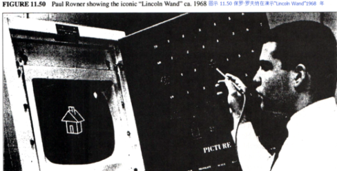

把这些结合在一起，我们想营造一个自由的环境，探索于其中，我们能各得其所（蒙台梭利）；
这个环境能够容我们进行动觉上、图标上和符号上的学习——“用图像来创造符号”（皮亚杰&布鲁纳）；
用户不会被一种模式所限（GRAIL）；
它的神奇之处也往往植根于为我们所熟知的地方（内格罗蓬特）；
对于用户自身智慧，它也是台放大镜（柯勒律治）。
如果我们对此清楚明了，我们就能够直接过度到今天的设计阶段——这样的故事结尾棒极了。
实际上，[用户界面设计（UI design）](http://baike.baidu.com/item/%E7%94%A8%E6%88%B7%E7%95%8C%E9%9D%A2%E8%AE%BE%E8%AE%A1?sefr=enterbtn)始于扩充Smalltalk、设计针对儿童的实验、尝试理解图标的建立与不断探索其中的功能等等这样的开始与磨合中。
除了这些曲折的过程外，这一语境还迫使我们想出好的设计。
如同此时所有在帕克中心的人对UI设计都持有自己的见解，我们也不例外。
对于那数以百计的观点与讨论，我们也许能给予它们更具体的信任。
但将这些观点结合起来的人是丹·英格尔斯（Dan Ingalls），他不仅倾听了所有人的观点，为原创观点献言献策，并且一直坚持不懈进行设计以方便用户测试。
在确立语境、发明重叠窗口等等工作上我做了不少事情。
其中，阿黛尔（Adele）和我设计了大部分的实验。
除此之外，泰德·凯勒（Ted Kaehler）和访问学者罗恩·贝克尔（Ron Baecker）也做出了极大的贡献。
戴夫·史密斯（Dave Smith）设计出了SmallStar，这是[Xerox Star产品](http://www.baike.com/wiki/XEROX+8010)图形界面的原形【史密斯 83】。
同时，我还让道格·费尔班（Doug Fairbairn）对Notetaker产生了兴趣。
他设计出了一款极棒的“智能公交车（smart bus）”，它能够有效控制慢速[多处理器（multiple processors）](http://baike.baidu.com/item/%E5%A4%9A%E5%A4%84%E7%90%86%E5%99%A8%E7%B3%BB%E7%BB%9F?sefr=enterbtn)，且前景大好，尽管此时大部分帕克中心的成员认为我是疯了才会放弃ALTO运行迅速的双极硬件设备。
但我并不觉得这种双极设备能够安置进笔记本或Dynabook中。
另一方面，我很讨厌最近刚出现的8比特大小的[微指令（micros）](http://baike.baidu.com/item/%E5%BE%AE%E6%8C%87%E4%BB%A4?sefr=enterbtn)，这是因为它的设计又傻又天真——我并不觉得它的设计人员有参与过软件设计的经验。

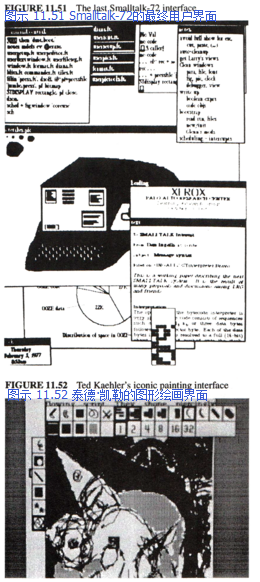

### The Smalltalk User Interface

I have been asked by several of the reviewers to say more about the development of the "Smalltalk-style" overlapping window user interface since there are now more than 20 million computers in the world that use its descendants. A decent history would be as long as this chapter, and none has been written so far. There is a summary of some of the ideas in [Kay 89]—let me add a few more points.

All of the elements eventually used in the Smalltalk user interface were already to be found in the sixties—as different ways to access and invoke the functionality provided by an interactive system. The two major centers of ideas were Lincoln Labs and RAND corp—both ARPA funded. The big shift that consolidated these ideas into a powerful theory and long-lived examples came because the LRG focus was on children. Hence, we were thinking about learning as being one of the main effects we wanted to have happen. Early on, this led to a 90 degree rotation of the purpose of the user interface from "access to functionality" to "environment in which users learn by doing." This new stance could now respond to the echoes of Montessori and Dewey, particularly the former, and got me, on rereading Jerome Bruner, to think beyond the children's curriculum to a "curriculum of the user interface."

The particular aim of LRG was to find the equivalent of writing—that is learning and thinking by doing in a medium—our new "pocket universe." For various reasons I had settled on "iconic programming" as the way to achieve this, drawing on the iconic representations used by many ARPA projects in the sixties. My friend Nicholas Negroponte, an architect, was extremely interested in how environments affected peoples' work and creativity. He was interested in embedding the new computer magic in familiar surroundings. I had quite a bit of theatrical experience in a past life, and remembered Coleridge's adage that "people attend 'bad theatre' hoping to forget, people attend 'good theatre' aching to remember." In other words, it is the ability to evoke the audience's own intelligence and experiences that makes theatre work.


Putting all this together, we want an apparently free environment in which exploration causes desired sequences to happen (Montessori); one that allows kinesthetic, iconic, and symbolic learning—"doing with images makes symbols" (Piaget & Bruner); the user is never trapped in a mode (GRAIL); the magic is embedded in the familiar (Negroponte); and which acts as a magnifying mirror for the user's own intelligence (Coleridge). It would be a great finish to this story to say that having articulated this we were able to move straightforwardly to the design as we know it today. In fact, the UI design work happened in fits and starts in between feeding Smalltalk itself, designing children's experiments, trying to understand iconic construction, and just playing around. In spite of this meandering, the context almost forced a good design to turn out anyway. Just about everyone at PARC at this time had opinions about the UI, ours and theirs. It is impossible to give detailed credit for the hundreds of ideas and discussions. However, the consolidation can certainly be attributed to Dan Ingalls, for listening to everyone, contributing original ideas, and constantly building a design for user testing. I had a fair amount to do with setting the context, inventing overlapping windows, etc., and Adele and I designed most of the experiments. Beyond that, Ted Kaehler, and visitor Ron Baecker made highly valuable contributions. Dave Smith designed SmallStar, the prototype iconic interface for the Xerox Star product [Smith 83].
Meanwhile, I had gotten Doug Fairbairn interested in the Notetaker. He designed a wonderful "smart bus" that could efficiently handle slow multiple processors and the system looked very promising, even though most of the rest of PARC thought I was nuts to abandon the fast bipolar hw of the ALTO. But I couldn't see that bipolar was ever going to make it into a laptop or Dynabook. On the other hand I hated the 8-bit micros that were just starting to appear, because of the silliness and naivete of their designs—there was no hint that anyone who had ever designed software was involved.


#### Smalltalk-76

11月丹（Dan）完成了Smalltalk-76的设计，并且在7个月的短短时间内，他、戴夫·罗伯森（Dave Robson）、泰德·凯勒（Ted Kaehler）和戴安娜·玛丽（Diana Merry）这个匆匆忙忙组成的小团队成功地将该系统投入使用（这一工作包含了重写所有现存类的定义）。
尽管我想要重新开始，他们的成绩还是令我颇为讶异。
这个系统很敏捷生动，能够解决“大”问题，并且使用起来很有趣。
它含有50个类，源代码约有180页。
这个系统包含所有OS功能、文件、打印和以太网服务、窗口界面、编辑器、绘图系统以及拉里·特斯勒（Larry Tesler）的两项贡献——继承等级中[静态方法（static method）](http://baike.baidu.com/item/%E9%9D%99%E6%80%81%E6%96%B9%E6%B3%95?sefr=enterbtn)所使用的浏览器和运行时间环境中调试所用的动态语境。
这是我们所有想法的集合，也是我们将Smalltalk一体化的愿景。
自此开始，所有Smalltalk的版本都牢牢围绕着这一概念。
这里诸多方面，如同[托尼·霍尔（Tony Hoare）](http://baike.baidu.com/item/%E6%89%98%E5%B0%BC%C2%B7%E9%9C%8D%E5%B0%94/65848?sefr=enterbtn)曾经评价ALTO的那样，在丹的Smalltalk-76面前，它的后代无出其右。

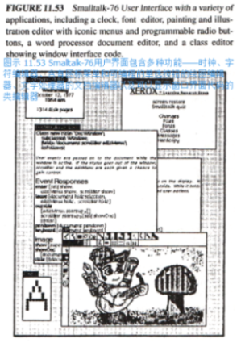

下面是丹所撰写的两种典型的Smalltalk-76的类：


尤其是在Window类中，为了使其他对象（或是代码本身）达到目标，要注意代码的表达方式。
Window超类的主要功能是关注各个事件，并将其当做消息分类至各个子类中。
这个例子说的是一个文件窗口（DocWindow的子类）要处理用户交互的影响。
Window类会注意到此时键盘的活动，并向其发送消息，该消息会被子类的方法（method）拦截。
如果这里没有方法，字母就会消失，而窗口也会一闪即逝。
在这种情况下，该类使用的是DocWindow的方法：键盘——它告诉暂存的文件要先检查一下。

1978年1月，Smalltalk进行了第一次真正意义上的测试。
CFL从施乐中心邀请了十名高层主管来帕克参加为期两天的软件研讨会。
该研讨会十分关注复杂性，并围绕着解决这一问题的方法进行讨论。
他们要求LRG小组让他们亲自体验终端用户编程，这样他们就能在每天1.5小时的会议中“做些实事”。
我当机立断，决定不教授他们如何使用Smalltalk-76（这显然是我“烧毁磁盘”的想法），取而代之，我们要在2个月内为那些非专业成人用户量身定做一款内容丰富的系统（丹的想法）。
于是，我们从“Simpula”[车间作业（job shop）](https://wenku.baidu.com/view/1fc939aef524ccbff12184dc.html)模拟模型开始，并打算为一般化的车间作业工具设计一个用户界面，这样这些主管们可以对其进行动态仿真，他们变化着的状态会通过将图标动画化在屏幕上显示出来。
我们把它称为Smalltalk SimKit。
在其中，每个人都倾尽了最大努力。
尽管那时阿黛尔（Adele）还生了孩子，她仍担任设计总监。
我仍记得那时她一边照顾蕾切尔（Rachell），一边在SimKit上进行调试的场景，这种记忆弥足珍贵。

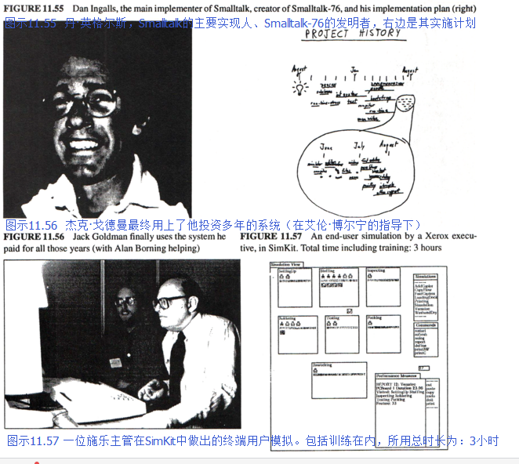

那时有不少有趣的问题亟待解决。
该系统本身很直白，但它需要通过Smalltalk的proper函数密封起来，尤其是涉及错误消息的情况。
戴夫·罗宾森（Dave Robson）想出了一个不错的办法（它几乎是个专业系统）来捕捉Smalltalk中的申诉，并将其翻译成有意义的SimKit术语。
还有许多用户界面的细节——较为一般的如让浏览器只读取四个SimKit类（Station、Worker、Job、Report）；有些令人惊奇的如我们在十名同龄成人身上进行实验（他们是帕克中心的非技术人员），并发现他们并不能很好地阅读屏幕上的内容。
三十岁年龄段所习惯的小字体并不能被五十岁年龄段的人所接受。
不过这是介绍该系统的好时机，我们可以借此鼓励那些主管们选择不同的字体和大小，且他们能在不知不觉中学会使用鼠标。

这个“大日子”的早晨，泰德·凯勒（Ted Kaehler）打算对虚拟内存系统OOZE做出一些使其运行更快的改变。
我们紧张得都要忘了呼吸，但清晰的设计与操作人的自信使得一切进展顺利，主管们的亲身实践也取得了极大的成功。
第一场会议大概进行了一个小时，一位副总裁（他15年前用[FORTRAN](http://baike.baidu.com/item/FORTRAN?sefr=enterbtn)进行过一些编程）恍然发觉他正在编写程序，他一边若有所思道：“所以最终是这样啊。”
有十分之九的主管都能解决他们所感兴趣的模拟问题。
其中最有趣也最复杂的例子之一是施乐的一位高层完成了PC板的生产线模拟，他用真实的数字（他一直记在脑子里）来制作模型，而使用[闭型（closed form）](https://www.zhihu.com/question/51616557?from=profile_question_card)则很难解决这一问题——这就揭示出了在进行人员安排时一个重大的缺陷，这会提升产品制造平均缺陷率。

这时还出现了另一个重要的系统，它是艾伦•博宁（Alan Borning）【博宁 1979】的Thinglab——这是试图超越伊凡•苏泽兰（Ivan Sutherland）Sketchpad第一次真正意义上的尝试。
艾伦想出了一个非常巧妙的办法来处理约束，这些约束不需要处理人具备丰富的知识（或具有解决[费马大定理](http://baike.baidu.com/item/%E8%B4%B9%E9%A9%AC%E5%A4%A7%E5%AE%9A%E7%90%86/80363?sefr=enterbtn)的能力）。

我们能够看见，Smalltalk的“pushing”模式最终会被“pulling”模式所取代，这是由奠定不同方法的change函数和value函数推动的。
这个想法挺旧的，但Thinglab向我们展示了面向对象的定义如何自动应用于限制事件驱动的处理过程的语境。
并且，我们很快就会发现，“原型”比那些类更合适。
如果针对那些方法的类大体知道我们的打算（灵感来自帕特·温斯顿<Pat Winston>第二种模型），那么就能很好地服务于多重继承。

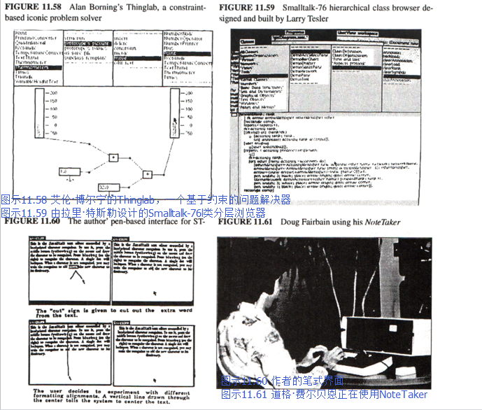

同时，NoteTaker变得更加真实、更大也更慢了。
此时我想运用的西部数据（Western Digital）仿真类芯片显示出要向“扩件（diffusion-ware）”发展的迹象，但我并不觉得最终这会实现。
我们开始寻找那些真正可靠的芯片，尽管它们的设计不尽如人意。
1978年，最好的备选就是[因特尔8086（Intel 8086）](http://baike.baidu.com/item/Intel%208086?sefr=enterbtn)这种16比特大小的芯片（它身上有不少8008和8080的缺点），但它（勉强）拥有胜任这些工作的能力——在ALTO身上我们将安装三块这种芯片，一块用于解释器，一块用于位映射图形（bitmapped graphic），还有一块用于i/o（联网等）。

丹一直以来都对NoteTaker很感兴趣，并且他想尝试把NoteTaker系统安装进Smalltalk-76中。
为了实现这一想法，该系统需要以256K的大小运行，这是我们为机器[RAM](http://baike.baidu.com/item/%E9%9A%8F%E6%9C%BA%E5%AD%98%E5%8F%96%E5%AD%98%E5%82%A8%E5%99%A8?sefr=enterbtn)设计的最大值。
ALTO中没有任何一个类似NOVA的模拟“[机器码（machine code）](http://baike.baidu.com/item/%E6%9C%BA%E5%99%A8%E7%A0%81?sefr=enterbtn)”能够胜任这些工作，并且系统还与内存相适应——只有磁盘，没有交换内存（swapping memory）。
在这些挑战驱动下，系统设计得到了显著改善。
泰德·凯勒（Ted Kaehler）的系统追踪（system tracer）（它可以为旧的版本写出新的虚拟内存）用于将Smalltalk-76克隆至NoteTaker中。
这里第一次出现了索引对象表（indexed object table）（它也用在Smalltalk-80中），其简化了访问对象的过程。
在堆栈语境下，他坚持做着一种实验：目的是为了节约空间并提升速度。
他重写了Smalltalk中大部分旧的机器码，并且整个机器内核的大小都缩减至6千比特的8086代码（并不是很强大）。

这些重建带来了颇为有趣的成效。
尽管在8086中，[BitBlt](http://baike.baidu.com/item/BitBlt?sefr=enterbtn)不如在ALTO中运行良好（且之前相当一部分用于图形的机器代码现在都用在了Smalltalkl中），但其解释器的整体速度则是ALTO的两倍（这是由于在ALTO上，有些Smalltalk的位码解释器不能适应其4k大小的微码内存）。
在进行了无数种形式的尝试后，（按丹的话来说）图形显示的缺憾得到了“最大程度上的弥补”。
这主要是由于ALTO没有足够大的微码内存来容纳所有Smalltalk仿真代码——其中有一部分不得不成为仿真的“NOVA”代码，它有两层解释。
事实上，NoteTaker运行得非常良好，尽管任何一台这样的笔记本都有崩溃的可能。
我们也曾重新回归台式机，它看上去与miniCOM如出一辙（若干年后又出现了几台这样的计算机）。
在电池的驱动下，NoteTaker运行良好，我们都很享受将它带上飞机、在35000英尺的高空运行这个面向对象且有着窗口界面的系统。

最终，我们又生产了大约10台这样的机器。
尽管在很多方面它都取得了设计上的成功，但我们的任务是通过它们培养出真正的终端用户，这也是我们最初的目标所在。
如果施乐（和帕克）大体支持这类想法，我们本有更多人力物力来实现这些梦想，且早在70年代它们初现端倪之时，我们就能一举成功。
因特尔CPU和惠普显示器的错误使用带来了遗憾，因为我们缺乏一种共同意愿——利用内部的技术专长。

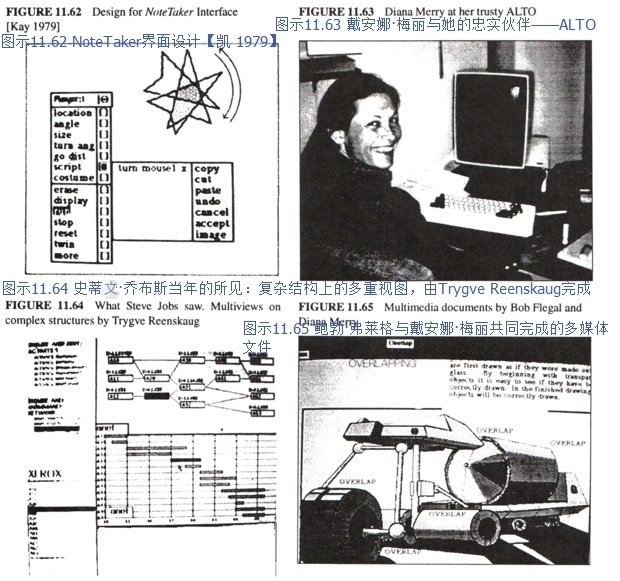

现在是1979年，我们在正在做其中的一个demo，而这一次的观众们对此非常感兴趣，他们是[史蒂文·乔布斯（Steve Jobs）](http://baike.baidu.com/item/%E5%8F%B2%E8%92%82%E5%A4%AB%C2%B7%E4%B9%94%E5%B8%83%E6%96%AF/85300?sefr=enterbtn)、[杰夫·拉斯金（Jef Raskin）](http://baike.baidu.com/item/%E6%9D%B0%E5%A4%AB%C2%B7%E6%8B%89%E6%96%AF%E9%87%91?sefr=enterbtn)及其他苹果公司的技术人员。
他们启动了一个叫Lisa的项目，但并不知道去往何方，直到杰夫对史蒂夫说：“你应当参观一下帕克，看看他们在做什么”。
于是，在重叠窗口发明八年后、ALTO运行六年后，可以真正实现那些想法的人们出现了。
我们当时使用的机器叫Dorado，这是ALTO的“老大哥”，速度很快。
上面相当大一部分Smalltalk微码由布鲁斯·霍恩（Bruce Horn）写就，他是最初几个参与Smalltalk教学的孩子之一，那时他还是个青少年。
拉里·特斯勒（Larry Tesler）在丹（Dan）的从旁协助下向大家展示了demo的主要内容，而阿黛尔（Adele）和我则在后面观看。
其中最棒的部分就是，当乔布斯提出他不喜欢blt模式的滚动形式，问我们能否换一种更流畅而连续的形式。
丹花了不到一分钟就想出了办法，他做出了（相当大的）改变，并且滚动形式真的变成了连续形式！
这让来访者倍感惊讶，尤其是那些程序员们，因为他们从未见过如此强大的增量系统。

史蒂夫曾试图从施乐（当时它是苹果少数几个风险投资人之一）获取/购买我们的技术，但施乐并不打算将技术卖给别人，也不提供资源和资金让我们继续在研究中心里发展NoteTaker和Smalltalk。

### Smalltalk-76

Dan finished the Smalltalk-76 design November, and he, Dave Robson, Ted Kaehler, and Diana Merry, successfully implemented the system from scratch (which included rewriting all of the existing class definitions) in just seven months. this was such a wonderful achievement that I was bowled over in spite of my wanting to start over. It was fast, lively, could handle "big" problems, and was great fun. The system consisted of about 50 classes described in about 180 pages of source code. This included all of the OS functions, files, printing and other Ethernet services, the window interface, editors, graphics and painting systems, and two new contributions by Larry Tesler, the famous browsers for static methods in the inheritance hierarchy and dynamic contexts for debugging in the runtime environment. In every way it was the consolidation of all of our ideas and yearning about Smalltalk in one integrated package. All Smalltalks since have resembled this conception very closely. In many ways, as Tony Hoare once remarked about Algol, Dan's Smalltalk-76 was a great improvement on its successors!


Here are two stylish ST-76 classes written by Dan.


Notice, particularly in class Window, how the code is expressed as goals for other objects (or itself) to achieve. The superclass Window's main job is to notice events and distribute them as messages to its subclasses. In the example, a document window (a subclass of DocWindow) is going to deal with the effects of user interactions. The Window class will notice that the keyboard is active and send a message to itself which will be intercepted by the subclass method. If there is no method the character will be thrown away and the window will flash. In this case, it finds DocWindow method: keyboard, which tells the held document to check it out.

In January of 1978 Smalltalk-76 had its first real test. CSL had invited the top ten executives of Xerox to PARC for a two day seminar on software, with a special emphasis on complexity and what could be done about it. LRG got asked to give them a hands-on experience in end-user programming so "they could do 'something real' over two 1½ hour sessions." We immediately decided not to teach them Smalltalk-76 (my "burn our disk packs" point in spades), but to create in two months in Smalltalk-76 a rich system especially tailored for adult nonexpert users (Dan's point in trumps). We took our "Simpula" job shop simulation model as a starting point and decided to build a user interface for a generalized job shop simulation tool that the executives could make into specific dynamic simulations that would act out their changing states by animating graphics on the screen. We called it the Smalltalk SimKit. This was a maximum effort and everyone pitched in. Adele became the design leader in spite of the very recent appearance of a new baby. I have a priceless memory of her debugging away on the SimKit while simultaneously nursing Rachell.


There were many interesting problems to be solved. The system itself was straightforward but it had to be completely sealed off from Smalltalk proper, particularly with regard to error messages. Dave Robson came up with a nice scheme (almost an expert system) to capture complaints from the bowels of Smalltalk and translated them into meaningful SimKit terms. There were many user interface details—some workaday, like making new browsers that could only look at the four SimKit classes (Station, Worker, Job, Report), and some more surprising as when we tried it on ten PARC nontechnical adults of about the same age and found that they couldn't read the screen very well. The small fonts our thirtysomething year-old eyes were used to didn't work for those in their 50s. This led to a nice introduction to the system in which the executives were encouraged to customize the screen by choosing among different fonts and sizes with the side effect that they learned how to use the mouse unselfconsciously.

On the morning of the "big day" Ted Kaehler decided to make a change in the virtual memory system OOZE to speed it up a little. We all held our breaths, but such was the clarity of the design and the confidence of the implementers that it did work, and the executive hands-on was a howling success. About an hour into the first session one of the VPs (who had written a few programs in FORTRAN 15 years before) finally realized he was programming and mused "so it's finally come to this." Nine out of the ten executives were able to finish a simulation problem that related to their specific interests. One of the most interesting and sophisticated was a PC board production line done by the head of a Xerox owned company using actual figures (that he carried around in his head) to prime a model that could not be solved easily by closed form mathematics—it revealed a serious flaw in the disposition of workers given the line's average probability of manufacturing defects.

Another important system done at this time was Alan Borning's Thinglab [Borning 1979]—the first serious attempt to go beyond Ivan Sutherland's Sketchpad. Alan devised a very nice approach for dealing with constraints that did not require the solver to be omniscient (or able to solve Fermat's last theorem).

We could see that the "pushing" style of Smalltalk could eventually be replaced by a "pulling" style that was driven by changes to values that different methods were based on. This was an old idea but Thinglab showed how the object-oriented definition could be used to automatically limit the contexts for event-driven processing. And we soon discovered that "prototypes" were more hospitable than classes, and that multiple inheritance would be well served if there were classes for methods that knew generally what they were supposed to be about (inspired by Pat Winston's 2nd order models).


Meanwhile, the NoteTaker was getting more real, bigger, and slower. By this time the Western Digital emulation-style chips I hoped to used showed signs of being "diffusion-ware," and did not look like they would really show up. We started looking around for something that we could count on, even if it didn't have a good architecture. In 1978, the best candidate was the Intel 8086, a 16-bit chip (with many unfortunate remnants of the 8008 and 8080), but with (barely) enough capacity to do the job—we would need three of them to make up for the ALTO, one for the interpreter, one for bitmapped graphics, and one for i/o (networking, etc).

Dan had been interested in the NoteTaker all along and wanted to see if he could make a version of Smalltalk-76 that could be the NoteTaker system. In order for this to happen it would have to run in 256K, the maximum amount of RAM that we had planned for the machine. None of the NOVA-like emulated "machine-code" from the ALTO could be brought over, and it had to fit in memory as well—there would only be floppies, no swapping memory existed. This challenge led to some excellent improvements in the system design. Ted Kaehler's system tracer (which could write out new virtual memories from old ones) was used to clone Smalltalk-76 into the NoteTaker. The indexed object table (as was used in early Smalltalk-80) first appeared here to simplify object access. An experiment in stacking contexts contiguously was tried: to save space and gain speed. Most of the old machine code was rewritten in Smalltalk and the total machine kernel was reduced to 6K bytes of (the not very strong) 8086 code.

All of the re-engineering had an interesting effect. Though the 8086 was not as good at bitblt as the ALTO (and much of the former machine code to assist graphics was now in Smalltalk), the overall interpreter was about twice as fast as the ALTO version (because not all the Smalltalk byte-code interpreter would fit into the 4k microcode memory on the ALTO). With various kinds of tricks and tuning, graphics display was "largely compensated" (in Dan's words). This was mainly because the ALTO did not have enough microcode memory to take in all of the Smalltalk emulation code—some of it had to be rendered in emulated "NOVA" code which forced two layers of interpretation. In fact, the Notetaker worked extremely well, though it would have crushed any lap. It had hopped back on the desk, and looked suspiciously like miniCOM (and several computers that would appear a few years later). It really did run on batteries and several of us had the pleasure of taking NoteTaker on a plane and running an object-oriented system with a windowed interface at 35,000 feet.

We eventually built about 10 of the machines, and though in many senses an engineering success, what had to be done to make them had once again squeezed out the real end-users for whom it was originally aimed. If Xerox (and PARC) as a whole had believed in these smaller scale ideas, we could have put much more silicon muscle behind the dreams and successfully built them in the 70's when they were first possible. It was a bitter disappointment to have to get the wrong kind of CPU from Intel and the wrong kind of display from HP because there was not enough corporate will to take advantage of internal technological expertise.


w it was already 1979, and we found ourselves doing one of our many demos, but this time for a very interested audience: Steve Jobs, Jef Raskin, and other technical people from Apple. They had started a project called Lisa but weren't quite sure what it should be like, until Jef said to Steve, "You should really come over to PARC and see what they are doing." Thus, more than eight years after overlapping windows had been invented and more than six years after the ALTO started running, the people who could really do something about the ideas, finally got to to see them. The machine used was the Dorado, a very fast "big brother" of the ALTO, whose Smalltalk microcode had been largely written by Bruce Horn, one of our original "Smalltalk kids" who was still only a teen-ager. Larry Tesler gave the main part of the demo with Dan sitting in the copilot's chair and Adele and I watched from the rear. One of the best parts of the demo was when Steve Jobs said he didn't like the blt-style scrolling we were using and asked if we could do it in a smooth continuous style. In less than a minute Dan found the methods involved, made the (relatively major) changes and scrolling was now continuous! This shocked the visitors, especially the programmers among them, as they had never seen a really powerful incremental system before.

Steve tried to get and/or buy the technology from Xerox (which was one of Apple's minority venture capitalists), but Xerox would neither part with it nor would come up with the resources to continue to develop it in house by funding a better NoteTaker cum Smalltalk.

> "艺术中最大的罪孽绝非 <br/>
> 众人所以为的乏味，而是 <br/>
> 比例失衡”-- [保罗·亨德密特（Paul Hindemith）](http://baike.baidu.com/item/%E4%BF%9D%E7%BD%97%C2%B7%E4%BA%A8%E5%BE%B7%E5%AF%86%E7%89%B9?sefr=enterbtn)

### 11.6 1980-1983 —— Smalltalk-80问世

如丹所言，“不继续开发NoteTaker的决定为广泛研发Smalltalk增加了动力”。
但我并不这么认为。
此时，我很高兴丹和其他人能将Smalltalk的概念实现得如此清晰优雅，但另一方面我又感到忧伤，因为它已经偏离孩子们的教育很远很远了——我很惊讶，从Smalltalk-76问世开始，就没有孩子用Smalltalk编程了。
现在施乐（和帕克）进入了一种“工作站（workstation）模式——但我仍希望这种模式是“游戏站（playstation）”。
这一情况很矛盾，当人们开始理解Dynabook的时候，它的传奇色彩就消减下去了，而此时正值我们所需的技术在商业上变得可行之时——不幸的是，美国公司把他们的一些发明丢给了日本，如平板显示器。
这是“功败垂成（snatching defeat from the jaws of victory）”的典型案例。
拉里·特斯勒（Larry Tesler）认为施乐永不可能实现这些想法，1980年5月，他接受乔布斯的邀请，成为Lisa的主要设计师。
在短暂的休息之后，我也接受了乔布斯的邀请。

> "The greatest sin in Art is not Boredom, <br/>
> as is commonly supposed, but lack of <br/>
> Proportion" — Paul Hindemith

As Dan said "the decision not to continue the NoteTaker project added motivation to release Smalltalk widely." But not for me. By this time I was both happy about the cleanliness and elegance of the Smalltalk conception as realized by Dan and the others, and sad that it was farther away than ever from the children—it came to me as a shock that no child had programmed in any Smalltalk since Smalltalk-76 made its debut. Xerox (and PARC) were now into "workstations" as things in themselves—but I still wanted "playstations". The romance of the Dynabook seemed less within grasp, paradoxically just when the various needed technologies were starting to be commercially feasible—some of them, unfortunately, like the flat-screen display, abandoned to the Japanese by the US companies who had invented them. This was a major case of "snatching defeat from the jaws of victory." Larry Tesler decided that Xerox was never going to "get it" and was hired by Steve Jobs in May 1980 to be a principal designer of the Lisa. I agreed, had a sabbatical coming, and took it.

阿黛尔（Adele）打算发展新Smalltalk的文档功能并免除其处理过程，这就几乎摆脱了目标硬件的桎梏，起到拓展其应用范围的作用。
为了制作一个可免除的系统，只需对NoteTaker Smalltalk-78做出一些必要的改变。
也许图像上最大的改变就是将Smalltalk的自定义字体（这种字体使得Smalltalk的可读性更强，也是帕克文化的象征）改回至乏味的标准ASCII字体。
诚如彼得·多伊奇（Peter Deutsch）所言：这种改变“遭到了当时团队内部激烈的反对，却是让全球用户接受这种系统的关键因素”。
另一种改变则是让分程序更接近[Lambda表达式](http://baike.baidu.com/item/Lambda%E8%A1%A8%E8%BE%BE%E5%BC%8F?fr=aladdin)，但如同彼得·多伊奇9年后所观察到的：“回溯后发现，这种不同[实例化（instantiation）](http://baike.baidu.com/item/%E5%AE%9E%E4%BE%8B%E5%8C%96)与[辖域（scoping）](http://baike.baidu.com/item/%E8%BE%96%E5%9F%9F)上的增值也许并不是个好主意”。
至少对我——作为一个新的局外人——来说，把[元类（metaclass）](http://www.pythontab.com/html/2015/pythonhexinbiancheng_0906/961.html)（它只让实例初始化变得简单了一点——Smalltalk-76已然做到了此点，而它只是在此基础上稍作完善）介绍过来是最莫名其妙的想法。
彼得1989年做出的评论最为典型中肯：“许多用户都认为元类很令人费解，总的来说，也许它的费解大于它的价值”。
事实上，在PIE系统中，戈德斯坦（Goldstein）与博布罗（Bobrow）已经在Smalltalk中使用了一种“观察者模式语言（observer language）”，在某种程度上，这种语言遵照着我曾建议使用的面向视图的方法，而另一方面，它又与KRL【戈德斯坦】中的“视角（perspective）”类似。
一旦某人能够通过多重视角观察实例，他甚至都不需要“半元类（semi-metaclasses）”中的类-类（Class Class）与类-对象（Class Object）了。
这是由于对象角色与类中的实例角色只是来自不同的视角，而解决包含实例化的[生活史（life history）](http://baike.baidu.com/item/%E7%94%9F%E6%B4%BB%E5%8F%B2)问题也较为容易。
（同其他好主意一道）这曾是我们需要好好考虑的，但我们最后并没有采纳。
我猜Smalltalk已经进入了我在这个故事开头所提到的最后一个阶段，即人们最后把这种方法神化为了僵化的信仰结构。

Adele decided to drive the documentation and release process for a new Smalltalk that could be distributed widely almost regardless of the target hardware. Only a few changes had to be made to the NoteTaker Smalltalk-78 to make a releasable system. Perhaps the change that was most ironic was to turn the custom fonts that made Smalltalk more readable (and were a hallmark of the entire PARC culture) back into standard pedestrian ASCII characters. According to Peter Deutsch this "met with heated opposition within the group at the time, but has turned out to be essential for the acceptance of the system in the world." Another change was to make blocks more like lambda expressions which, as Peter Deutsch was to observe nine yeas later: "In retrospect, this proliferation of different kinds of instantiations and scoping was probably a bad idea." The most puzzling strange idea—at least to me as a new outsider—was the introduction of metaclasses (really just to make instance initialization a little easier—a very minor improvement over what Smalltalk-76 did quite reasonably already). Peter's 1989 comment is typical and true: "metaclasses have proven confusing to many users, and perhaps in the balance more confusing than valuable." In fact, in their PIE system, Goldstein and Bobrow had already implemented in Smalltalk an "observer language", somewhat following the view-oriented approach I had been advocating and in some ways like the "perspectives" proposed in KRL [Goldstein *]. Once one can view an instance via multiple perspectives even "semi-metaclasses" like Class Class and Class Object are not really necessary since the object-role and instance-of-a-class-role are just different views and it is easy to deal with life-history issues including instantiation. This was there for the taking (along with quite a few other good ideas), but it wasn't adopted. My guess is that Smalltalk had moved into the final phase I mentioned at the beginning of this story, in which a way of doing things finally gets canonized into an inflexible belief structure.

### Coda

这是最后一条评论。
硬件其实是在早期具体化了的软件。
它存在的目的是帮助程序尽可能地高效运行。
但现在情况基本反过来了，硬件固定不变，软件设计师却要围绕其存在的合理性进行设计。
这就导致了在设计程序时，设计师们选择许多低级方法并过度优化，这实际上拖慢了进程。
诚如鲍勃·巴顿（Bob Barton）所言：“系统程序员就是主持低端祭祀的高级牧师。”

### Coda

One final comment. Hardware is really just software crystallized early. It is there to make program schemes run as efficiently as possible. But far too often the hardware has been presented as a given and it is up to software designers to make it appear reasonable. This has caused low-level techniques and excessive optimization to hold back progress in program design. As Bob Barton used to say: "Systems programmers are high priests of a low cult."

有一种方式来思考软件发展：大部分软件设计都是为了想办法进行后期绑定（late-bind），然后说服制造商将这些想法融入硬件中去。
早期硬件有联网的程序和参数，随机存取内存能够对其进行后期绑定。
过去，计算机循环（looping）与标引（indexing）都由存储中的地址修改（address modification）完成。
数年来软件设计师们已经找出了各种各样的方法来对计算位置进行后期绑定——这就衍生出了[变址寄存器（base register）](http://baike.baidu.com/item/%E5%8F%98%E5%9D%80%E5%AF%84%E5%AD%98%E5%99%A8)/界限暂存器（bound register）、段落迁移（segement relocation）、页面[MMU](http://baike.baidu.com/item/MMU)、迁移程序（migratory process）等。
由于“效率低下”，分时（time-sharing）系统也停滞了多年——然而制造商并不会将MMU置入机器，因此大学需要自食其力！
递归将参数后期绑定在这些过程中，但在CPU中放入哪怕是最基本的堆栈机制也花费了数年时间。
大部分机器也还不具备动态配置（dynamic allocation）与[垃圾回收（garbage collection）](http://baike.baidu.com/item/GC/66426)等功能。
总体说来，目前大多数硬件设计只是在过去粗制滥造的基础上进行了重新优化。

One way to think about progress in software is that a lot of it has been about finding ways to late-bind, then waging campaigns to convince manufacturers to build the ideas into hardware. Early hardware had wired programs and parameters; random access memory was a scheme to late-bind them. Looping and indexing used to be done by address modification in storage; index registers were a way to late-bind. Over the years software designers have found ways to late-bind the locations of computations—this led to base/bounds registers, segment relocation, page MMUs, migratory processes, and so forth. Time-sharing was held back for years because it was "inefficient"— but the manufacturers wouldn't put MMUs on the machines, universities had to do it themselves! Recursion late-binds parameters to procedures, but it took years to get even rudimentary stack mechanisms into CPUs. Most machines still have no support for dynamic allocation and garbage collection and so forth. In short, most hardware designs today are just re-optimizations of moribund architectures.

从后期绑定的角度来看，我们可以把OOP看作是一种较为全面的手段，它尽可能对所有事物进行后期绑定：一系列行为状态与过程的融合，它们发生的位置、名称、调用时间与原因、采用何种硬件等，以及更微妙的——OOP中所使用的策略。
这些包装的艺术也是限制的艺术（The art of the wrap is the art of the trap）。

From the late-binding perspective, OOP can be viewed as a comprehensive technique for late-binding as many things as possible: the mix of state and process in a set of behaviors, where they are located, what they are called, when and why the are invoked, which HW is used, etc., and more subtle, the strategies used in the OOP scheme itself. The art of the wrap is the art of the trap.

为了完全将对象包装起来，有两种情况必须得到有效控制——一种是需要经常计算a+b，或者a与b受约束，这都是很糟糕的。
例如，“3”和“4”在一种形式中需要由[算数逻辑单元（ALU）](http://baike.baidu.com/item/%E7%AE%97%E6%9C%AF%E9%80%BB%E8%BE%91%E5%8D%95%E5%85%83)控制。
如果运算对象与ALU不兼容，此时的操作应为：**全速使用后备逻辑（look-aside logic）（in the simplest scheme a single and gate）** 对其进行限制。
现在，在不降低机器运行速度的情况下，已对所有需要快速进行的最初级操作进行了包装。

Consider the two cases that must be handled efficiently in order to completely wrap objects. It would be terrible if a + b incurred any overhead if a and b were bound, say, to "3" and "4" in a form that could be handled by the ALU. The operations should occur full speed using look-aside logic (in the simplest scheme a single and gate) to trap if the operands aren't compatible with the ALU. Now all elementary operations that have to happen fast have been wrapped without slowing down the machine.

第二种情形是：在一些问题中，对ALU来说由约束决定的对象过于复杂。
这种情况下，硬件需要不断发掘可以控制对象的方法。
这与标引类似——理想中的方法选择器（method-selector）会通过一种较为普遍的方式将某个对象的类编入索引中。
换句话或就是这种方法的虚拟地址为：<class><selector>。
如今，由于为了找到真实的地址，大部分硬件都会翻译某种虚拟地址——我们称之为一种“约束（trap）”——于是将OOP不间断的处理过程隐藏在MMU（这已经合理化了）中是非常可能实现的。

The second case happens if the trap has determined the objects in questions are too complicated for the ALU. Now the HW has to dynamically find a method that can handle the objects. This is very similar to indexing—the class of one of the objects is "indexed" by the desired method-selector in a slightly more general way. In other words the virtual-address of a method is <class><selector>. Since most HW today does a virtual address translation of some kind to find the real address—a trap—it is quite possible to hide the overhead of the OOP dispatch in the MMU overhead that has already been rationalized.

再次强调，整个OOP的关键不需考虑对象中有什么。
不同的机器使用不同的语言创造对象，但它们应当能相互交流——未来也是如此。
这里，后期绑定包括用再兼容方法约束不兼容的部分——其中能折射出关于一些问题的优秀论述【Popek 1984】。

Again, the whole point of OOP is not to have to worry about what is inside an object. Objects made on different machines and with different languages should be able to talk to each other—and will have to in the future. Late-binding here involves trapping incompatibilities into recompatibility methods—a good discussion of some of the issues is found in [Popek 1984].

鉴于后期绑定的隐喻，未来我们期望看到怎样的后期绑定方案呢？
其中最好的后期绑定方案之一是目前正在施乐帕克进行实验的元类协议【Kiczales 1991】。
整个概念是这样的：语言设计师对实例、变量等内在表现的选择可能无法满足操作人的需要，因此，在固定语义中，他们允许操作人对系统采取一些策略——例如，在一个实例中对槽（slot）（译者注：“槽”指散列表中的一个位置）进行查找时，用[散列查找（hashed lookup）](http://baike.baidu.com/item/%E6%95%A3%E5%88%97%E6%9F%A5%E6%89%BE)代替直接分度（direct indexing）。
这些方法会被有效地进行编译，并扩展系统的基本实现。
这是同过去 Simula、FLEX、 CDL、 Smalltalk与Actors方向相似的直系后嗣。

Staying with the metaphor of late-binding, what further late-binding schemes might we expect to see? One of the nicest late-binding schemes that is being experimented with is the metaobject protocol work at Xerox PARC [Kiczales 1991]. The notion is that the language designer's choice for the internal representation of instances, variables, etc., may not cover what the implementer needs, so within a fixed semantics they allow the implementer to give the system strategies—for example, using a hashed lookup for slots in an instance instead of direct indexing. These are then efficiently compiled and extend the base implementation of the system. This is a direct descendant of similar directions from the past of Simula, FLEX, CDL, Smalltalk, and Actors.

另一种十分必要的后期绑定是：一个系统中，在出现新的对象时，避免直接对其进行协议匹配。
换一种说法就是，如果世界上有任何人在半道上给你发送了新对象，而这个新对象又恰巧适应你当地的协议，这种情况是罕见的。
在某一时刻让这个对象本身包含更多与其有关的信息更为容易——这些信息很充分，因此对象的情况能够被“理解”，而它在这里的配置又由更细致的推断匹配完成。

Another late-binding scheme that is already necessary is to get away from direct protocol matching when a new object shows up in a system of objects. In other words, if someone sends you an object from halfway around the world it will be unusual if it conforms to your local protocols. At some point it will be easier to have it carry even more information about itself—enough so its specifications can be "understood" and its configuration into your mix done by the more subtle matching of inference.

对后期绑定进行思考，也是超越今天大众所熟知的OOP进行思考。
[Prolog语言](http://baike.baidu.com/item/Prolog)带来的伟大想法就是：在进行计算时不需与值进行绑定。
变量是一个对象，而当我们最终发现绑定时，一张由部分结果织成的网就能被填满。
在尝试解决问题时，这种方法随着Eurisko语言应运而生，同时改变着它的基本策略。
这些方法自主地去寻找问题，而不是让问题去寻找方法——且Eurisko寻找的是方法的方法。
这被称为是“机会主义编程”——我把它看做是带来更多启蒙的助推器，解决问题是这过程中的一部分。

A look beyond OOP as we know it today can also be done by thinking about late-binding. Prolog's great idea is that it doesn't need binding to values in order to carry out computations [Col **]. The variable is an object and a web of partial results can be built to be filled in when a binding is finally found. Eurisko [Lenat **] constructs its methods—and modifies its basic strategies—as it tries to solve a problem. Instead of a problem looking for methods, the methods look for problems—and Eurisko looks for the methods of the methods. This has been called "opportunistic programming"—I think of it as a drive for more enlightenment, in which problems get resolved as part of the process.

下一次范式转换——网络的普及——需要这种更高级的计算策略，它在下一个五年内就会发生。
对象会逐渐变成活跃的情报人员，跑遍整个网络为它们的管理者搜集有用的信息与工具。
与现在的对象相比，这些对象从半道回归计算环境无法直接通过协议匹配对自身进行配置。
取而代之，这些对象会携带更多关于自身的信息，而其表现形式也允许与推论进行对接。
在这一规范中，有些正在行进中的工作可以选用这种方式。

This higher computational finesse will be needed as the next paradigm shift—that of pervasive networking—takes place over the next five years. Objects will gradually become active agents and will travel the networks in search of useful information and tools for their managers. Objects brought back into a computational environment from halfway around the world will not be able to configure themselves by direct protocol matching as do objects today. Instead, the objects will carry much more information about themselves in a form that permits inferential docking. Some of the ongoing work in specification can be turned to this task [Guttag **][Goguen **].

开个玩笑，我曾把编程语言的发展总结为一种“太阳黑子理论”，每11年就会发生重大变革。
1950年机器代码进入视野，1956年[FORTRAN](http://baike.baidu.com/item/FORTRAN)以“新瓶装旧酒”的身份问世，但把它当成崭新的事物，它就是1961年ALGOL-60的先导。
同样地，1966年出现的SIMULA也是“新瓶装旧酒”，但在1972年出现的Smalltalk面前，它也是给其带来灵感的新事物。

Tongue in cheek, I once characterized progress in programming languages as kind of "sunspot" theory, in which major advances took place about every 11 years. We started with machine code in 1950, then in 1956 FORTRAN came along as a "better old thing" which if looked at as "almost a new thing" became the precursor of ALGOL-60 in 1961. In 1966, SIMULA was the "better old thing," which if looked at as "almost a new thing" became the precursor of Smalltalk in 1972.

随后发生的一系列事件似乎都在佐证这一理论：1978年出现了Eurisko，它也既是“新瓶装旧酒”，又能被看做全新的事物。
但1983年往后的整个十年都没有“新事物”出现。
当然了，这种理论挺无聊的——并且，我还认为，个人电脑一系列的商业化措施抑制了其本该在大学和实验室中的发展，那些本来天赋异禀的孩子们都把时间完全放在实际应用上面了。
在制造硬件时公司都选择规避风险，而那些硬件公司都没能真正了解软件，这就导致了在诸多方面我们都后退一大步的恶果。

Everything seemed set up to confirm the "theory" once more: in 1978 Eurisko was in place as the "better old thing" that was "almost a new thing". But 1983—and the whole decade—came and went without the "new thing". Of course, such a theory is silly anyway—and yet, I think the enormous commercialization of personal computing has smothered much of the kind of work that used to go on in universities and research labs, by sucking the talented kids towards practical applications. With companies so risk-adverse towards doing their own HW, and the HW companies betraying no real understanding of SW, the result has been a great step backwards in most respects.

20世纪的问题在于技术过于“简单化”。
无论好坏，在做任何事情时一旦面临困境，人们会在上面花费足够的时间，因此结果通常是积极的。
现在，创造事物时，尤其是软件，我们能够细之又细，但大多数设计也有着琐碎的毛病。
这就反转了蓄意破坏的罪名：因为力所能及，所以人们去创造事物。
一系列这种事情，甚至是那些花花肠子没那么多的买家和你促成了开发市场的出现，这种市场和为青少年建立的那种如出一辙。
与之相反的方向则是把整个人类艺术作为设计标准，在此基础上建立目标，产出无数不尽如人意的作品。
这里用到的诀窍是通过实现自身价值来尽力消除不满——否则结果不是令人沮丧，就是人们在得到了没什么价值的结果后就草草了事。

A twentieth century problem is that technology has become too "easy". When it was hard to do anything whether good or bad, enough time was taken so that the result was usually good. Now we can make things almost trivially, especially in software, but most of the designs are trivial as well. This is inverse vandalism: the making of things because you can. Couple this to even less sophisticated buyers and you have generated an exploitation marketplace similar to that set up for teenagers. A counter to this is to generate enormous dissatisfaction with one's designs using the entire history of human art as a standard and goal. Then the trick is to decouple the dissatisfaction from self worth—otherwise it is either too depressing or one stops too soon with trivial results.

关于早期Smalltalk语言的故事，我的讲述到1981年就要停止了，那时Byte杂志出版了大量与之有关的文章【Byte 1981】，随后阿黛尔（Adele）和戴夫·罗宾森（Dave Robson）又出版了书【Goldberg 1983】，1983年这一系统正式发表。
如果不重新发明虚拟机，没有程序员能够轻易驾驭它们，且在一些案例中group能够滚动其基本类的图像。
尽管Smalltalk不得不在糟糕的硬件中运行，其增速却出奇地可观（一部分要归功于对这些机器进行了大量优化）【Deutsch 83】。
至少我敢说，这似乎是使用最广泛的面向对象系统。
令我感到难以置信的是，迄今为止，还没人能够想出一个更好的主意让编程更加简洁、优雅、容易，其本身也更实用与全面。（很可惜，后来我们并不知道[PROLOG](http://baike.baidu.com/item/Prolog)，反之亦然，之后将这两种语言结合在一起，结果相当之迷人。）

I will leave the story of early Smalltalk in 1981 when an extensive series of articles on Smalltalk-80 was published in Byte magazine, [Byte 1981] followed by Adele's and Dave Robson's books [Goldberg 1983] and the official release of the system in 1983. Now programmers could easily implement the virtual machine without having to reinvent it, and, in several cases, groups were able to roll their own image of basic classes. In spite of having to run almost everywhere on moribund HW architectures, Smalltalk has proliferated amazingly well (in part because of tremendous optimization efforts on these machines) [Deutsch 83]. As far as I can tell, it still seems to be the most widely used system that claims to be object-oriented. It is incredible to me that no one since has come up with a qualitatively better idea that is as simple, elegant, easy to program, practical, and comprehensive. (It's a pity that we didn't know about PROLOG then or vice versa, the combinations of the two languages done subsequently are quite intriguing.)

在为丹（Dan）、阿黛尔（Adele）及那些让Smalltalk成为现实的人们喝彩之时，我们须怀揣这个问题：未来八十年代和九十年代将我们引向新纪元的丹和阿黛尔们又在哪里？


While justly applauding Dan, Adele and the others that made Smalltalk possible, we must wonder at the same time: where are the Dans and the Adeles of the '80s and '90s that will take us to the next stage?


